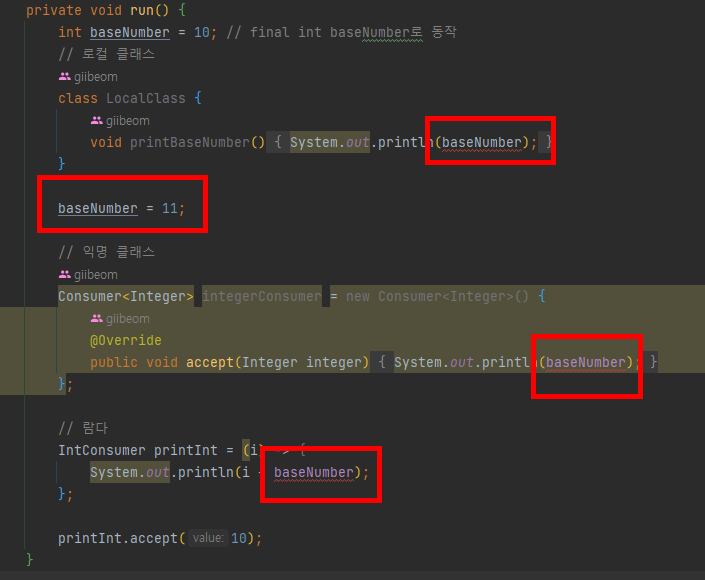

## 함수형 인터페이스와 람다

### 함수형 인터페이스란?
- 1개의 추상메서드를 갖는 인터페이스 (다른 형태의 메서드가 존재해도 추상메서드가 1개라면 무관)
- `@FunctionalInterface`을 사용하여 함수형 인터페이스를 정의할 수 있다
- 해당 어노테이션을 사용할 시, 추상메서드가 2개 이상이면 컴파일 에러 발생
- java8부터 interface에서도 static, default 메서드 정의 가능

<br>

### 람다 표현식

#### 람다를 왜 사용하나?
- 코드가 간결해진다
  - 불필요한 코드를 줄일 수 있다
  - 가독성을 높일 수 있다

#### 기본 형식
`(인자 리스트) -> {바디}`

- 인자 리스트
    - 인자가 없을 때 : ()
    - 인자가 한개일 때 : (i) or i
    - 인자가 여러개일 떄 : (i, j, k)
    - 인자의 타입은 변수 선업 타입(제네릭)을 통해 컴파일러가 추론할 수 있음
        - 따라서 생략이 가능
        - 명시할 수도 있음
          - `ex : (Integer i, Integer j)` 


- 바디
    - 화살표 오른쪽에 함수 본문을 정의함
    - 함수 내 정의가 여러줄인 경우에는 {} 를 사용해서 묶어야 한다.
    - 함수 내 정의가 한줄인 경우
        - {} 생략가능
        - return도 생략 가능

<br>

#### 람다 사용 예시
```java
// 추상메서드를 1개 가지고 있는 인터페이스 (함수형 인터페이스)
@FunctionalInterface
public interface Calc {
   // 추상 메서드
    int sum(int a, int b);
}
```
```java
/* 추상 메서드를 구현하려면 재정의를 하여야 한다! */
public class Test {
  
  // 익명 내부 클래스 (람다 사용전)
  Calc calculate = new Calc() {
    @Override
    public int sum(int a, int b) {
      return a + b;
    }
  };

  // 익명 내부 클래스 (람다 사용) : 코드가 간결해짐
  Calc calculate = (a, b) -> a + b;
}
```
<br>

### Java 기본 제공 함수형 인터페이스
<br>

#### `Function<T, R>` : 하나의 값(T)을 받아 하나의 값(R)을 리턴
<details>
<summary>Function 의 default 메서드</summary>
<div markdown="1">     

- apply() : 값을 받아 리턴하는 메서드
  ```
  R A.apply(T t) : T 값을 받아 R로 리턴
  ```    
- compose() : 함수와 함수를 조합하는 메서드 (매개변수 함수 먼저 실행)
    ```
    A.compose(B) : B를 실행 한 다음 A가 실행
    ```
- andThen() : 함수와 함수를 조합하는 메서드 (객체 참조하는 함수 먼저)
  ```
  A.andThen(B) : A를 실행 한 다음 B가 실행
  ```

<br>

`💡 compose()와 andThen()은 메서들끼리의 조합이 완료된 함수 자체를 반환한다! -> return Function<T, R> `
<br>

`다른 함수의 compose(), andThen()도 동일하게 해당 함수를 반환`
```java
/* 예시를 들어보자 */
// 20 더하는 함수
Function<Integer, Integer> plus20 = i -> (i + 20);

// 2 곱하는 함수
Function<Integer, Integer> multiply2 = i -> (i * 2);


// 2곱하는 함수와 20 더하는 함수를 합친 Function을 참조변수 multiply2AndPlus20에 선언
// multiply2AndPlus20  -> (2곱한 후 20 더하는 함수)
Function<Integer, Integer> multiply2AndPlus20 = plus20.compose(multiply2);

// multiply2AndPlus20 함수 내 apply 메서드를 통해 주입하는 값에 결과값을 리턴
System.out.println(multiply2AndPlus20.apply(2));  // 결과는 24가 반환됩니다 (2 x 2 + 20)
```
</div>
</details>

<br>

#### `BiFunction<T, U, R>` : 두개의 값(T, U)을 받아 하나의 값(R)로 리턴
<details>
<summary>BiFunction 의 default 메서드</summary>
<div markdown="1">      

- apply() : 값을 받아 리턴하는 메서드
  ```
  R apply(T t, U u) : T, U 값을 받아 R로 리턴
  ```
</div>
</details>

<br>

#### `Consumer<T>` : 값을 받지만 아무값도 리턴하지 않음
<details>
<summary>Consumer 의 default 메서드</summary>
<div markdown="1">       

- accept() : 값을 받아 넘기는 메서드
  ```
  void accept(T t) : T 값을 받아 넘긴다. (리턴 x)
  ```
- andThen() : 함수와 함수를 조합하는 메서드
  ```
  A.andThen(B) : A를 실행 한 다음 B가 실행
  ```
</div>
</details>

<br>

#### `Supplier<T>` : T 타입의 값을 제공
<details>
<summary>Supplier 의 default 메서드</summary>
<div markdown="1">       

- get() : 리턴하는 메서드
  ```
  T get() : T 타입의 값을 리턴
  ```
</div>
</details>

<br>

#### `Predicate<T>` : T 타입을 받아 boolean 타입으로 리턴
<details>
<summary>Predicate 의 default 메서드</summary>
<div markdown="1">       

- test() : true / false를 리턴하는 메서드
  ```
  boolean test(T t) : T타입을 받아서 boolean으로 리턴
  ```
- and() : &&
  ```
  A.and(B).test(T) : T값을 전달하여 A함수와 B함수가 모두 true 일때 (&&)
  ```
- or() : ||
  ```
  A.or(B).test(T) : T값을 전달하여 A함수 혹은 B함수가 true 일때 (||)
  ```
- negate() : !
  ```
  A.negate().test(T) : T값을 전달하여 A함수 결과의 반대를 리턴
  ```
</div>
</details>

<br>

#### `UnaryOperator<T>` : Function<T, R>에서 입력타입(T)과 리턴타입(R)이 동일한 함수
<details>
<summary>UnaryOperator 의 default 메서드</summary>
<div markdown="1">       

- Function<T,R> 상속 -> Function의 메서드를 모두 사용 가능
    - apply()
    - compose()
    - andThen()
  ```
      Function<Integer, Integer> plus20 = i -> (i + 20);
                     ↓↓↓↓↓↓↓↓↓
      UnaryOperator<Integer> plus20 = i -> (i + 20);
  ```
</div>
</details>  

<br>

#### `BinaryOperator<T>` : BiFunction<T, U, R>에서 입력타입(T, U)과 리턴타입(R)이 모두 동일한 함수

<details>
<summary>BinaryOperator 의 default 메서드</summary>
<div markdown="1">       

- BiFunction<T, U, R> 상속 -> BiFunction의 메서드를 모두 사용 가능
    - apply()
  ```
      BiFunction<Integer, Integer, Integer> plus = (i, j) -> i + j;
                     ↓↓↓↓↓↓↓↓↓
      BinaryOperator<Integer> plus = (i, j) -> i + j;
  ```

</div>
</details>

<br>


### 변수 쉐도윙이란?
`(로컬 클래스 vs 익명 클래스 vs 람다)`


#### 쉐도윙(Shadowing)?
- 감싸고 있는 영역(클래스 외부)에 선언된 변수와 동일한 변수명을 클래스 내부에 선언할 경우 외부 변수가 가려진다.
- scope 단위❗❗


- 공통점
  ```
  클래스 외부의 final변수를 참조 할 수 있다.
  effective final (사실상 final) 도 가능
  ```

- 차이점
  ```
  로컬 클래스와 익명 클래스는 변수 섀도잉이 가능하다. (감싸고있는 영역과 내부는 다른 스콥이기 때문)
  람다는 람다를 감싸고있는 영역과 스콥이 동일하여 변수의 섀도윙이 불가능하다.
  
  람다는 렉시컬 스코프로써 새로운 수준의 범위를 도입하지 않고 둘러싸여 있는 범위를 따라간다고 다큐먼트에 기재되어 있음
  ```

<br>

### effective final?
- final 선언의 특징은 딱 한번 값이 초기화되면 변경이 불가능한 상수
- effective final은 java8부터 생긴 특별한 final(상수)
- final로 선언하지 않아도 코드 상에서 초기화 된 이후 값이 한번도 변경되지 않았다면 자바 컴파일러에서 final 키워드를 붙인 것과 동일하게 처리 (effective final)
- 따라서 "선언부를 제외하고 변경하는 곳이 없을경우 final을 생략"해도 final로 동일하게 인식
  
  ```markdown
  💡 예시를 들어보자
  
  아래의 int baseNumber는 10으로 최초 선언 이후 값이 변경된적이 없기 때문에 effective final에 해당됩니다
  따라서 사실상 final이기 때문에 내부 inner class에서 변수 baseNumber를 참조할 수 있습니다.
  ```
  
  ```java
        private void run() {
    int baseNumber = 10; // final int baseNumber로 동작

    // 로컬 클래스
    class LocalClass {
        void printBaseNumber() {
            System.out.println(baseNumber);
        }
    }

    // 익명 클래스
    Consumer<Integer> integerConsumer = new Consumer<Integer>() {
        @Override
        public void accept(Integer integer) {
            System.out.println(baseNumber);
        }
    };

    // 람다
    IntConsumer printInt = (i) -> {
        System.out.println(i + baseNumber);
    };

    printInt.accept(10);
  }
  ```

  ```markdown
  아래와 같이 baseNumber를 11로 변경하였을 경우 effective final이 깨져버립니다.
  따라서 내부 클래스에서 참조하는 baseNumber 부분이 모두 컴파일 에러가 나는것을 볼 수 있습니다.
  ```

    


<br>

### 메서드 레퍼런스
- ::(콜론 2개) 는 메소드 레퍼런스를 의미
  - 예시
     ```
      class 1)
      UnaryOperator<String> hi = (s) -> "hi " + s;
        
      
      class 2)
      public class Greeting {
        
          private String name;
        
          public static String hi(String name) {
                return "hi " + name;
            }
        }
     ```
  - 위 예시에서 class 2의 hi 메서드를 class 1에서 레퍼런스 하는 방법
    ```
      UnaryOperator<String> hi = Greeting::hi;
    ```

<br>

#### 레퍼런스 종류

| 참조 종류 | 사용법 |
| --- | --- |
| static 메서드 참조 | 타입::staticMethod |
| 특정 객체의 인스턴스 메서드 참조 | 인스터스 생성 -> 인스턴스변수::method |
| 임의 객체의 인스턴스 메서드 참조 | 타입::인스턴스 메서드 -> ex. String::compareToIgnoreCase |
| 생성자 참조 | 타입::new  ->  get() |