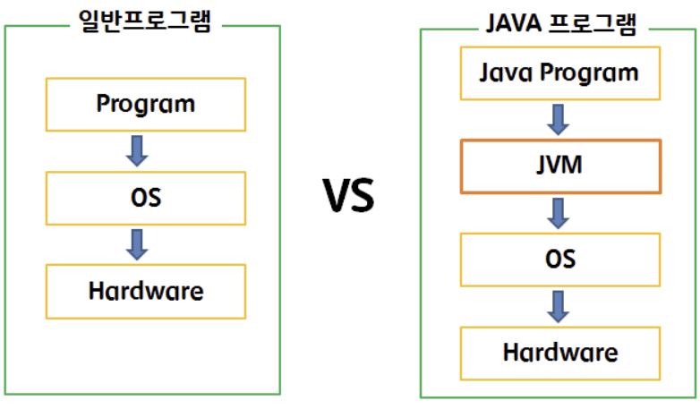

## JAVA란?

- 썬 마이크로시스템즈에서 개발하여 1996년 1월에 공식 발표된 **객체지향 프로그래밍 언어**
    - 썬 → 오라클(oracle)사에 인수 (2010년)
- 객체지향 개념과 C++의 장점을 채택하는 동시에 잘 사용되지 않는 부분은 과감히 제외시킴
    - 배우기 쉽고 이해하기 쉬운 간결한 표현이 가능
- 다양한 클래스 라이브러리(Java API)를 통해 프로그래밍에 필요한 요소들을 기본적으로 제공
    - java.lang 패키지 (String, Integer, …)
    - java.util 패키지 (Arrays, Calendar, Date, Objects, StringTokenizer, …)

 

## Java 언어의 특징

1. 운영체제에 독립적이다.
2. 객체지향 언어이다.
3. 비교적 배우기 쉽다.
4. 자동 메모리 관리 (Garbage Collection)
5. 네트워크와 분산처리를 지원
6. 멀티쓰레드를 지원
7. 동적 로딩(Dynamic Loading)을 지원

 

### 1. 운영체제에 독립적

- 일종의 [에뮬레이터](https://ko.wikipedia.org/wiki/%EC%97%90%EB%AE%AC%EB%A0%88%EC%9D%B4%ED%84%B0)인 자바가상머신(JVM)을 통해 프로그램을 실행할 때 운영체제를 신경쓰지 않아도 된다.
- 자바 프로그램은 운영체제나, 하드웨어가 아닌 JVM하고만 통신하고, JVM이 자바 응용프로그램으로부터 전달받은 명령을 해당 운영체제가 이해할 수 있도록 변환하여 전달
    - `Java Application → JVM → OS -> 하드웨어`
    - 한번 작성하면, 어디서나 실행된다 (Write once, run anywhere)

      
      
      이미지 출처 : [https://m.blog.naver.com/rbdi3222/220594436564](https://m.blog.naver.com/rbdi3222/220594436564)

- Java는 각 OS에 맞는 JVM을 따로따로 지원한다.

### 2. 객체지향 언어

- Java는 객체지향 프로그래밍언어(object-oriented programming language) 중의 하나이다.
- 따라서 객체지향개념의 특징인 **상속, 캡슐화, 다형성**이 잘 적용된 순수한 객체지향 언어이다.

### 3. 비교적 배우기 쉽다

- Java의 연산자와 기본 구문은 C++에서, 객체지향 관련 구문은 스몰톡(small talk)이라는 객체지향 언어에서 가져왔다.
- 위 언어들의 장점은 취하며 복잡하고 불필요한 부분은 과감히 제거하여 단순화함
    - 객체지향 언어의 특징인 재사용성과, 유지보수의 용이성 등의 많은 장점이 있지만,
      배우기가 어렵다는 최대의 단점을 보다 쉽게 이해하고 활용할 수 있도록 하여 해결

### 4. 자동 메모리 관리 (Garbage Collection)

- 자바 프로그램이 실행되면 가비지컬렉터가 자동적으로 메모리를 관리해준다.
    - 다소 비효율적인 면도 있지만 프로그래머가 프로그래밍에만 집중할 수 있도록 도와주는 장점도 있다.

### 5. 네트워크와 분산처리를 지원

- Java는 인터넷과 대규모 분산환경을 염두하여 만든 언어이다.
- Java API를 통한 다양한 네트워크 프로그래밍 라이브러리를 통해 네트워크 관련 프로그램을 쉽게 개발할 수 있도록 지원한다.

### 6. 멀티쓰레드를 지원

- 이 또한 Java API가 제공되므로 쉽게 구현할 수 있다.
- 여러 쓰레드에 대한 스케줄링(scheduling)을 자바 인터프리터(JVM)가 담당하게 된다.
    - `Java는 컴파일 언어이기도 하며 인터프리터 언어이기도 합니다`

### 7. 동적 로딩을 지원

- Java 애플리케이션은 보통 여러개의 클래스로 구성되어 있다.
- 하지만 동적 로딩을 지원하기에 실행될 때 모든 클래스가 로딩되지 않고
  필요한 시점에 유연하게 로딩하여 사용할 수 있다.
- 따라서 일부 클래스가 변경되어도 전체 어플리케이션을 다시 컴파일하지 않아도 된다.

 

## JDK vs JRE vs JVM

- JDK : 자바개발도구 (Java Development Kit)
    - `JRE + 개발에 필요한 실행파일 (javac.exe 등)`
- JRE : 자바실행환경 (Java Runtime Environmnet)
    - 자바로 작성된 응용프로그램이 실행되기 위한 최소환경
    - `JVM + 클래스라이브러리 (Java API)`
- JVM : 자바를 실행하기 위한 가상 컴퓨터 (Java Virtual Machine)

  

  이미지 출처 : [https://cryptosalamander.tistory.com/4](https://cryptosalamander.tistory.com/4)

 

## Java는 어떻게 실행될까?

### 실행파일

- 먼저 JDK를 다운로드 받으면 bin 폴더에 수많은 실행파일이 있을 것이다.

  

- 그 중에 5가지의 실행 파일에 대해서 알아보자
  - `바이트코드는 JVM이 이해할 수 있는 기계어 → JVM은 바이트코드를 해당 OS 기계어로 변환 후 전달`

| 실행파일 | 설명                                                                   |
| --- |----------------------------------------------------------------------|
| javac.exe | 자바 컴파일러, 자바소스코드를 바이트코드로 컴파일 한다.   `소스코드 → 바이트코드`                  |
| java.exe | 자바 인터프리터, 컴파일러가 생성한 바이트코드를 해석하고 실행한다.   `바이트코드 → 해석 후 실행`           |
| javap.exe | 역어셈블러, 컴파일된 클래스파일을 원래의 소스로 변환한다.   `바이트코드 → 소스코드`                   |
| javadoc.exe | 자동문서 생성기, 소스파일에 있는 주석(/** */)을 이용하여 Java API문서와 같은 형식의 문서를 자동으로 생성해준다. |
| jar.exe | 압축프로그램, 클래스파일 + 프로그램의 실행과 관련된 파일을 하나의 jar파일로 압축 or 압축해제              |

 

### 실행과정

- Hello라는 class를 생성 후 메인 함수에서 “Hello My name is Gibeom”을 출력하는 상황

  

1. Hello.java 소스코드 작성
2. Java Compiler(javac.exe)를 통한 컴파일 진행
3. Hello.class 바이트파일 생성
4. JVM (java.exe)을 통해  “Hello My name is Gibeom” 출력
    1. Class Loader를 통해 .class 파일들을 JVM에 올린다.
        - 동적 로딩을 통해 필요한 클래스들만 로딩 및 링킹한다.
    2. JVM에 있는 .class 파일들을 Execution Engine의 Interpreter와 JIT Compiler를 통해 해석된다.
    3. 해석된 바이트 코드는 Runtime Data Area에 배치되어 실질적인 수행이 이루어진다.

   

   이미지 출처 : [https://kingofbackend.tistory.com/123](https://kingofbackend.tistory.com/123)

 

## JVM이란?

- JVM(Java Virtual Machine)은 자바를 실행하기 위한 가상 컴퓨터이다. (컴퓨터 속의 컴퓨터)
- Java로 작성된 모든 애플리케이션은 JVM(가상 컴퓨터)에서만 실행된다.
- 상단에 운영체제에 독립적인 특징을 설명할 때 봤듯이 Java는 일반 어플리케이션과 다르게 OS를 거쳐 하드웨어로 전달되기 전에 JVM을 한번 더 거친다.
    - 일반 애플리케이션 ↔ OS ↔ 컴퓨터(하드웨어)
    - Java 애플리케이션 ↔ JVM ↔ OS ↔ 컴퓨터(하드웨어)

### 장점

- JVM은 OS에 종속적이기 때문에 해당 OS에 맞는 JVM만 사용한다면 프로그램의 변경 없이 어느 환경에서나 사용이 가능하다

### 단점

- JVM을 한번거치기도 하고, 하드웨어에 맞게 완전히 컴파일된 상태가 아닌 실행 시에 해석(interpret)되기 때문에 속도가 느리다.
  - `최근엔 바이트코드(컴파일된 자바코드)를 하드웨어의 기계어로 바로 변환해주는 JIT 컴파일러와 향상된 최적화 기술을 적용하여 속도의 격차를 많이 줄임`

### JVM 구조

- JVM 구조에 대해 조금 더 자세히 들어가보겠다.

    

  이미지 출처 : [https://steady-coding.tistory.com/305](https://steady-coding.tistory.com/305)

 

#### Class Loader

- JVM 내로 클래스 파일을 로드하고, 링크를 통해 Runtime Data Area에 배치하는 작업을 수행합니다.
- 런타임 시에 동적으로 클래스를 로드합니다 (동적 로딩)

#### Execution Engine

- 클래스 로더가 Runtime Data Area에 배치해놓은 바이트 코드들을 명령어 단위로 읽어서 실행합니다.
- 인터프리터 방식과 JIT 컴파일러 방식을 동시에 사용
    - JIT 컴파일러 : 어셈블러 같은 네이티브 코드로 바꿈으로써 실행을 빠르게 해주지만 변환과정 비용이 발생하므로 인터프리터와 같이 사용

#### Garbage Collector

- 힙 메모리 영역(Heap Area)에 생성된 객체들 중, 참조가 끊긴 객체들을 탐색 후 제거합니다.
- `📢 해당 주제는 추후 따로 다뤄질 예정입니다`

#### Runtime Data Area

- JVM의 메모리 영역으로 자바 애플리케이션이 실행될 때 사용되는 데이터들을 적재하는 영역입니다.
1. Method Area == Static Area
    - 모든 쓰레드가 공유하는 메모리 영역
    - 클래스, 인터페이스, 메서드, 필드, Static 변수 등의 바이트 코드를 보관
2. Heap Area
    - 모든 쓰레드가 공유하는 메모리 영역
    - new 키워드로 생성된 객체와 배열이 생성되는 영역
    - 메서드 영역에 로드된 클래스만 생성이 가능
    - Garbage Collector 활동 영역
3. Stack Area
    - 메서드 호출 시마다 각각의 스택 프레임, 즉 해당 메서드만을 위한 임시 저장 공간을 생성
    - 해당 메서드 안에서 사용 및 연산되는 값과 호출된 메서드의 매개변수, 지역변수, 리턴 값 등을 임시로 저장
    - 메서드 수행이 끝나면 프레임 별로 삭제
4. PC Register
    - Thread가 생성될 때 마다 생기는 공간 (1 스레드 : 1 PC레지스터)
    - Thread가 어떠한 명령을 실행하게 될 지에 대한 부분을 기록을 한다.
5. Native Method Stack
    - Java 외 언어로 작성된 네이티브 코드를 위한 메모리

이미지 출처 : [https://limkydev.tistory.com/51](https://limkydev.tistory.com/51)

 

## 소스 코드 작성 시 주의할 점은?

1. 주석을 제외한 모든 코드는 클래스의 블럭 {} 내에 작성되야 한다.
2. Java 애플리케이션에는 main 메서드를 포함한 클래스가 최소 1개는 반드시 있어야 한다.
    - main 메서드가 Java 애플리케이션의 시작점
    - main 메서드의 첫 문장부터 마지막 문장까지 수행 후 종료 및 사용된 모든 자원 반환
3. 하나의 소스파일에 여러개의 클래스가 정의될 수 있지만, 소스파일의 이름은 public class의 이름과 일치해야 하고, 소스파일 하나의 public class는 하나만 존재할 수 있다.
    - 만약 소스파일에 public class가 없다면 소스파일 이름은 소스파일 내 어떤 클래스의 이름으로 해도 무관하다.
4. 주석은 범위주석(/* */) or 한줄주석(// )이 있다.
    - javadoc으로 API 문서를 자동으로 만들어줄 수 있는 주석(/** */ ) 도 있지만 많이 사용되지는 않는다.
    - 문자열을 의미하는 “” 사이에서 주석이 사용될 때는 주석으로 인식하지 못하고 문자열로 인식된다.

 

### Reference

- [Java의 정석](https://www.aladin.co.kr/shop/wproduct.aspx?ItemId=76083001)
- [자바의 동작과정 Java Compiler와 JVM](https://kingofbackend.tistory.com/123)
- [JVM 메모리 구조란?](https://steady-coding.tistory.com/305)