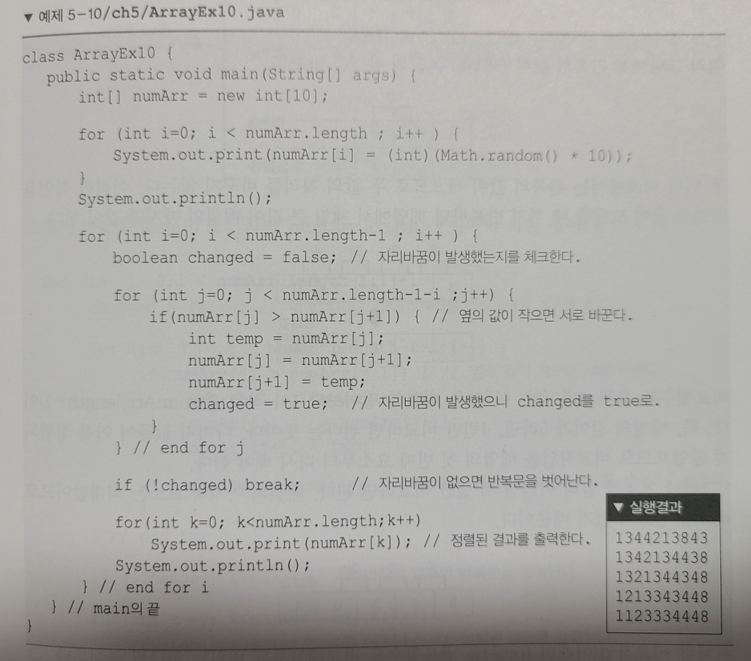
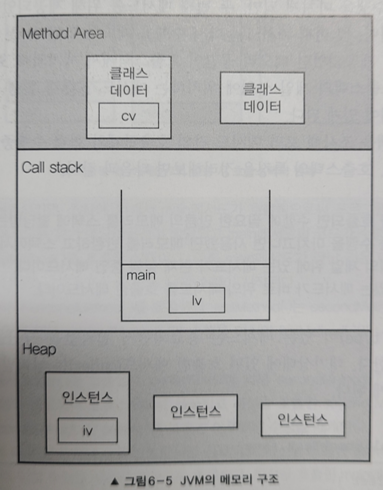
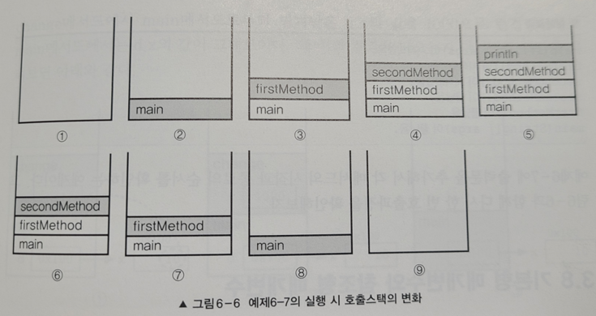

## 변수의 종류

- 변수는 변수가 선언된 위치에 따라서 변수의 종류가 결정됩니다
- 클래스 영역에 선언된 변수는 모두 멤버 변수이고, 멤버 변수를 제외한 나머지 변수들은 모두 지역변수입니다
- 멤버 변수는 두가지로 나뉘어지는데, static이 붙어있으면 클래스 변수이고 붙지 않은것은 인스턴스 변수입니다
  - `멤버변수 = 클래스 변수 + 인스턴스 변수`


| 변수 종류 | 설명 | 생성 시기 |
| --- | --- | --- |
| 클래스 변수 (멤버 변수) | static이 붙어있는 경우 | 클래스가 메모리에 로딩될 때 |
| 인스턴스 변수 (멤버 변수) | static이 붙어있지 않은 경우 | 인스턴스가 생성되었을 때 |
| 지역 변수 | 멤버 변수를 제외한 나머지 | 변수 선언문이 수행되었을 때 |

```java
public class Study {
    
    int iv; // 인스턴스 변수
    static int cv;  // 클래스 변수 (static변수, 공유변수)

    void method() {
        int lv = 0; // 지역 변수
    }
}
```

<br>

### 인스턴스 변수

- 클래스의 인스턴스를 생성할 때 만들어집니다
    - Person giibeom = **new Person();**
- 인스턴스는 독립적인 저장 공간을 가지므로 각자 서로 다른 값을 가질 수 있습니다

    ```java
    class Person {
        String name;
        static int eye;
    }
    
    // 참조변수 giibeom과 alex는 같은 Person 객체이지만 name은 서로 다른 값을 가진다 (다른 주소값)
    Person giibeom = new Person();
    giibeom.name = "Myoung gibeom";
    
    Person alex = new Person();
    alex.name = "Alex";
    ```

- 따라서 인스턴스 마다 고유한 상태를 유지해야 하는 속성(변수)의 경우 인스턴스 변수로 선언해야 합니다
- 인스턴스 변수는 직접 접근이 안되므로 인스턴스 생성 후 접근이 가능합니다!
    - `Person myoung = new Person();` <br>
      `myoung.name = “gibeom”;`

<br>

### 클래스 변수

- 클래스 변수 선언은 인스턴스 변수 앞에 static을 붙이기만 하면 됩니다
- 클래스 변수는 모든 인스턴스가 공통된 저장 공간(변수)을 공유하게 됩니다
- 따라서 한 클래스의 모든 인스턴스들이 공통적인 값을 유지하며, 공유하여 사용해야 하는 변수인 경우 클래스 변수로 선언해야 합니다
- 클래스 변수는 인스턴스를 만들지 않아도 직접 접근이 가능합니다!
    - `Person.eye = 2;`

<br>

### 지역 변수

- 지역 변수는 메서드 내에 선언되며 메서드 내에서만 사용이 가능합니다
- 메서드 내에서 선언된 변수들 + 매개변수는 모두 지역변수입니다
- 따라서 메서드가 종료되면({} 밖으로 벗어난 경우) 소멸되어 사용할 수 없습니다

    ```java
    // add의 매개변수 x,y 와 minus의 매개변수 x,y는 서로 다른것이다!
    
    int add(int x, int y) {
    ....
    }
    
    int minus(int x, int y) {
    ....
    }
    ```

<br>

### 이 상황에선 클래스 변수? or  인스턴스 변수?

- 클래스 변수와 인스턴스 변수를 각각 언제 무엇으로 써야 되는지 알아봅시다

    ```java
    // 💡 원카드, 포커 등을 할 수 있는 게임카드를 예시로 들어보자
    
    
    // 카드의 속성: 무늬, 숫자, 폭, 높이, 재질
    
    // 카드의 폭, 높이, 재질은 "공통적인 부분"이니 서로 공유하게끔 클래스 변수로 선언합니다
    // 무늬와 숫자는 "각자 고유한 값"을 가져가야 하니 인스턴스 변수로 선언합니다
    class Card {
        String kind;    // 무늬
        int number;     // 숫자
        static int width = 100;     // 폭
        static int height = 250;    // 높이
        static String material = "plastic"; // 재질
    }
    ```

<br>

## 메서드

- 메서드는 특정 작업을 수행하는 일련의 문장들끼리 하나로 묶은 것입니다
- 메서드를 사용할 땐 그저 넣을 값(입력)과 반환하는 결과(출력)만 알면 됩니다
    - 메서드가 내부적으로 어떻게 동작하는지 몰라도 사용하는데 아무런 지장이 없습니다
    - 따라서 메서드는 내부가 보이지 않는 블랙박스 라고도 불립니다
    - 이 말은 즉슨 넣을 값과 반환 결과만 동일하다면 언제든 메서드 내부 수정이 가능하다는 말입니다
    - 이것이 **객체지향 메서드의 장점**입니다!

<br>

### 메서드를 사용하는 이유

`메서드의 대표적인 장점 3가지에 대해서 알아봅시다`

#### 1. 높은 재사용성(reusability)

- 이미 우리는 Java API에서 제공하는 다양한 메서드들을 사용하면서 경험해본 적이 있습니다
    - java.lang 패키지 (String, Integer, …)
    - java.util 패키지 (Arrays, Calendar, Date, Objects, StringTokenizer, …)
- 메서드를 한번 만들어 놓으면 필요한 상황에서 몇 번이고 호출하여 사용할 수 있습니다

<br>

#### 2. 중복된 코드의 제거

- 프로그래밍을 하다 보면 같은 내용의 문장들을 여러 곳에서 반복해서 사용하곤 합니다
    - ex) 로그용 System.out.println()  등등 …
    - 물론 실무에서는 log 라이브러리를 사용해야 합니다
- 메서드를 사용하면 반복되는 문장들 대신, 메서드를 호출하는 한 문장으로 대체가 가능합니다
- 오류를 수정해야할 때에도 여러곳에 퍼진 것들을 일일히 정리하기에는 위험요소가 많지만, 메서드로 구현을 한다면 메서드만 변경하면 됩니다

<br>

#### 3. 프로그램의 구조화

- 프로그램의 전체 흐름이 한눈에 들어올 정도로 단순하게 구조화 하여 코드를 작성하여야 합니다
- 가독성이 좋아야 오류를 빠르게 찾을 수 있어 유지보수에 용이합니다
- 이때 메서드를 통해 프로그램을 구조화 시킬 수 있습니다

  `아래 예제를 작업단위로 나누어서 메서드를 만들어보면 다음과 같습니다`

    
  
    ```java
    // 위 사진(코드)의 구조화 적용 코드
    
    public static void main(String[] args) {
    
        int[] numArr = new int[10];
    
        initArr(numArr);    // 1. 배열을 초기화
        printArr(numArr);   // 2. 배열을 출력
        sortArr(numArr);    // 3. 배열을 정렬
        printArr(numArr);   // 4. 배열을 출력
    
    }
    ```

<br>

## 메서드의 선언과 구현

- 메서드는 선언부(header, 머리)와 구현부(body, 몸통)로 이루어져 있습니다

    ```markdown
    반환타입  메서드이름  (타입 변수명, 타입 변수명, ...)      --> 선언부
    {
    ....         --> 구현부
    }
    ```

<br>

### 메서드 선언부

- 메서드 선언부는 메서드가 작업을 수행하기 위해 어떤 값들을 필요로 하고, 작업의 결과로 어떤 타입의 값을 반환하는지에 대한 정보를 제공합니다
- 메서드의 선언부는 3가지로 구성되어 있습니다
    1. 메서드의 이름
        - 보통 동사로 많이 짓습니다
        - 메서드의 이름만으로도 어떤 기능인지 쉽게 알 수 있도록 함축적이면서도 의미 있는 이름을 짓도록 노력해야 합니다
    2. 매개변수 선언 (parameter declaration)
        - 작업을 수행하는데 제공 받아야 하는 필요한 입력 값들을 적습니다
        - 매개변수는 여러개가 될 수 있습니다
    3. 반환타입 (return type)
        - 작업 수행 출력결과인 반환값의 타입을 적습니다
        - 반환값은 최대 1개만 허용됩니다
        - 반환타입이 void일 경우에는 아무것도 반환하지 않습니다

<br>

### 메서드 구현부

- 메서드 선언부 다음에 오는 괄호 {} 를 메서드의 구현부라고 합니다
- 해당 메서드 반환 타입이 void가 아닐 시 `return 반환값;` 을 반드시 포함해야 합니다
    - 반환 타입이 void 이면 컴파일러가 메서드 마지막에 `return;` 을 자동적으로 추가해줍니다
    - 반환 값의 타입은 메서드 선언부의 반환 타입과 일치하거나, **자동 형변환이 가능한 것**이여야 합니다

        ```java
        // 반환값인 result가 반환타입인 double와 동일하거나 double로 자동 형변환이 되는 타입이어야 한다
        // 반환 타입: double,  반환값: int(int -> double 자동 형변환 가능)
        
        double add(int x, int y) {
            int result = x + y;
            return result;
        }
        ```

<br>

### 메서드의 호출

- 메서드는 매개변수와 일치하는 ‘인자(argument)’ 또는 인수를 집어넣어 호출하여야 합니다

    ```java
    add(7, 10)          // int add(int x, int y)를 호출하고 인자 7을 x에, 인자 10을 y에 대입
    print99danAll();     // void print99danAll()을 호출
    ```

- 같은 클래스 내의 메서드끼리는 참조변수 없이 서로 호출이 가능하지만, static 메서드는 같은 클래스 내의 인스턴스 메서드를 호출할 수 없습니다
    - static → static  : 가능
    - non-static → non-static : 가능
    - non-static → static : 가능
    - static → non-static : 불가능

<br>

#### 왜 static에서 non-static을 호출할 수 없을까?

- static 변수와 static 메서드는 클래스가 로딩되는 시점에 메모리에 올라갑니다
- 하지만 non-static은 인스턴스가 생성될 때만 사용이 가능합니다
- 따라서 인스턴스가 생성된 시점에서는 static은 당연히 메모리에 올라가있는 상태이겠지만, 반대로 클래스가 로딩되는 시점엔 인스턴스가 생성 되어있을거란 보장이 없기 때문에 컴파일 오류가 발생합니다
- 따라서 static에서 non-static을 사용하려면 메서드 내에서 해당 인스턴스를 생성 한 후 사용하여야 합니다

<br>

## JVM의 메모리 구조

- JVM 메모리 영역은 주로 사용되는 3가지의 영역이 존재합니다

    

<br>

### 메서드 영역 (Method Area)

- 프로그램 실행 중 어떤 클래스가 사용되면 JVM은 해당 클래스파일을 읽고 분석하여 클래스에 대한 정보(클래스 데이터)를 이곳에 저장합니다 → 동적 바인딩
- 클래스 변수들이 생성되는 공간입니다

<br>

### 힙 (Heap)

- 프로그램이 실행 중 생성되는 모든 인스턴스는 이곳에 저장합니다
- 인스턴스 변수들이 생성되는 공간입니다

<br>

### 호출 스택 (Call stack)

- 메서드 작업에 필요한 메모리 공간을 제공합니다
- 메서드 작업이 끝나면 할당되었던 메모리공간은 반환되어 비어집니다
    - 이 특징으로 인해 메서드 내부의 지역변수는 메서드 외부에서 사용하지 못합니다
- 지역 변수(매개변수 포함)들이 생성되는 공간입니다

<br>

#### 프로그램 실행 시 호출 스택(Call stack) 흐름

- 호출 스택은 이름 그대로 자료구조 중 하나인 Stack 구조를 따라갑니다
- 아래 예시의 main 메서드 호출을 통해 흐름을 따라가보겠습니다

    `실행 순서: main - firstMethod - secondMethod - println`

    ```java
    public class CallStackTest{
    
        public static void main(String[] args) { // 시작
            firstMethod();
        }
    
        private static void firstMethod() {
            secondMethod();
        }
    
        private static void secondMethod() {
            System.out.println("secondMethod()");
        }
    }
    ```

- 메서드 실행 흐름대로 호출 스택의 과정을 담은 사진입니다
  

<br>

## 기본형 매개변수 vs 참조형 매개변수

| 매개변수 | 특징 | 이유 |
| --- | --- | --- |
| 기본형 매개변수 | 변수의 값을 읽기만 할 수 있다 (read only) | 기본형 값이 복사 |
| 참조형 매개변수 | 변수의 값을 읽고 변경할 수 있다 (read & write) | 인스턴스(객체)의 주소가 복사 |

<br>

#### 기본형 매개변수

```java
// 기본형 매개변수는 값을 복사하기 때문에 변경이 불가능하다

public static void main(String[] args) {

    int num = 10;
    System.out.println("A: " + num);    // A: 10
    change100(10);
    System.out.println("C: " + num);    // C: 10
}

private static void change100(int num) {
    num = 1000;
    System.out.println("B: " + num);    // B: 1000
}
```

<br>

#### 참조형 매개변수

```java
// 인스턴스나 배열같은 참조형 매개변수는 주소값을 공유한다
// 따라서 메서드 안에서 변경한 값이 메서드 밖에서도 변경된 값으로 출력된다

class Data {
    int num;
}

public class Study {

    public static void main(String[] args) {

        Data d = new Data();
        d.num = 10;

        System.out.println("A: " + d.num);   // A: 10
        change100(d);    // Data 인스턴스 자체를 넘긴다
        System.out.println("C: " + d.num);    // C: 1000
    }

    private static void change100(Data d) {
        d.num = 1000;
        System.out.println("B: " + d.num);    // B: 1000
    }
```

<br>

## 재귀호출(recursive call)

- 메서드의 내부에서 메서드 자신을 다시 호출하는 것
- 호출된 메서드는 `‘값에 의한 호출(call by value)’을 통해 원래의 값이 아닌 복사된 값으로 작업`하기 때문에 독립적인 작업수행이 가능합니다 → 호출한 메서드와 호출당한 메서드는 서로 관련이 없습니다
- 재귀호출을 `탈출할 수 있는 조건문이 필수`입니다 → 무한루프가 돌면 Stack Overflow Error
- 재귀호출의 대부분은 반복문으로 작성하는 것이 가능하며, 반복문 보다 몇가지 과정(매개변수 복사, 종류 후 복귀할 주소 저장 등등)이 추가로 필요하여 수행시간이 오래 걸립니다

<br>

### 그렇다면 재귀호출을 왜 사용할까?

- 재귀호출이 주는 논리적 간결함 때문입니다
- 몇겹의 반복문과 조건문을 재귀호출로 사용하면 단순한 구조로 바뀔 수도 있습니다

    ```java
    // 재귀호출 사용에 대표적인 예는 Factorial 입니다
    
    public static void main(String[] args) {
    
        int result = factorial(4);
        System.out.println(result);
        
    }
    
    static int factorial (int n) {
        int result = 0;
    
        if (n == 1) {
            result = 1;
        } else {
            result = n * factorial(n - 1);  // 메서드 자신을 다시 호출한다.
        }
        return result;
    }
    ```

- 하지만 재귀 호출은 for문에 비해 비효율적이므로 재귀 호출에 드는 비용보다 재귀 호출이 주는 논리적 간결함의 이득이 충분히 큰 경우에만 사용하여야 합니다

<br>

## 클래스 메서드 vs 인스턴스 메서드

- 변수와 동일하게 메서드 앞에 static이 붙어있으면 클래스 메서드, 붙어있지 않으면 인스턴스 메서드입니다
- 또한 동일하게 클래스 메서드는 객체(인스턴스)를 생성하지 않고도 호출이 가능합니다
    - `클래스이름.메서드이름(매개변수)`
- 인스턴스 메서드는 반드시 객체를 생성하여 호출해야 합니다
    - `클래스 참조변수 = new 클래스();` <br>
      `참조변수.메서드이름(매개변수);`

<br>

### 클래스 메서드 (static 메서드)

- 인스턴스 변수나 인스턴스 메서드를 사용하지 않는 메서드인 경우 클래스 메서드로 정의합니다
- 물론 인스턴스 변수를 사용하지 않는다고 무조건 클래스 메서드(static)로 정의할 필요는 없지만 특별한 이유가 없으면 일반적으로는 클래스 메서드로 정의합니다

<br>

### 인스턴스 메서드

- 메서드 내 인스턴스 변수를 필요로 하는 메서드일 경우 인스턴스 메서드로 정의해야 합니다
    - 인스턴스 변수는 인스턴스 생성 후 사용이 가능하기 때문입니다

<br>

### 어느 상황에서 뭘 선언하지?

- 클래스의 멤버변수 중 모든 인스턴스에 **“공통된 값을 유지”** 해야 한다면 static을 붙여줍니다 (클래스 메서드)
- 또한 메서드 중 인스턴스 변수, 인스턴스 메서드를 사용하지 않는 메서드에는 static을 붙여줍니다 (클래스 메서드)
    - `ex) 매개변수로만 작업을 수행하는 경우에는 클래스 메서드(static)`
    - 클래스 메서드는 클래스가 메모리에 로딩될 때 이미 같이 메모리에 할당되므로 바로 사용이 가능합니다
    - 하지만 인스턴스 메서드는 실행 시 호출되어야 할 메서드를 찾는 시간이 추가적으로 발생하므로 클래스 메서드가 효율적입니다
- 나머지 상황에 경우는 모두 인스턴스 메서드를 선언해야 합니다
