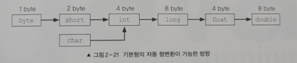

# 오버로딩(overloading)

## 오버로딩이란?

- 메서드도 변수와 동일하게 같은 클래스 내에서 서로 구별될 수 있어야 하기 때문에 각기 다른 이름을 가져야 합니다
- 하지만 Java에서는 메서드의 `매개변수 개수` 또는 `타입`이 다르다면 같은 이름을 사용해서 메서드를 정의할 수 있습니다
- 이것을 메서드 오버로딩(method overloading) 또는 오버로딩(overloading)이라고 합니다
- 따라서 메서드가 `같은 일을 하지만 매개변수를 달리해야 하는 경우`에 오버로딩을 구현합니다

<br>

## 오버로딩의 조건

- 오버로딩을 사용하고 싶으면 2가지의 조건을 따라야 합니다
    1. 메서드 이름이 같아야 한다
    2. 매개변수의 **개수** 또는 **타입**이 달라야 한다
- 해당 조건이 성립되지 않고 메서드명을 동일하게 선언할 경우, 중복정의로 간주되어 컴파일 에러가 발생합니다
- 메서드의 선언부(반환타입, 메서드명, 매개변수) 중 `반환타입`은 **오버로딩을 구현하는데 아무런 영향을 주지 못합니다**

<br>

## 오버로딩의 예시

### 예시 1: 변수명이 다른경우 → X

- 해당 경우는 `매개변수의 타입과 개수가 동일`하므로 오버로딩이 성립되지 않으므로 않습니다 → 컴파일 에러

    ```java
    int add(int a, int b) {
        return a + b;
    }
    
    int add(int x, int y) {
        return x + y;
    }
    ```


### 예시 2: 반환타입이 다른 경우 → X

- 오버로딩 조건은 `매개변수의 개수나, 타입, 위치` 이므로 `반환 타입과는 무관`하여 오버로딩이 성립되지 않습니다 → 컴파일 에러

    ```java
    int add(int x, int y) {
        return x + y;
    }
    
    String add(int x, int y) {
        return x + y + "";
    }
    ```


### 예시 3: 매개변수 순서(위치)가 다른 경우 → O

- 해당 경우는 메서드 타입과 개수가 동일하지만 `위치가 다르므로 호출될 메서드가 구분이 가능`므로 오버로딩이 성립됩니다

    ```java
    // 1번 메서드
    int add(int x, double y) {
        return (int) (x + y);  // int + double 일 경우 타입이 double로 되므로 형변환 필요 -> 반환타입은 int이기 때문
    }
    
    // 2번 메서드
    int add(double y, int x) {
        return (int) (x + y);
    }
    ```

- 하지만 매개변수 순서만 다르게 하여 오버로딩을 하는 경우에는 단점이 존재합니다
- 다음 예시 같이 **메서드 인자에 `자동 형변환`이 되는 타입**을 집어 넣을 시에는 어느 메서드를 호출해야 되는지 모호하기 때문에 메서드 호출부에서 컴파일 에러가 발생합니다
    - `Ambiguous method call.` <br>
      `Both add (int, double) in OverLoading and add (double, int) in OverLoading match`

      ```java
      public class App {
          public static void main(String[] args) {
              OverLoadingTest overloading = new OverLoading();
              overloading.add(3, 3.0);  // 1번 메서드가 호출
              overloading.add(3.0, 3);  // 2번 메서드가 호출
              overloading.add(3, 3);  // 컴파일 에러 -> Ambiguous method call. Both...
          }
      }
      ```

<br>

#### 자동 형변환?

- Java의 연산은 서로 다른 타입간의 대입이나 연산을 할 때, 형변환으로 타입을 일치시키는 것이 원칙입니다
- 하지만 경우에 따라서는 컴파일러가 자동으로 형변환을 추가해주기 때문에 형변환의 생략이 가능합니다
- 자동 형변환은 기존의 값을 `최대한 보존할 수 있는 타입으로 변환`하는 특징을 가지고 있습니다
    - 표현범위: `byte >> short/char >> int >> long >> float >> double`
    - 아래는 기본 자료형 타입의 자동 형변환이 가능한 방향을 설명한 예시입니다

      

- 따라서 위의 오버로드 예시는 `overloading.add(3, 3);` 에서 첫번째 인자와 두번째 인자 모두 double로 자동 형변환이 가능하기 때문에 1, 2번 메서드 모두 사용이 가능하여 `Ambiguous 컴파일 에러`가 발생하는 것입니다

<br>

## 오버로딩의 장점

- 만일 오버로딩이 지원되지 않는다면 모두 근본적으로 같은 기능을 하는 메서드들도 서로 다른 이름을 가져야 합니다
- 이렇게 되면 메서드를 작성하는 쪽에서도 문제지만 막상 메서드를 사용해야 되는 쪽도 이름을 일일이 구분해서 기억하고 있어야 합니다
- 하지만 오버로딩을 통해 **여러 메서드들을 하나의 이름으로 정의**될 수 있다면 해결됩니다

    ```java
    // 아래의 값들을 출력하는 기능을 구현해 봅시다
    Boolean a = true;
    char b = 'b';
    double c = 3.3;
    String d = "test";
    
    // 오버로딩이 지원이 안됐을 경우
    void println() {}
    void printBoolean(boolean x) {}
    void printlnChar(char x) {}
    void printlnDouble(double x) {}
    void printlnString(String x) {}
    
  
  
    // ------ 메서드 호출부 ------
    printBoolean(a)
    printlnChar(b)
    printlnDouble(c)
    printlnString(d)
    
  
    // -- 오버로딩을 사용할 경우 메서드 호출부 --
    System.out.println(a);
    System.out.println(b);
    System.out.println(c);
    System.out.println(d);
    ```

- 위와 같이 오버로딩을 사용할 경우 `println` 이라는 이름만 기억하면 되니 편리합니다
- 또한 메서드의 이름만 보고도 쉽게 예측할 수 있습니다
    - ‘이 메서드들은 이름이 같으니, 같은 기능을 하겠구나’
- 정리하자면 같은 기능을 하는 메서드 이름을 짓는데 고민을 줄여주며, 사용성도 올라갑니다

<br>

## 가변인자(varargs)와 오버로딩

- JDK 1.5 버전부터 매개변수의 개수를 동적으로 지정해줄 수 있습니다
- 가변인자는 `타입… 변수명` 으로 선언하며 매개변수 제일 마지막 순서에 선언해야 합니다
- 가변 인자는 내부적으로 배열을 이용하는 것으로, 가변인자가 선언된 메서드를 호출할 때마다 배열이 새로 생성됩니다

    ```java
    // 매개변수로 받는 문자열들을 합치는 메서드를 만들어봤습니다
    public static String concatStr(String... str) {
        StringBuilder result = new StringBuilder();
        for (int i = 0; i < str.length; i++) {
            result.append(str[i]);
        }
        return result.toString();
    }
    
    // 결과: gibeom
    public static void main(String[] args) {
        System.out.println(overloading.concatStr("gi", "beom"));
    }
    ```

- 위의 예시에서 `overloading.concatStr("gi", "beom")` 는 내부적으로 `overloading.concatStr(new String[] {”gi”, “beom”});` 이 동작합니다
- 따라서 매번 새로운 인스턴스를 생성(new ...)하여 메모리에 비효율적이므로, 꼭 필요한 경우에만 사용하여야 합니다
- 또한 아래와 같이 가변인자를 선언한 메서드를 오버로딩 할 경우, 메서드 구별이 되지 못하는 경우가 발생하기 쉽기 때문에 가능하면 가변인자를 사용한 메서드 오버로딩은 사용하지 않는것을 추천합니다

    ```java
    // delim 을 붙여서 문자를 조합해주는 함수
    String concatenate (String delim, String... args) {
        String result = "";
    
        for (String str : args) {
            result += str + delim;
        }
        return result;
    }
    
    // delim 이 없을 경우 delim을 ""으로 설정하고 위의 함수를 호출
    String concatenate(String... args) {
        return concatenate("", args);
    }
    
    // Ambiguous 오류
    public static void main(String[] args) {
    		// 첫번째 메서드와 두번째 메서드 모두 해당되므로 컴파일 에러
        concatenate("-", "100", "200", "300")
    }
    ```

  > 💡 만약 첫번째 메서드의 첫번째 인자인 delim의 타입이 String이 아닌 다른 타입이였다면 정상적으로 실행 됩니다


<br>
<br>


# 상속(inheritance)

## 상속이란?

- 상속은 기존의 클래스를 재사용하여 새로운 클래스를 작성하는 것입니다
- 모든 상속계층도의 최상위에는 Object 클래스가 위치합니다 (모든 클래스들은 Object 클래스를 상속받음)

<br>

## 상속의 장점

- 적은 양의 코드로 새로운 클래스를 작성할 수 있습니다
- 코드를 공통적으로 관리할 수 있어 코드의 추가 및 변경이 매우 용이합니다
- `코드의 재사용성`을 높이고 `코드의 중복을 제거`하여, 프로그램의 생산성과 유지보수에 크게 기여합니다

<br>

## 상속은 어떻게 사용할까?

- 새로 작성하고자 하는 클래스의 이름 뒤에 상속받고자 하는 클래스의 이름을 `extends`와 함께 작성해주면 됩니다

    ```java
    public class MercedesBenz extends Car {
    		.....
    }
    ```

- 위 예시는 새로 작성하려는 MercedesBenz 클래스가 Car라는 기존 클래스를 상속받는 예시입니다
- 두 클래스는 서로 상속 관계에 있다하며 조상 클래스, 자손클래스라고 불립니다

  | 명칭 | 또 다른 용어 | 대상 |
  | --- | --- | --- |
  | 조상 클래스 | 부모(parent) 클래스, 상위(super) 클래스, 기반(base) 클래스 | Car |
  | 자손 클래스 | 자식(child) 클래스, 하위(sub) 클래스, 파생된(derived) 클래스 | MercedesBenz |

<br>

## 상속의 특징

### 1. 자손 클래스는 조상의 멤버를 모두 상속받는다

- 아래 예시에서 조상 클래스 Car에 멤버 8개(변수 4개 + 메서드 4개) 를 추가하였습니다
- Car를 상속받고 있는 MercedesBenz 또한 4개의 변수를 자동으로 멤버 변수에 추가됩니다
- 또한 MercedesBenz 클래스의 멤버에 4개의 메서드가 자동으로 추가됩니다

    ```java
    public class Car {
        String model;
        String carColor;
        String carNumber;
        int speed;
    
        public void speedUp() {
            speed++;
        }
    
        public void speedDown() {
            if (speed > 0) {
                speed--;
            }
        }
    
        public void hitTheBreak() {
            speed = 0;
    
        public int getSpeed() {
            return speed;
        }
    }
    ```

- 아래는 Car를 상속받은 MercedesBenz 클래스입니다

    ```java
    public class MercedesBenz extends Car {
    
    }
    ```

- MercedesBenz는 Car를 상속만 받았을 뿐 별다른 선언은 하지 않았습니다
- 하지만 MercedesBenz의 인스턴스를 생성하면 조상 클래스(Car)의 멤버도 함께 생성되기 때문에, 별다른 조상 클래스의 인스턴스 생성 필요없이 조상 클래스의 멤버들을 사용할 수 있습니다

    ```java
    public class CarApp {
        public static void main(String[] args) {
            MercedesBenz benzCar = new MercedesBenz();
            benzCar.speedUp(); // 조상클래스(Car)에 선언되어 있는 메서드 -> 사용 가능
            System.out.println("benzCar speed: " + benzCar.getSpeed()); // 출력- benzCar speed: 1
        }
    }
    ```

<br>

### 2. 자손클래스의 멤버는 조상 클래스와 관련이 없다

- 반대로 자손 클래스인 MercedesBenz 클래스에 새로운 멤버로 honking() 메서드를 추가해봅니다

    ```java
    public class MercedesBenz extends Car {
        void honking() {
            System.out.println("빵빵!!!!!!!!!!!!!!!!!!!!!");
        }
    }
    ```

- 현재 두 클래스의 멤버들입니다

    | 클래스 | 클래스의 멤버 |
    | --- | --- |
    | Car | model, carColor, carNumber, speed, speedUp(), speedDown(), hitTheBreak(), getSpeed() |
    | MercedesBenz | model, carColor, carNumber, speed, speedUp(), speedDown(), hitTheBreak(), getSpeed(), `honking()` |
  
- 위와 같이 조상 클래스(Car)가 변경될 경우 자손 클래스(MercedesBenz)는 자동적으로 영향을 받게 되지만, 자손 클래스(MercedesBenz)가 변경되는 것은 조상 클래스(Car)에 아무런 영향을 주지 못합니다

> 💡 `생성자`와 `초기화 블럭`은 상속되지 않습니다. `오직 멤버만 상속`됩니다 <br> 💡 자손 클래스의 멤버 개수는 조상 클래스보다 항상 같거나 많습니다


<br>

#### 참고

- 접근 제어자(access modifier)가 private 또는 default인 멤버들은 상속되지 않는다기보다는  상속은 받지만 **자손 클래스로부터의 접근이 제한**되는 것입니다

<br>

#### 따라서!

> - 조상 클래스에서는 자손 클래스들의 공통적인 부분은 관리해야합니다 <br>
> - 자손 클래스에서는 자신에 정의된 멤버들만 관리해야합니다

<br>

## 클래스간의 관계 - 포함관계?

- 위에서는 상속을 통해 클래스 간에 관계를 맺어주며 재사용하는 방법에 대해 알아보았습니다
- 상속 이외에도 클래스를 재사용하는 또 다른 방법이 있습니다
- 클래스 간에 `포함(Composite) 관계`를 맺어주는 방식입니다
- 클래스 간의 포함관계를 맺어 주는 방법은 `한 클래스의 멤버 변수`로 다른 클래스 타입의 `참조변수를 선언`하는 것입니다

    ```java
    public class Audi {
        Car car = new Car(); // 포함관계 (Composition)
        int wheel;
    
        public Car getCar() {
            return car;
        }
    
        public int getWheel() {
            return wheel;
        }
    }
    
    public class CarApp {
        public static void main(String[] args) {
            Audi audiCar = new Audi();
            // Car에 있는 멤버
            int speed = audiCar.getCar().getSpeed();
            System.out.println(speed);
        }
    }
    ```

- 위와 같이 Car를 멤버 변수로 선언하여 포함관계를 맺어주면 코드가 간결해져서 이해하기 쉽습니다

<br>

## 상속관계(inheritance) vs 포함관계(composition) - 어느 상황에서 뭘 선택할까?

- 클래스 간의 관계를 `~은 ~이다(is-a)` 혹은 `~은 ~을 가지고 있다(has-a)` 로 판단하여 선택하면 됩니다
- `~은 ~이다(is-a)` 상황일 경우에는 `상속관계`를 선택하면 됩니다
- `~은 ~을 가지고 있다(has-a)` 상황일 경우에는 `포함관계`를 선택하면 됩니다

    ```markdown
    💡 예시를 들어보자
    
    Car: 차
    Porsche: 포르쉐
    Parts: 부품
    
    `포르쉐`는 `차이다`  - O
    `포르쉐`는 `차를 포함`한다 - X
    
    `포르쉐`는 `부품이다` - X
    `포르쉐`는 `부품을 포함`한다 - O
    ```


- 위의 예시를 보면 Porsche는`Car를 상속`받고 `Parts를 포함`하여야 합니다

    ```java
    public class Porsche extends Car {
        Parts parts = new Parts();
    }
    ```

<br>

## 단일 상속(single inheritance)

- 다른 객체지향 언어인 C++에서는 다중 상속을 허용하지만 Java에서는 `오직 단일 상속만 허용`합니다
- 다중 상속을 허용할 경우 여러 클래스로부터 상속받을 수 있기 때문에 복합적인 기능을 가진 클래스를 쉽게 작성할 수 있는 장점이 있습니다
- 하지만 클래스 간의 관계가 매우 복잡해지고, 서로 다른 클래스로부터 상속받은 멤버간의 이름 충돌 등의 단점이 있습니다
- 따라서 Java는 다중상속의 장점을 포기하는 대신, 단일 상속을 통해 `클래스 간의 관계가 보다 명확`해지고 코드를 더욱 신뢰할 수 있는 이점을 챙깁니다
- 아래는 단일 상속(inheritance)을 했지만 포함관계(composition)를 통해 2개의 객체를 동시에 사용하는 방법입니다

    ```java
    // TV 클래스
    public class TV {
        boolean power;
        int channel;
    
        void power () { power = !power; }
        void channelUp() { ++channel; }
        void channelDown() { --channel; }
    }
    
    // VCR 클래스
    public class VCR {
        boolean power;
        int counter = 0;
        void power() { power = !power; }
        void play () {...}
        void stop () {...}
    }
    
    // 상속(inheritance) + 포함(composition)
    public class TVCR extends TV {
        // composition
        VCR vcr = new VCR(); // VCR 클래스를 포함시켜서 사용
        
        void play() { vcr.play(); }
        void stop () { vcr.stop(); }
    }
    ```


<br>
<br>

# 오버라이딩(overriding)

## 오버라이딩이란?

- 조상 클래스로부터 `상속받은 메서드의 내용`을 자손 클래스 자신에 맞게 `변경(재정의)`하는 것을 오버라이딩이라고 합니다

  ```java
  // 조상클래스 Car
  public class Car {
      void honking() {
          System.out.println("빵빵!!!!!!!!!!!!!!!!!!!!!");
      }
  }
  
  // 자손클래스 MercedesBenz
  public class MercedesBenz extends Car {
      // 메서드 재정의 -> 오버라이딩
      public void honking() {
          System.out.println("고급스런 빵빵~");
      }
  }
  ```

<br>

## 오버라이딩의 조건

- 오버라이딩은 메서드의 내용만을 새로 작성하는 것이므로, `메서드의 선언부는 조상의 것과 완전히 일치`해야 합니다
- 자손 클래스에서 오버라이딩하는 메서드의 조건은 아래와 같습니다
  - 조상클래스의 메서드와 `이름`이 같아야 합니다
  - 조상클래스의 메서드와 `매개변수`가 같아야 합니다
  - 조상클래스의 메서드와 `반환타입`이 같아야 합니다
    - JDK1.5 부터는 반환타입을 자손 클래스의 타입으로 변경하는 것은 가능합니다
- 하지만 접근 제어자(access modifier)와 예외(exception)는 제한된 조건 하에서만 다르게 변경할 수 있습니다 (위의 조건에 추가적으로 제약 조건이 달립니다)
 

<br>

#### 1. 접근 제어자는 조상 클래스의 메서드보다 좁은 범위로 변경 할 수 없다

    ```java
    💡 예시를 들어보자
      
    조상클래스의 메서드 접근 제어자: protected
    오버라이딩 할 자손클래스의 메서드 접근 제어자 가능: protected, public
      
    private이나 default는 불가능합니다
      
    접근 제어자 접근 범위 (좁은것에서 넓은 순)
    private < (default) < protected < public
    ```

<br>

#### 2. 조상 클래스의 메서드보다 많은 수의 예외를 선언할 수 없다

    ```java
    // 조상클래스 Car
    public class Car {

        public void honking() throws IOException, SQLException{
            System.out.println("빵빵!!!!!!!!!!!!!!!!!!!!!");
        }

    }
      
    // 자손클래스 MercedesBenz
    public class MercedesBenz extends Car {

      public void honking() throws Exception { // 컴파일 에러
          System.out.println("고급스런 빵빵~");
      }

    }
    ```

   - 위의 예시에서 Exception은 모든 예외의 최고 조상이므로 가장 많은 개수의 예외를 던질 수 있는 가장 큰 범위입니다
   - 따라서 조상 클래스에서 핸들링된 `IOException`, `SQLException` 보다 범위가 큰 `Exception` 을 핸들링 했으므로 컴파일 에러가 발생합니다

<br>

#### 3. 인스턴스 메서드를 static 메서드로 또는 그 반대로 변경할 수 없다

<br>

## 오버로딩 vs 오버라이딩

- 오버로딩과 오버라이딩은 명칭상 서로 혼동하기 쉽지만 그 차이는 명백합니다

    | 명칭 | 설명 |
    | --- | --- |
    | 오버로딩 (overloading) | 기존에 없는 새로운 메서드를 정의하는 것 (new) |
    | 오버라이딩 (overriding) | 상속받은 메서드의 내용을 변경하는 것 (change, modify) |

- 아래는 오버로딩과 오버라이딩의 차이 예시입니다

    ```java
    // 부모 클래스
    public class Parent {
        void parentMethod() {}
    }
    
    // 자식 클래스
    public class Child extends Parent {
        void parentMethod() {}  // 오버라이딩 (Parent)
        void parentMethod(int i) {} // 오버로딩 (Parent)
        
        void childMethod () {} // 새로 선언
        void childMethod (int i) {}  // 오버로딩 (Child)
        void childMethod () {} // 중복선언 -> 컴파일 에러
    }
    ```

<br>

## super

- super는 자손 클래스에서 `조상 클래스로부터 상속받은 멤버를 참조`하는데 사용되는 `참조변수` 입니다
- 상속받은 멤버와 자신의 멤버와 이름이 같을 때는 super를 붙여서 구별할 수 있습니다 (상속받은 멤버가 super)
- 모든 인스턴스 메서드에는 자신이 속한 `인스턴스의 주소가 지역변수로 저장`됩니다
  - 이것이 참조변수인 `super` 와 `this` 입니다
  - 따라서 `super`와 `this`는 인스턴스 주소이므로 static 메서드에서는 사용할 수 없습니다
- 아래와 같이 변수와 메서드 모두 `super`, `this` 로 부모 클래스 멤버, 자식 클래스 멤버를 나눠서 호출할 수 있습니다

    ```java
    // 부모 클래스
    public class Parent {
        String x = "나는 Parent 이지롱";
    
        public String getX() {
            return x;
        }
    }
    
    // 자식 클래스
    public class Child extends Parent {
        String x = "나는 Child 이지롱";
    
        public void method() {
            System.out.println("x= " + x);  // 출력: x= 나는 Child 이지롱
            System.out.println("this.x= " + this.x);  // 출력: this.x= 나는 Child 이지롱
            System.out.println("super.x= " + super.x);  // 출력: super.x= 나는 Parent 이지롱
        }
    
        
        // 아래처럼 getX()를 오버라이딩 하여 조상의 메서드를 호출하여 덧붙이는 방식도 가능합니다
        public String getX() {
            // 동작이 동일한 문장  
            // return super.x + " " + this.x;   // 출력: 나는 Parent 이지롱 나는 Child 이지롱
            return super.getX() + " " + x;   // 출력: 나는 Parent 이지롱 나는 Child 이지롱
        }
    }
    ```

- 이처럼 조상클래스에 선언된 멤버변수(x)와 같은 이름의 멤버변수(x)를 자손클래스에서 중복해서 정의하는 것이 가능하며 참조변수 super를 이용해서 서로 구별합니다

<br>

## super()

- super()는 조상 클래스의 생성자를 호출하는데 사용됩니다
- 자손 클래스의 인스턴스를 생성하면, 자손의 멤버 + 조상의 멤버가 모두 합쳐진 하나의 인스턴스가 생성됩니다
  - 이때 super() 를 사용합니다
- 그렇기 때문에 자손 클래스의 인스턴스가 조상 클래스의 멤버들을 사용할 수 있는 것입니다
- 자식 클래스의 생성자 예시는 아래와 같습니다

    ```java
    public class Parent {
        String x = "나는 Parent 이지롱";
    
        public Parent(String x) {
            this.x = x;
        }
    }
    
    public class Child extends Parent {
        String x = "나는 Child 이지롱";
        String sonName;
        String daughterName;

        // Child 클래스의 생성자    
        public Child(String x, String sonName, String daughterName) {
        /*
            조상 클래스가 매개변수가 있는 생성자를 선언한 경우 super()가 없으면 컴파일 에러
            조상 클래스가 별다른 생성자 선언을 안할 경우(기본 생성자) super 생략 가능
                -> 컴파일러가 자동으로 넣어줍니다
        */
        super(x); // 조상 클래스 초기화 (조상클래스에 생성자가 선언되어있으므로 없을 시 컴파일 에러)
        this.sonName = sonName;
        this.daughterName = daughterName;
        }
    }
    
    public static void main(String[] args) {
        Child child = new Child("2남매", "강", "설");
    }
    ```

  - 위와 같이 조상클래스의 멤버변수는 조상의 생성자에 의해 초기화되도록 해야 합니다
- 모든 클래스의 생성자는 반드시 첫줄에 `자신의 다른 생성자`(`this()`) 또는 `조상의 생성자`(`super()`)를 호출해야 합니다
