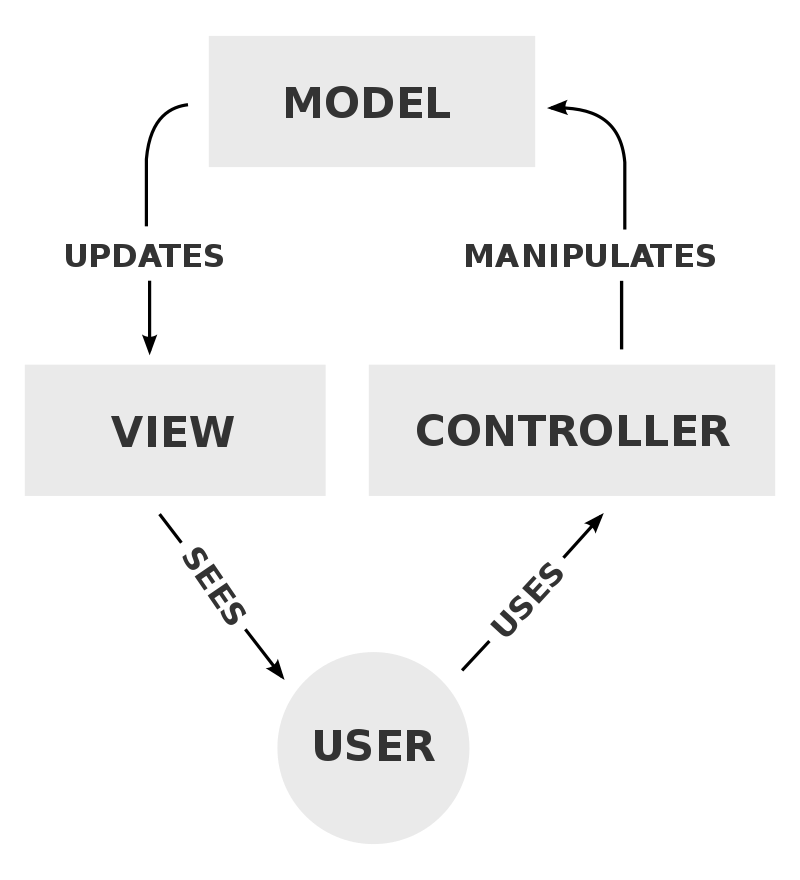
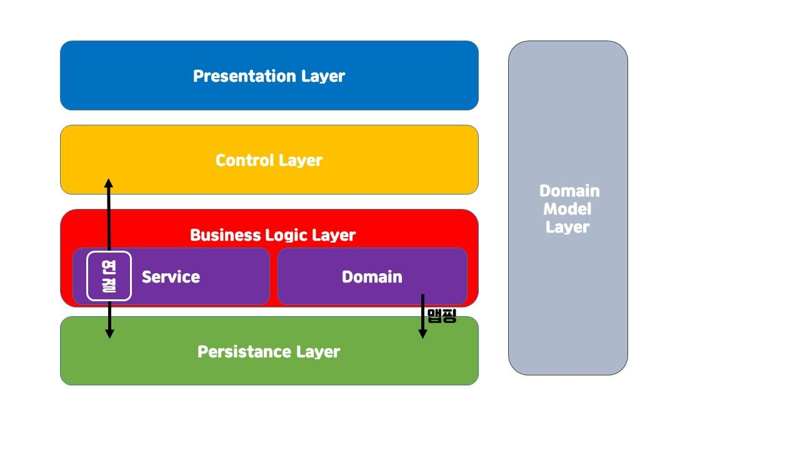
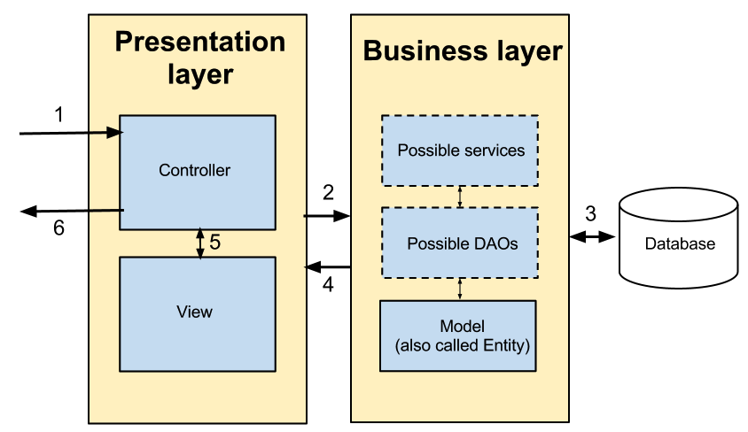

## MVC 패턴이란?

- 애플리케이션을 세가지 역할 **(모델 - 뷰 - 컨트롤러)** 로 분리한 소프트웨어 디자인 패턴입니다

| 용어 | 설명 |
| --- | --- |
| Model | 데이터와 관련된 부분 |
| View | 사용자한테 보여지는 부분 |
| Controller | Model과 View를 이어주는 부분 |

<br>

## MVC 흐름

1. 사용자가 애플리케이션을 통해 필요한 기능을 컨트롤러에 요청합니다
   - (Client → Controller)
2. 컨트롤러는 필요한 데이터를 갖고 있는 알맞은 모델에게 비지니스 수행을 맡긴 후 데이터를 받아옵니다
   - (Controller → Model)
   - (Controller ← Model)
3. 컨트롤러는 사용자에게 보여줄 뷰를 선택합니다
   - (Controller → View)
   - (Controller ← View)
4. 사용자에게 결과 화면을 출력해줍니다
   - (Controller → Client)




<br>

## MVC 패턴을 왜 사용할까요?

- 계층 간, 즉 사용자가 실제 사용하는 인터페이스(시각적 요소)와 내부 비지니스 로직을 분리하여 서로 영향 없이 쉽게 고칠 수 있습니다
    - 모듈의 독립성 = 낮은 결합도 + 높은 응집도
- 코드 및 구성 요소들을 재사용하여 중복 코딩을 지양할 수 있으며, 확장에 유리합니다

<br>

## MVC 패턴은 어떻게 사용해야되나요?

**아래 5가지의 규칙을 지키면 자연스럽게 MVC 패턴을 지키게 됩니다**

1. Model은 Controller와 View에 의존하지 않아야 합니다
    - `Model 내부에 Controller와 View에 관련된 코드가 있으면 안됩니다`
2. View는 Model에만 의존해야 하고, Controller에는 의존하면 안됩니다
    - `View 내부에 Model 코드만 있을 수 있고, Controller의 코드가 있으면 안됩니다`
3. View가 Model로부터 데이터를 받을 때는, 사용자마다 다르게 보여주어야 하는 데이터에 대해서만 받아야 합니다
    - `모든 유저에게 동일한 데이터라면 Model이 아닌 View 자체에서 갖고 있어야 합니다`
4. Controller는 Model과 View에 의존해도 됩니다
    - `Controller 내부에는 Model과 View의 코드가 있을 수 있습니다`
    - Controller는 Model과 View의 중개자 역할을 하며 전체 로직을 구성하기 때문입니다
5. View가 Model로부터 데이터를 받을 때, 반드시 Controller에서 받아야 합니다


<br>

## 5-Layer

#### 단순히 MVC 패턴만을 사용한다면 서비스가 대폭 확장될 시 Controller에 과도한 업무가 주어지며, Controller 내 중복 로직이 발생하게 됩니다 (단일책임 원칙 위반)
#### 따라서 각 역할에 맞게 5가지의 계층으로 나눠집니다
1. 프레젠테이션 계층 (Presentation layer)
2. 제어 계층 (Control Layer)
3. 비지니스 로직 계층 (Business Logic Layer)
4. 퍼시스턴스 계층 (Persistence Layer)
5. 도메인 모델 계층 (Domain Model Layer)




### 1. 프레젠테이션(Presentation) 계층

- UI 및 Client의 요청, 응답을 처리를 담당
- JSP 및 React, App 등 템플릿 혹은 정적, 동적 콘텐츠 같은 뷰 관련 콘텐츠가 이 계층에 속함
- 스프링의 Controller가 이 계층에 속함

### 2. 제어 계층 (Control Layer)

- 보통 제어 계층은 프레젠테이션(Presentation) 계층에 포함

### 3-1. 서비스(Service) 계층

- 비지니스 계층에 대한 퍼사드 역할
    - 퍼사드란? → [https://leeheefull.tistory.com/13](https://leeheefull.tistory.com/13)
- 프레젠테이션 ↔ 서비스 ↔ 비지니스(Domain)
    - 비지니스 요구사항을 이해하고 프레젠테이션 계층에 올바른 데이터를 제공
    - 프레젠테이션 계층에서 서비스 계층으로 들어온 데이터를 비지니스 객체에 매핑
    - 비지니스 계층의 함수를 호출
- 해당 계층에서 Transaction 작업을 수행
- 스프링의 Service가 이 계층에 속함

### 3-2. 비지니스(Domain) 계층

- 모든 핵심 비지니스 로직이 존재
- 데이터 계층과 액세스

```markdown
💡 예시를 들어보자

배달의 민족에서 신전떡볶이를 주문해보자
신전 떡볶이 주문이 이루어지고 사장님이 수락을 누를 시 아마 4가지가 발동될 것이다. (내 예상이다)

1. 사용자가 주문한 메뉴 내역 화면
2. 사용자에게 요리 시작 알람
3. 미리 설정해 놓은 예상 조리시간 반환
4. 배달 라이더들에게 배달건 요청 알람

서비스 계층에서 필요한 비지니스 로직은 4개와 같다. (세부적인건 더 많겠지만 일단 요약!!)
1, 2, 3, 4가 각각의 또 다른 서비스 이거나 비지니스 일것이다.

즉 '주문 수락'이라는 서비스에 4가지에 비지니스를 모아놓은 것이라고 생각하면 될 것 같다
이게 서비스와 비지니스의 차이이다!
```

### 4. 데이터 처리(Persistence) 계층

- 데이터 베이스에 접근하는 계층 (CRUD)
- 스프링의 Repository가 이 계층에 속함
- DAO, DTO, VO로 나눠지는 이 부분은 따로 내용을 정리해볼까 한다



<br>

## 유효성 검증

`요청이 들어왔을때 어느 계층에서 각각의 적절한 유효성 검증을 할 수 있을지 알아보겠습니다`

### View (프레젠테이션 계층)

- 요청에 들어온 데이터에 대한 간단한 검증을 해주자
    - 비어있는값, 적절하지 않은 타입 등

### Controller (프레젠테이션 계층)

- 파라미터 존재 유무 검증 (@PathVariable, @RequestBody)
- 프론트엔드 측, 백엔드측 양쪽에서 더블체크를 해주는 것이 좋다

### Model (데이터 처리 계층)

- 데이터 검증 (@Valid)
- 로직에 대한 검증

<br>

## MVC 패턴의 대안은 무엇일까요?

`해당 내용은 본 주제와는 벗어나므로 자세한 내용은 다음에 정리해볼까 합니다`

| 패턴 | 특징 |
| --- | --- |
| MVC | 컨트롤러와 뷰의 강한 결합 |
| MVP | Presenter를 사용하여 뷰의 인터페이스를 주입 받음 |
| MVVM | View가 ViewModel을 구독 |


<br>

### Reference
- 우아한 Tech 10분 테코톡
    - [제리의 MVC 패턴](https://youtu.be/ogaXW6KPc8I)
    - [해리&션의 MVC 패턴](https://youtu.be/uoVNJkyXX0I)
    - [범블비의 MVC Pattern](https://youtu.be/es1ckjHOzTI)
- [MVC Layering Architecture](https://umbum.dev/1066)
- [Layered Architecture 간단히 살펴보기](https://velog.io/@ljinsk3/%EB%A0%88%EC%9D%B4%EC%96%B4-%EC%95%84%ED%82%A4%ED%85%8D%EC%B2%98)