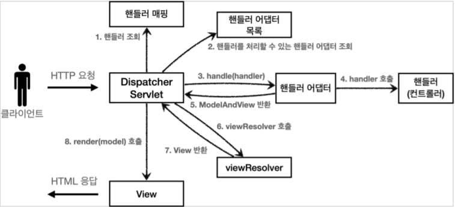

## 스프링 MVC 프레임워크 설계 구조



### @Controller

1. 클라이언트 요청
2. Dispatcher Servlet에서 요청된 URL과 매핑되는 핸들러 조회
3. Handler Adapter에서 매핑된 핸들러의 객체의 메서드(컨트롤러)를 선택 후 요청 실행
4. Controller ↔ Service ↔ Repository ↔ DB 순으로 요청처리

---

5. Handler Adapter에 ModelAndView 반환
6. ViewResolver를 통해 적합한 View(JSP)를 선택
    - 보통 반환 타입이 void 인 경우나 혹은 단순한 단일 모델 Object이면 RequestToViewNameResolver 전략을 통해 자동 생성되는 뷰 이름을 사용한다
    - 단, URL과 뷰 이름을 일관되게 통일해야 함
    - 뷰 리졸버에서 prefix와 suffix를 설정하면 편리하다
    - 뷰 리졸버를 따로 빈으로 등록하지 않은 상태이면 디폴트인 InternalResourceViewResolver를 직접 빈으로 등록하여 prefix, suffix 프러퍼티를 설정
7. 선택된 View를 클라이언트에 반환 (text/html)

### @RestController (@Controller + @ResponseBody)

1. 클라이언트 요청
2. Dispatcher Servlet에서 요청된 URL과 매핑되는 핸들러 조회
3. Handler Adapter에서 매핑된 핸들러의 객체의 메서드(컨트롤러)를 선택 후 요청 실행
4. Controller ↔ Service ↔ Repository ↔ DB 순으로 요청처리

---

5. Handler Adapter에 ResponseEntity 반환
6. Message Converter를 통해 알맞은 응답 형태로 변환하여 HTTP 응답 메시지 body로 전환
    - 메시지 컨버터로 변환 후 HttpServletResponse의 출력 스트림에 넣어버린다
7. HTTP Response 반환 (application/json, xml, text/plain)

<br>

```markdown
💡 생각정리

@Controller 와 @RestController의 흐름은 4번까지는 동일합니다
하지만 컨트롤러(핸들러)의 요청 반환 이후의 흐름이 다른 것을 볼 수 있습니다

반환 시점에서 @Controller는 ViewResolver를 호출하는 반면
@RestController는 바로 메시지 컨버터가 동작되어 메시지 변환을 진행 후 반환합니다
```

<br>

## Why or How 🧐❓

### 1. Handler 조회는 어떤 걸 기준으로 하나요?

- Handler 조회를 통한 매핑은 요청이 들어온 URL 정보를 가지고 진행합니다

### 2. Message Converter는 어떤 기준으로 알맞은 형태로 변환할까요?

- 요청 타입 또는 오브젝트의 타입에 따라 선택됩니다.
- 사용할 메시지 컨버터는 AnnotationMethodHandlerAdapter을 통해 등록합니다 (default 컨버터 메시지는 4개이다)
- 메서드 상단에 @ResponseBody가 되어 있을 경우 리턴 타입에 맞는 메시지 컨버터를 선택한 후 리턴값을 통째로 메시지 변환 후 반환합니다
- 또한 요청일 경우에 파라미터에 @RequestBody를 입력 시 파라미터 타입에 맞는 메시지 컨버터를 선택 후 **HTTP 요청 body** 통째로 메시지로 변환하여 파라미터에 바인딩합니다

### 3. Filter와 Interceptor는 어느 시점에서 적용되는 걸까요?

`📢 해당 관련 글은 다음 포스팅에서 더욱 자세하게 알아보겠습니다`

- Filter
    - 디스패처 서블릿에 요청이 전달되기 전/후 시점입니다
    - 따라서 스프링의 가장 앞단에 존재하는 프론트 컨트롤러이므로 웹 컨테이너에서 동작하므로  스프링 범위 밖입니다
    - url 패턴에 맞는 모든 요청에 대해 부가 작업을 처리할 수 있는 기능을 제공합니다
    - 주로 공통된 보안 및 인증/인가 관련 작업이나 모든 요청에 대한 로깅이 필요할 때 활용합니다
- Interceptor
    - 디스패처 서블릿이 컨트롤러를 호출하기 전/후 시점입니다
    - 스프링 컨텍스트에서 동작하므로 스프링이 관리합니다
    - 요청과 응답을 참조하거나 가공할 수 있는 기능을 제공합니다
    - 주로 Controller로 넘겨주는 데이터의 가공을 하거나 API 호출에 대한 로깅이 필요할 때 활용합니다.

<br>

### Reference

- [토비의 스프링 3.1 vol. 2](https://book.naver.com/bookdb/book_detail.nhn?bid=7006515) - 436p, 507p, 509p, 608p
- [https://joont92.github.io/spring/MessageConverter/](https://joont92.github.io/spring/MessageConverter/)
- [https://mangkyu.tistory.com/m/49](https://mangkyu.tistory.com/m/49)
- [https://mangkyu.tistory.com/173](https://mangkyu.tistory.com/173)