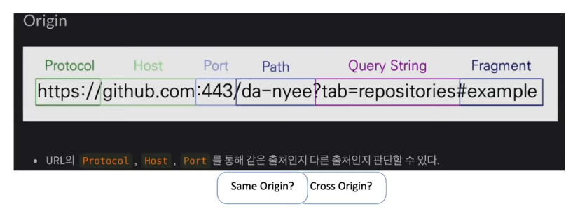

## CORS Error는 왜 발생할까?

- 웹 개발을 하다보면 아래와 같은 에러를 심심치 않게 마주칠 수 있습니다
    - `Access to XMLHttpRequest at '주소A' from origin '주소B' has been blocked by CORS policy: No 'Access-Control-Allow-Origin' header is present on the requested resource.`

        

- CORS Error는 동일 출처 정책(SOP: Same-Origin Policy)에 의해서 **브라우저가 발생**시키는 에러입니다
    - `CORS는 SOP를 피하기(허용) 위한 수단이다!`

<br>

## SOP(Same-Origin Policy: 동일 출처 정책) 란 무엇일까?

- 대부분의 웹 브라우저는 SOP라는 보안 정책을 준수합니다
- SOP는 한 Origin(내가 현재 접속해 있는 사이트)에서 로드된 문서나 스크립트가 다른 Origin(다른 사이트)에서 가져온 리소스와 상호 작용하는 것을 제한하는 보안 방식입니다
- 말 그대로 `같은 출처에서만 리소스를 공유`할 수 있다 라는 규칙을 가진 정책입니다

  

  이미지 출처: [https://evan-moon.github.io/2020/05/21/about-cors/](https://evan-moon.github.io/2020/05/21/about-cors/)

<br>

### SOP는 왜 만들어졌을까?

- 웹에서 돌아가는 클라이언트 애플리케이션은 사용자의 공격에 너무나도 취약합니다
- 당장 F12 개발자 도구만 켜도 소스코드가 적나라하게 드러나며, 어떤 서버와 어떻게 통신 하는지에 대한 각종 정보들을 무리 없이 열람할 수 있습니다
- 만약 SOP 정책이 없다면 서로 다른 두 애플리케이션이 마음대로 소통할 수 있는 환경이 됩니다
- 이 말은 즉슨 다른 출처의 애플리케이션에서 악의적인 목적으로 사용자의 정보를 탈취하기가 너무나도 쉬워진다는 겁니다
- 따라서 같은 출처에서만 리소스를 공유할 수 있다는 규칙(SOP)을 default로 하여 어느정도의 보안적인 이점을 가져갈 수 있습니다

<br>

## 출처(Origin) 란?

- 위 설명에서 출처(Origin)라는 말이 계속 나오고 있습니다
- 출처는 Protocol + Host+ Port 의 쌍을 말합니다
- 즉 URL의 맨 앞 3개의 요소인 프로토콜, 호스트, 포트번호가 동일하다면 같은 출처라고 판단하여 SOP(동일 출처 정책)에 가로막히지 않습니다

| 용어 | 조건 |
| --- | --- |
| Same Origin (동일 출처) | Protocol, Host, Port 모두 일치 |
| Cross Origin (다른 출처, 교차 출처) | Protocol, Host, Port 중 하나라도 다를 시 |
    

    
이미지 출처: [[10분 테코톡] 나붐의 CORS](https://youtu.be/-2TgkKYmJt4?t=62)


<br>

#### 참고

- Internet Explorer에서는 SOP(동일 출처 정책) 기준에 두가지 예외사항이 있습니다
    - `IE는 거의 사용되지 않는 브라우저이므로 해당 예외사항은 알고만 있으면 될 것 같습니다`
1. 신뢰할 수 있는 사이트
    - 양쪽 도메인 모두 “높음” 단계의 보안 수준을 가지고 있을 경우 두 출처가 다르더라도 SOP에 가로막히지 않습니다
2. 포트
    - 같은 출처라고 판단하는 기준에서 포트를 포함하지 않습니다
    - 따라서 IE에서는 Protocol + Host만 동일하다면 같은 출처로 판단합니다

<br>

## CORS(Cross-Origin Resource Sharing: 교차 출처 리소스 공유) 란?

- 시대가 발전하면서 많은 애플리케이션들은 내부적으로만 동작하기 보다 다양한 다른 애플리케이션과 상호 작용하면서 사용자들에게 더욱 편리한 서비스를 제공합니다
- 즉 서로 다른 출처끼리 리소스를 공유해야 하는 상황이 발생합니다
- CORS란 추가 HTTP 헤더를 사용하여, 한 출처에서 실행 중인 웹 애플리케이션이 `다른 출처의 선택한 자원에 접근할 수 있는 권한을 부여`하도록 브라우저에 알려주는 체제입니다
- 즉 정해진 헤더를 통해 다른 출처의 리소스 자원을 공유할 수 있는 방법입니다

<br>

## CORS는 어떻게 동작할까?

- 다시 상기하자면 CORS Error는 브라우저에서 발생시키는 오류입니다
- 기본적인 CORS Error의 발생 과정은 다음과 같습니다
    1. HTTP 요청을 하면 브라우저는 요청 헤더에 `Origin`이라는 필드를 추가합니다
       - `Origin` : 요청을 보낸 출처 (ex. https://github.com/giibeom)
    2. 이후 서버는 응답을 내려줄 때 응답 헤더에 `access-control-allow-origin` 라는 필드를 내려줍니다
        - `access-control-allow-origin` : 해당 리소스를 접근할 수 있게 허용된 출처 (ex. **access-control-allow-origin:** *)
        - `*`은 모든 출처를 허용한다는 와일드카드 입니다
    3. 브라우저는 응답을 반환하기 전에 Origin과 access-control-allow-origin 값을 비교하여 응답의 유효성을 검증합니다
- 즉 요청에 대한 응답을 서버가 내려준 후 `브라우저 단에서 판단하여 응답을 그대로 반환할지 버릴지 판단`하는 것입니다

<br>

## CORS 접근제어 시나리오

- 위의 예시같이 브라우저에서는 요청과 응답을 통해 본 요청이 유효한 지 판단하는 메커니즘을 갖고 있습니다
- 해당 메커니즘, 즉 CORS의 접근제어 시나리오는 대표적으로 3가지의 시나리오로 나뉘어집니다
    1. 프리플라이트 요청 (Preflight Request)
    2. 단순 요청 (Simple Request)
    3. 인증정보 포함 요청 (Credentialed Request)

<br>

### 1. 프리플라이트 요청 (Preflight Request)

- 프리플라이트 방식은 본 요청 전 사전 작업으로 예비 요청을 먼저 서버에 보내는 방식입니다
- 예비 요청을 보냄으로써 현재 출처가 자원을 요청할 서버에 리소스를 요청할 수 있는지를 판단하여 이 요청이 유효한지를 확인합니다
    - 예비 요청을 프리플라이트(Preflight)라고 부르는 것이며 HTTP 메서드 중 `OPTIONS` 라는 메서드를 사용합니다
- 예비 요청을 통해 본 요청이 유효하다고 판단되면 실제 본 요청을 전송합니다

<br>

#### Preflight 동작 흐름

1. 클라이언트에서 다른 출처에 리소스 자원을 요청합니다
2. 브라우저에서는 본 요청을 잠시 대기 시켜놓고 예비 요청을 보낼 준비를 합니다
3. 예비 요청은 OPTIONS 메서드를 사용하며 요청 헤더에는 아래와 같은 정보를 담습니다
    - `Origin` : 요청 출처
    - `Access-Control-Request-Method` : 실제 요청의 메서드
    - `Access-Control-Request-Headers` : 실제 요청의 추가 헤더
4. 예비 요청을 받은 서버는 현재 자신이 어떤 것들을 허용하고 있는지에 대한 정보들을 응답 헤더를 통해 반환합니다
    - 예비 요청(Preflight Request)의 응답은 코드는 200, 바디는 비어있는 것이 좋습니다
    - `Access-Control-Allow-Origin` : 서버 측 허가 출처
    - `Access-Control-Allow-Methods` : 서버 측 허가 메서드
    - `Access-Control-Allow-Headers` : 서버 측 허가 헤더
    - `Access-Control-Max-Age` : Preflight 응답 캐시 기간
        - 프리플라이트(Preflight Request) 방식은 매 요청마다 2개의 요청을 보내는 셈이 됩니다
        - 따라서 `Access-Control-Max-Age`는 효율적으로 리소스를 관리해주기 위해 필요한 값입니다
        - 브라우저는 캐싱을 하여 캐시 기간 내에는 해당 출처에 대한 모든 요청에 대해서 Preflight Request를 진행하지 않고 바로 본 요청을 진행합니다
          
    

    이미지 출처: [https://evan-moon.github.io/2020/05/21/about-cors/#preflight-request](https://evan-moon.github.io/2020/05/21/about-cors/#preflight-request)

<br>


#### 브라우저는 리소스 효율 때문에 캐시까지 사용해가며 예비 요청(Preflight Request)을 하는 이유가 뭘까?

- CORS spec이 생기기 이전에 만들어진 서버는 브라우저의 SOP 보안 정책으로 인해 같은 출처에서만 요청이 가능하다는 가정하에 개발되었습니다
- 이 말은 즉슨 이전에 만들어진 서버들은 Cross-Origin(교차 출처, 다른 출처)에서의 접근에 대한 보안 메커니즘이 존재하지 않습니다
- 만약 Preflight가 없고 CORS에 대응도 안되는 서버일 경우에는 다음과 같은 문제가 있을 수 있습니다
    1. 다른 출처에서 DB의 DELETE가 발생하는 요청을 합니다
    2. CORS의 설정이 없기 때문에 서버 측 허가 출처인 `Access-Control-Allow-Origin` 이 존재하지 않습니다
    3. 하지만 Preflight가 없이 다이렉트로 서버에 꽂힌 요청은 서버에서 모든 동작이 완료 된 후, 결과 반환 직전에 브라우저에서 CORS Error를 뱉습니다
    4. 뒤늦게 브라우저는 CORS Error를 뱉지만 실제 서버에서는 DB 삭제가 진행되었습니다
- 따라서 이러한 상황을 방지하고자 CORS 설정이 안되어 있는 서버들을 보호하기 위해 CORS spec에 예비 요청(preflight request)을 포함시켰다고 합니다

<br>

#### 예시

- 아래는 www.google.com 에서 제 블로그로 리소스 요청을 전송하였고, 브라우저가 자동으로 진행한 예비 요청(Preflight Request)의 예시입니다
- 예비요청 응답 코드가 200으로 떨어지는 이유는 CORS가 발생하는 시점은 이 다음에 일어나고 실제 예비 요청 자체는 성공하기 때문입니다
- 예시 내 응답 헤더에 있는 `Access-Control-Allow-Origin`과 요청 헤더에 있는 `Origin`이 서로 다르기 때문에 아래 콘솔창과 같이 CORS 에러가 발생하는 것을 볼 수 있습니다

  

<br>

### 2. 단순 요청 (Simple Request)

- 심플 리퀘스트 방식은 Preflight 요청 없이 바로 다이렉트로 서버에 요청을 꽂아넣는 방식입니다
    - 위에서 간단하게 설명했던 CORS Error의 발생 과정과 동일하다고 보면 될 것 같습니다
- 리소스 자원을 서버로 바로 요청할 경우 서버는 요청 데이터과 함께 `Access-Control-Allow-Origin` 값을 반환해줍니다
- 브라우저에서는 응답을 반환하기 전 응답 데이터에 있는 `Access-Control-Allow-Origin` 와 Request 시 보냈던 `Origin`을 판별하여 응답의 여부를 결정합니다
- 하지만 단순 요청 (Simple Request) 방식이 일어나는 상황은 아래와 같은 조건을 **“모두”** 충족할 때 일어납니다
    1. 요청의 메서드는 `GET`, `HEAD`, `POST` 중 하나여야 합니다
    2. Content-Type 에서는 3가지만 허용됩니다
        - application/x-www-form-urlencoded
        - multipart/form-data
        - text/plain
    3. 요청 헤더에는 해당 값들만 허용됩니다
        - Accept, Accept-Language, Content-Language, Content-Type, DPR, Downlink, Save-Data, Viewport-Width, Width
- 사실상 3가지의 조건이 모두 충족하기란 쉽지 않습니다 (2, 3 때문에)
    - 2번 같은 경우는 주로 사용되는 Content-Type은 `application/json`이 많이 사용됩니다
    - 3번 같은 경우에는 보통 최근의 토큰 인증 방식으로 헤더에 **`Authorization`** 를 많이 세팅합니다

<br>

### 3. 인증정보를 포함한 요청 (Credentialed Request)

- Credentialed Request 방식은 인증된 요청을 사용하는 방식입니다
- 즉 다른 출처의 리소스 자원을 요청할 때 인증과 관련된 정보(쿠키)를 헤더에 포함시키고 싶을 때 사용하는 방식입니다
- 해당 방식은 클라이언트와 서버 양쪽에서의 설정이 필요합니다
- 클라이언트
    - `credentials` : 요청에 인증과 관련된 정보를 담을 수 있게 하는 옵션

    | 옵션 값 | 동작 설명 |
    | --- | --- |
    | same-origin (기본 값) | 같은 출처 간 요청에만 인증 정보를 담을 수 있습니다 |
    | include | 모든 요청에 인증 정보를 담을 수 있습니다 |
    | omit | 모든 요청에 인증 정보를 담지 않습니다 |

    - 만약 `credentials` 옵션에서 `omit`을 제외한 나머지 옵션을 설정하게 되면 브라우저는 기존에 확인했던 `Access-Control-Allow-Origin` 이외에도 추가적인 검사를 진행합니다
- 서버
    - 클라이언트에서 `credentials` 설정을 하였다면 두가지의 설정을 하여야 합니다
    1. 응답 헤더에 `Access-Control-Allow-Credentials: true` 를 반환해야 합니다
    2. 모든 출처를 허가하겠다는 **`Access-Control-Allow-Origin: *`**을 설정할 수 없습니다

<br>

## CORS Error를 해결하는 방법은 뭘까?

- 지금까지는 CORS에 대한 전반적인 개념과 CORS의 동작 방식 및 시나리오에 대해서 알아봤습니다
- 이젠 CORS를 잘 사용하여 합법적(?)으로 다른 출처의 리소스 자원을 사용하는 방법에 대해서 알아보겠습니다
- CORS Error를 해결하는 방법은 크게 3가지가 있습니다
    1. 서버에서 **`Access-Control-Allow-Origin`** 설정해주기 (정석)
    2. 프론트 프록시 서버 설정을 변경해주기
    3. CORS 기능 끄기 (로컬 개발 시 급할때만 쓰자!)

<br>

### 1. 서버에서 Access-Control-Allow-Origin 설정해주기

- Spring 기준으로 서버에서 CORS 관련 설정하는 방법은 크게 두가지가 존재합니다
    1. @Configuration 설정 방법
    2. @CrossOrigin 설정방법

<br>

#### 1. @Configuration 설정 방법

- 해당 방식은 Configuration 어노테이션을 통해 전역으로 처리하는 방법입니다

    ```java
    // 전역적으로 CORS 설정을 할 수 있는 방법
    @Configuration
    public class CorsFilter implements WebMvcConfigurer { // WebMvcConfigurer 구현
    		@Override
        public void addCorsMappings(CorsRegistry registry) {
            registry.addMapping("/api") // 적용할 path 패턴을 입력
                    .allowedOrigins("http://localhost:8081") // 허가할 출처들을 기입
                    .allowedMethods(                // 허가할 메서드를 기입
                            HttpMethod.GET.name,
                            HttpMethod.POST.name,
                            HttpMethod.PUT.name,
                            HttpMethod.DELETE.name
                    );
        }
    }
    ```

<br>

#### 2. @CrossOrigin 설정방법

- 해당 방식은 모든 도메인이 아닌 특정 도메인에서만 허용할 때 사용하는 방식입니다
- CORS 설정을 적용시킬 Class 혹은 Method 위에 @CrossOrigin 어노테이션을 붙이면 됩니다

    ```java
    @RestController
    @RequiredArgsConstructor
    @RequestMapping("/api")
    @CrossOrigin(origins = {"http://localhost:8080", "http://localhost:9090"}, allowCredentials = "true")
    public class MemberController {
    
        @GetMapping("/hello")
        public String Hello() {
            return "hello";
        }
    }
    ```

- 하지만 이 방식은 각각의 Class 혹은 Method 마다 선언해줘야 하므로 보통은 1번 방식을 많이 사용합니다

<br>

### 2. 프론트 프록시 서버에서 설정해주기

- 프론트 프록시 서버에서 백엔드 서버간의 출처를 조율해줍니다
- 브라우저와 프론트 프록시 서버는 출처가 동일하므로 CORS Error가 발생하지 않습니다

  

  이미지 출처: [[10분 테코톡] 나붐의 CORS](https://youtu.be/-2TgkKYmJt4?t=62)

<br>

### 3. CORS 기능 끄기 (로컬 개발 시 급할때만 쓰자!)

- 보안 때문에 프록시와 같은 외부 서버도 못 띄우는 상황이거나 서버의 설정을 기다릴 수 없이 당장 핫픽스 같은 개발을 진행해야 될 때 사용하면 유용합니다
- `근본적인 해결이 될 때까지 임시적으로 사용하는 방법입니다!  → 광고 아닙니다.....`
- 방법은 아래와 같습니다
    1. Chrome 웹스토어에 들어갑니다 → [https://chrome.google.com/webstore](https://chrome.google.com/webstore)
    2. CORS를 검색합니다
    3. CORS를 허용하게끔 도와주는 확장 프로그램을 다운받습니다
        - 아래는 현재 제가 사용중인 프로그램입니다

            

<br>

#### 읽어보면 좋을 내용들

- 본 글과는 별개로 CORS의 전반적인 역사와 근본적인 내용이 담긴 블로그 글이 있길래 링크를 남겨 봅니다 → [CORS에서 이기는 방법](https://ui.toast.com/weekly-pick/ko_20211110)

<br>
<br>

### Reference

- [얄코 - 웹개발 짜증유발자! CORS가 뭔가요?](https://youtu.be/bW31xiNB8Nc)
- [[10분 테코톡] 나붐의 CORS](https://youtu.be/-2TgkKYmJt4?t=62)
- [https://developer.mozilla.org/ko/docs/Web/Security/Same-origin_policy](https://developer.mozilla.org/ko/docs/Web/Security/Same-origin_policy)
- [https://developer.mozilla.org/ko/docs/Web/HTTP/CORS](https://developer.mozilla.org/ko/docs/Web/HTTP/CORS)
- [https://evan-moon.github.io/2020/05/21/about-cors/#preflight-request](https://evan-moon.github.io/2020/05/21/about-cors/#preflight-request)