# OSI 7 Layer

> 글 작성 전에 본 내용은 [[10분 테코톡] 🔮 히히의 OSI 7 Layer](https://youtu.be/1pfTxp25MA8) 해당 영상의 내용을 메인으로 설정하여 공부하였음을 참고 드립니다 <br> (대부분의 시각적 자료는 해당 영상 자료)

<br>

## OSI 7 계층이란?

- OSI 7계층은 네트워크 통신을 표준화한 모델로, 통신 시스템을 7단계로 나눈 것입니다
- OSI 7계층과 TCP/IP 5계층 모델에서의 각 계층은 `하위 계층의 기능을 이용`하고, `상위 계층에게 기능을 제공`합니다
    - `ex) HTTP 프롵토콜은 TCP 프로토콜과 IP 프로토콜을 이용해서 작동`
    - `OSI 7계층` 모델이 실무적으로 이용하기에 복잡한 탓에, 실제 인터넷에서는 이를 `단순화`한 `TCP/IP 5계층`을 사용합니다
    - 아래 그림과 같이 OSI 7계층에서 `소프트웨어적으로 구현되어 있는 5~7 계층`을 묶어서 합쳐 놓은 것이 TCP/IP 5계층이라고 생각하면 됩니다    
    
        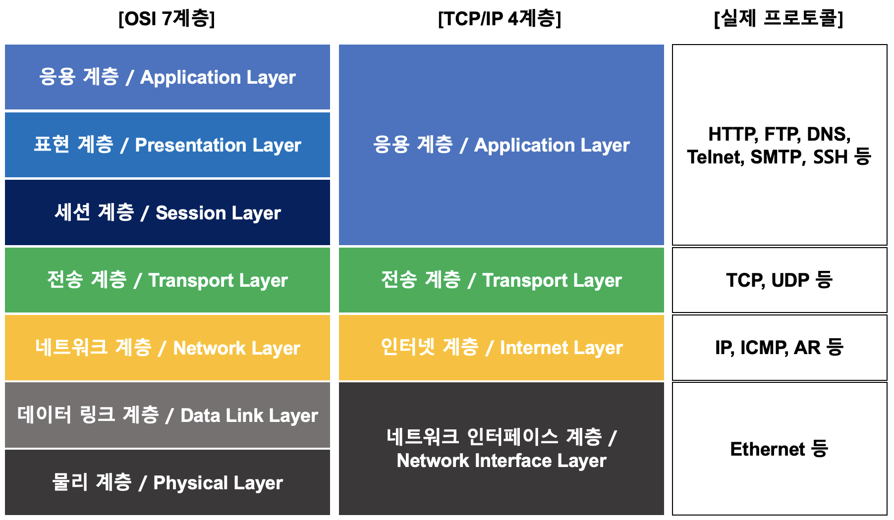
        
        이미지 출처: [https://www.inflearn.com/course/개발자-전공면접-cs-완전정복](https://www.inflearn.com/course/%EA%B0%9C%EB%B0%9C%EC%9E%90-%EC%A0%84%EA%B3%B5%EB%A9%B4%EC%A0%91-cs-%EC%99%84%EC%A0%84%EC%A0%95%EB%B3%B5)

    > 위의 예시는 TCP/IP 예전버전인 4계층이지만 최근 버전은 `네트워크 인터페이스 계층`이 `2계층 데이터링크 계층`과 `1계층 물리 계층`으로 나눠져 `TCP/IP 5계층`으로 변경되었습니다
- 위 사진에서 알 수 있듯이 `상위 계층`의 프로토콜일수록 `사용자들이 직접 사용`하는 `소프트웨어`적인 계층이고, `하위 계층`의 프로토콜일수록 `기계 간에 사용`되는 `하드웨어`적인 계층입니다

<br>

## 계층을 나눈 이유는 뭘까?

- OSI 7계층은 `각 계층간 상호 작동하는 방식`을 정해놓았으며, `각 계층은 독립`되어 있으므로 `계층(단계)별로 파악이 가능`합니다
- 이 말은 즉슨 어떠한 문제가 발생했을 시 모든 계층(단계)의 하드웨어 장비 및 소프트웨어를 건드리기 보다는, 이상이 생긴 계층(단계)만 파악하여 고친다면 보다 빠른 해결이 가능하다는 장점이 있습니다

<br>

## 네트워크 통신의 동작 흐름

- 두 사용자 간의 네트워크 통신이 발생할 때, `전송`하는 쪽에서는 `데이터의 캡슐화`를 통해 정보를 전달하고, `받는`쪽에서는 `데이터 역캡슐화`를 통해 정보를 받습니다
    - `캡슐화`: 데이터를 전송할 때는 전송에 필요한 프로토콜 정보들을 각각의 담당자(계층)들이 바구니(데이터 패킷)에 담아서 하위 계층으로 계속 전달합니다
        - **💡 ※ 각 계층마다 `각각의 프로토콜의 정보`를 `Header에 포함`시킵니다 ※ 💡**
    - 맨 하위계층(`물리 계층`)까지 데이터가 전달이 되면 `binary 데이터로 변환되어 전송`합니다
    - `역캡슐화`: 데이터를 받을 때는 각각의 담당자(계층)들이 바구니(데이터 패킷)를 역순으로 하나씩 까면서 상위 계층으로 전달합니다

  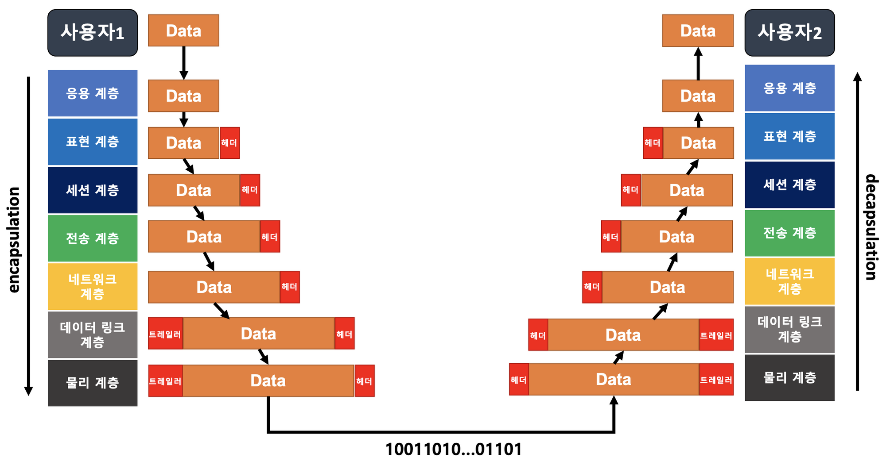

  이미지 출처: [https://www.inflearn.com/course/개발자-전공면접-cs-완전정복](https://www.inflearn.com/course/%EA%B0%9C%EB%B0%9C%EC%9E%90-%EC%A0%84%EA%B3%B5%EB%A9%B4%EC%A0%91-cs-%EC%99%84%EC%A0%84%EC%A0%95%EB%B3%B5)

<br>

## 계층 단계별 역할

> 자 이제 1계층부터 7계층까지 오름차순으로 각 계층에 대해서 알아보겠습니다! <br> 보통 1계층 ~ 4계층은 주 기능이 데이터를 전달하는 것이라면, 5계층 ~ 7계층의 주 기능은 프로세스들에 의해 데이터를 만드는 작업입니다 <br> 또한 1 ~ 3계층은 대부분 하드웨어 부분, 4계층은 하드웨어와 소프트웨어의 중간, 5~7계층은 소프트웨어 부분입니다

<br>

### 1. 물리 계층 (Physical Layer)

- 물리 계층은 `encoding`과 `decoding`을 통해 물리적으로 연결된 `두 대의 컴퓨터`가 0과 1의 나열을 주고받을 수 있게 해주는 모듈입니다
    - 통신 단위: `비트(Bit, 0 또는 1)`
    - `encoding`: 0과 1의 나열을 아날로그 신호로 바꾸어 전선으로 흘려보냅니다
    - `decoding`: 아날로그 신호가 들어오면 0과 1의 나열로 해석합니다

      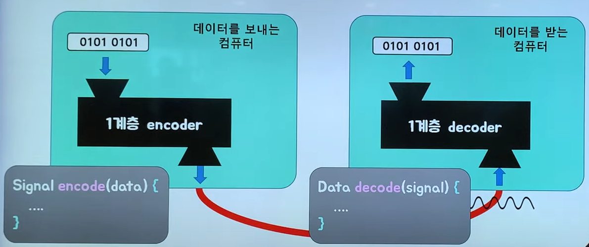

      이미지 출처: [[10분 테코톡] 🔮 히히의 OSI 7 Layer](https://youtu.be/1pfTxp25MA8?t=533)

- 1계층인 물리계층 모듈은 `하드웨어`적으로 구현되어 있습니다
    - PHY 칩에는 L1 기술이 구현되어 있습니다
    - 따라서 위 그림에서의 `encoder`와 `decoder`는 함수로 표현했으나 사실 `PHY 칩의 회로`를 통해 수행됩니다
        - `input을 받아서 output을 만드는 동작방식은 하드웨어나 소프트웨어나 동일하기 때문!`
- 사용되는 대표적인 장비로는 `통신 케이블`, `리피터`, `허브` 등이 있습니다

<br>

#### 리피터

- 전기적인 신호 세기를 증폭시켜 먼 거리에 있는 디바이스에 데이터를 전달해주는 역할을 하는 장비입니다

<br>

#### 허브 (L1 더미허브)

- 멀티포트 리피터라고 불립니다
    - 단순한 분배 중계기로 여러대의 디바이스에(멀티포트) 데이터를 전달하는(리피터) 역할을 하는 장비입니다
- `연결된 모든 장치`들에게 데이터를 전달하는 장치
    - 전송된 데이터 프레임이 모든 디바이스에게 일괄적으로 전부 전송하는 `플러딩`이 발생하므로 충돌 문제 및 보안 문제로 인해 최근에 잘 사용되지 않는 구시대 장비입니다 (스위치를 주로 사용)

<br>

### 2. 데이터 링크 계층 (Data-Link Layer)

- 같은 네트워크에 있는 `여러 대의 컴퓨터`들이 데이터를 주고받기 위해서 필요한 모듈입니다
    - 같은 네트워크란 아래 설명에 있는 `스위치` 하나에 대해 연결되어 있는 PC들을 말합니다

      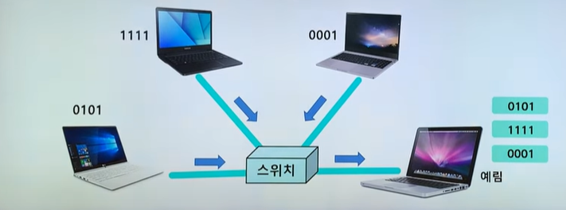

      이미지 출처: [[10분 테코톡] 🔮 히히의 OSI 7 Layer](https://youtu.be/1pfTxp25MA8?t=1166)

      <br>

      #### 스위치 (L2 스위치 허브)

        - 위의 `L1 더미허브`에서 문제였던 데이터 전송 시 모든 영역에 노드들(장치)에게 영향을 미치는 단점을 해결한 장비입니다
        - `MAC 주소`를 이용해 `원하는 장치`에만 데이터를 전달하는 장치
        - 소규모 네트워크 안에서 컴퓨터, 프린터, 서버 등 모든 디바이스를 서로 연결함으로써 리소스를 쉽게 공유할 수 있도록 도와주는 장비

        <br>

- Framing이라는 작업을 통해 Frame 단위의 데이터를 전송합니다
    - Framing: 데이터의 시작과 끝에 특정한 비트열을 붙여서 구분 (`L2의 데이터 캡슐화`)

      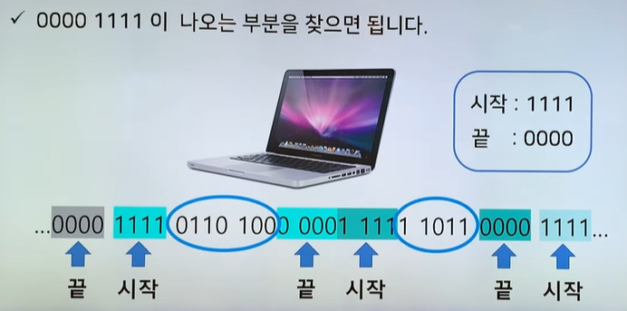

      이미지 출처: [[10분 테코톡] 🔮 히히의 OSI 7 Layer](https://youtu.be/1pfTxp25MA8?t=1122)

        <br>

      #### Frame?

        - 전송 프레임 내부에는 상위 계층에서 보낸 전송 데이터에 오류 확인을 위한 `체크섬`, `송수신 호스트의 주소`, 기타 프로토콜에서 사용하는 `제어 코드 등`의 정보를 포함합니다
            - 따라서 프레임을 전송받은 호스트는 체크섬 에러를 확인 후 에러 및 변형 등의 오류를 체크하며 에러 검출 시 재전송을 요구하여 복구 과정을 거칩니다
        - Frame은 `동일 네트워크 상`의 정보만 가지고 있는 데이터 컨테이너 입니다
            - 이것을 `페이로드`라고 합니다 (`페이로드`: 보내고자 하는 데이터 자체를 의미)

                ```markdown
                💡 택배를 예시로 들어보자
                
                페이로드 -> 물건
                페이로드가 아닌것 -> 송장, 박스, 뾱뾱이 같은 완충재 등의 부가적인 것
                ```

            - 즉 다른 네트워크에게 전송을 위한 부가적인 데이터들이 아닌 동일 네트워크 상에서의 `전달하고자 하는 데이터(페이로드)` + 구분자를 가지고 있는 것입니다

        <br>


- 따라서 데이터 링크계층은 `물리계층을 통해` 송수신되는 `정보의 오류와 흐름을 관리`하여 `안전한 정보의 전달을 수행`할 수 있도록 도와줍니다
- 데이터 링크 계층의 흐름은 아래의 예시와 같습니다
    - 전송 측: `데이터를 Framing`하여 1계층을 통해 인코딩 후 `아날로그 신호`로 전선을 타고 데이터를 전송
    - 수신 측: 1계층을 통해 디코딩을하고, Frame 데이터를 분석하여 상위 계층으로 전달

  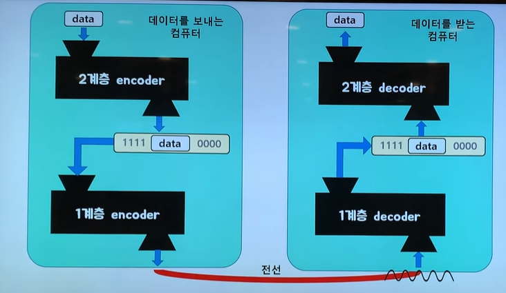

  이미지 출처: [[10분 테코톡] 🔮 히히의 OSI 7 Layer](https://youtu.be/1pfTxp25MA8?t=1266)

    #### 스위치는 목적지에 어떻게 전달할까?

    - 스위치에는 자신에게 연결된 디바이스들의 `MAC 주소`가 기록된 MAC 주소 테이블 (`ARP Table`)을 가지고 있습니다
    - L2 스위치가 프레임 목적지 주소를 ARP Table을 참조하여 해당 목적지가 어디인지 확인하여 전달합니다
      - 해당 스위치가 목적지 디바이스에 직접 연결되어 있다면 바로 완료
      - 또 다른 스위치로 연결되어 있다면, 그 연결 된 스위치의 ARP Table을 참조하여 전달하는 과정 반복


<br>

- 데이터링크 계층에서의 L2 기술은 `랜카드`에 구현되어 있습니다
- 따라서 2계층 모듈도 1계층 모듈처럼 `하드웨어`적으로 구현되어 있음을 알 수 있습니다

<br>

### 3. 네트워크 계층 (Network Layer)

> 수많은 네트워크들의 연결로 이루어지는 inter-network 속에서 어딘가에 있는 목적지 컴퓨터로 데이터를 전송하기 위해, IP 주소를 이용해서 길을 찾고 (routing), 자신 다음의 라우터에게 데이터를 넘겨주는 것 (forwarding)

- 아래 예시는 발신 측에서 전송한 데이터가 IP 패킷으로 만들어진 후 라우터 안에서 `decoding`과 `encoding`을 거친 후 `다음 라우터`로 전송되는 흐름입니다
    - 라우터는 IP 패킷을 까보고 해당 IP 주소를 가진  컴퓨터를 찾으며, 자기 네트워크에 없으면 패킷을 다시 포장해서 상위 라우터 또는 이웃 라우터로 전송(forwarding) 합니다

  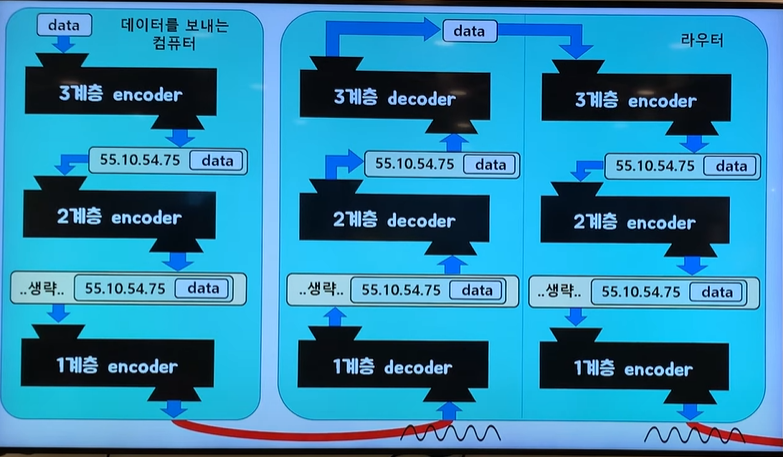

  이미지 출처: [[10분 테코톡] 🔮 히히의 OSI 7 Layer](https://youtu.be/1pfTxp25MA8?t=1809)


- 해당 계층에서 가장 중요한 기능은 데이터를 목적지까지 가장 안전하고 빠르게 전달하는 라우팅 기능입니다
- IP 주소를 제공하는 역할을 수행하며, 수신자의 IP 주소를 기반으로 `라우터`가 경로를 제공합니다
- 네트워크 계층에서의 L3기술은 라우터에 구현되어 있으므로 `하드웨어로 구현`될 수도, `소프트웨어로 구현`될 수도 있습니다
    - 네트워크 장비 구성에 따라 `하드웨어 라우터` 혹은 `소프트웨어 라우터`로 사용될 수 있습니다
- 사용되는 프로토콜은 `IP(Internet Protocol)` 입니다
- `IP 패킷`을 생성하여 하위 계층으로 전달합니다

<br>

#### IP (Internet Protocol)

- IP 프로토콜은 송신 호스트와 수신 호스트가 패킷 교환 네트워크에서 정보를 주고받는 데 사용하는 정보 위주의 규약입니다
- 즉 `출발지 IP`와 `목적지 IP`, 기타 정보를 IP 헤더에 저장하고, 전송 데이터를 합쳐서 IP 패킷을 생성합니다 (`L3의 데이터 캡슐화`)
    - `IP 패킷` = `IP 헤더` + `전송 데이터`

  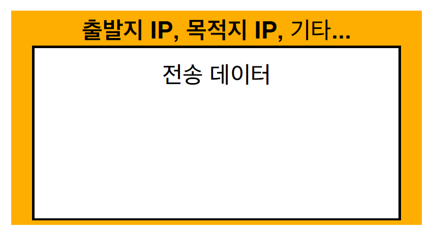

  이미지 출처: [김영한-모든 개발자를 위한 HTTP 웹 기본 지식](https://www.inflearn.com/course/http-%EC%9B%B9-%EB%84%A4%ED%8A%B8%EC%9B%8C%ED%81%AC/)

<br>

#### 라우터 (L3 스위치)

- 네트워크들 간 데이터 전송을 위한 최적의 경로를 제공해주는 장치
    - 트래픽을 전달하고 정보의 `가장 효율적인 경로`를 선택하는 `디스패처 역할`을 합니다
- 여러 `스위치` 및 각각의 네트워크들의 연결을 도와주며, 더 큰 네트워크를 형성하게 도와주는 장비입니다
    - `스위치 + 라우터` 기능
- 일반적으로 가정의 라우터 역할은 `공유기`가 수행하고 있습니다
- 아래는 1, 2, 3계층의 간략한 구조를 나타낸 예시입니다

  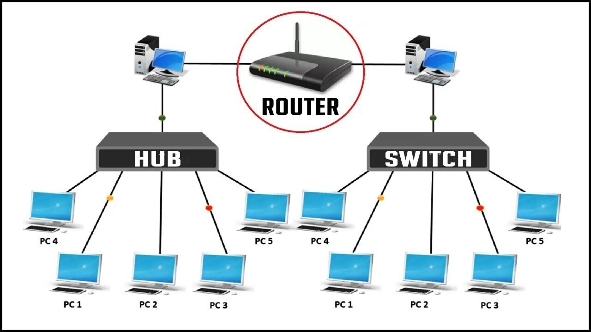

  이미지 출처: [https://jtktech.tistory.com/13](https://jtktech.tistory.com/13)

<br>

> 이처럼 라우터간의 연결이 계속되다 보면 거대한 네트워크가 형성이 되는데, 이것을 인터넷이라고 합니다


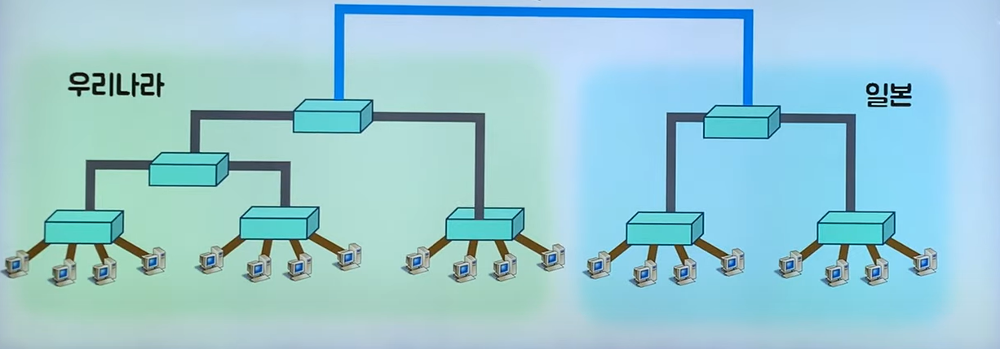

이미지 출처: [[10분 테코톡] 🔮 히히의 OSI 7 Layer](https://youtu.be/1pfTxp25MA8?t=954)

> 위 사진처럼 나라 간의 네트워크 통신은 바다에 깔려있는 해저 케이블을 통해 이루어집니다 → [해저케이블 있기에 가능한 지구촌 소통](https://www.yna.co.kr/view/AKR20210108069100051) <br> 따라서 각 국가 간의 라우팅은 `해저 케이블`을 통해 수행됩니다 (해저케이블은 전기 신호 통신 사용 - `물리계층`)

<br>

### 4. 전송 계층 (Transport Layer)

> Port 번호를 사용하여, 도착지 컴퓨터의 최종 도착지인 프로세스까지 데이터가 도달하게 하는 모듈

- 아래 예시는 발신 측에서 전송한 데이터가 `Port`와 `기타 정보`가 담긴 `세그먼트`를 생성 한 후 하위 계층으로 보내고 수신 측에서는 `세그먼트`를 분석하여 해당 Port 에 맞는 애플리케이션에 전송 데이터를 전달하는 흐름입니다

  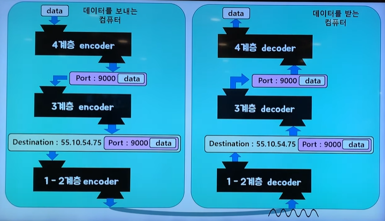

  이미지 출처: [[10분 테코톡] 🔮 히히의 OSI 7 Layer](https://youtu.be/1pfTxp25MA8?t=2040)


- 해당 계층에서 가장 중요한 기능은 `하위 계층`에 `신뢰할 수 있는 데이터 전송` 서비스를 제공하는 것입니다
- 전송 계층에서는 `연결형 프로토콜(TCP)` 와 `비 연결형 프로토콜(UDP)`를 사용합니다
- 전송 계층의 기술은 `게이트웨이`가 담당하며, 이 또한 3계층과 동일하게 하드웨어로 구현되기도, 소프트웨어로 구현되기도 합니다

  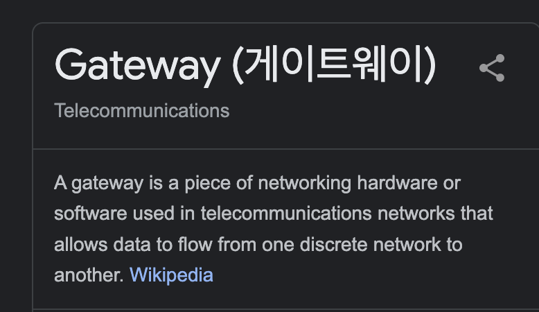

- `TCP 프로토콜`과 `UDP 프로토콜`은 해당 글에서 상세하게 따로 정리하였으니 참고해주세요
    - [TCP vs UDP, 그 속으로](https://github.com/giibeom/programmers_knowledge_storage/blob/main/Computer-Science/%EB%84%A4%ED%8A%B8%EC%9B%8C%ED%81%AC/TCP%20vs%20UDP/Alex/TCP%20vs%20UDP.md)

<br>

#### Port

- `포트번호`는 하나의 컴퓨터에서 동시에 실행되고 있는 프로세스들이 서로 겹치지 않게 가져야하는 정수값입니다
- 즉 전송된 데이터의 목적지가 `어느 애플리케이션인지를 구분`하기 위한 정보입니다
- Port 번호는 0번부터 65535번까지 사용할 수 있고, 0 ~ 1023번 포트까지는 잘 알려진 포트라고 하여 주요 프로토콜이 사용됩니다
    - 대표적인 포트 & 등록된 포트

        | 애플리케이션 | 포트 |
        | --- | --- |
        | HTTP | 80 |
        | HTTPS | 443 |
        | SSH | 22 |
        | SMTP | 25 |
        | DNS | 53 |
        | MSSQL | 1433 |
        | MySQL | 3306 |
        | Redis | 6379 |
        | HTTP 대체 (Tomcat default) | 8080 |
        | Node.js default | 3000 |

<br>

#### TCP 세그먼트

- 해당 계층에서는 아래와 같이 `TCP인지 UDP인지에 대한 정보` 및 `출발지 Port`와 `목적지 Port`, 신뢰성 있는 데이터 전송을 위한 `전송 제어`, `순서`, `검증정보` 등의 기타 정보를 Transport 헤더에 저장하여 전송 데이터와 함께 세그먼트를 생성합니다 (`L4의 데이터 캡슐화`)
    - `세그먼트` = `Transport 헤더` + `전송 데이터`

      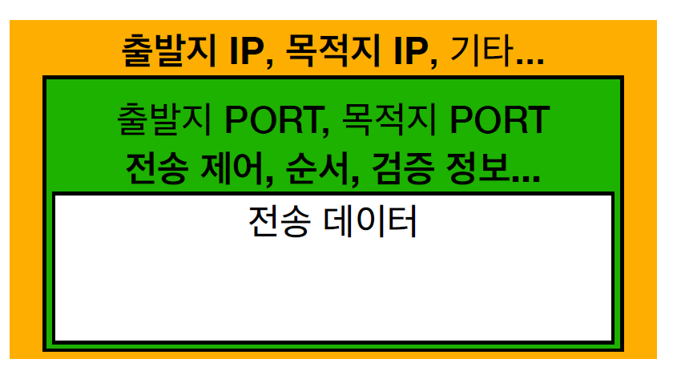
    
      이미지 출처: [김영한-모든 개발자를 위한 HTTP 웹 기본 지식](https://www.inflearn.com/course/http-%EC%9B%B9-%EB%84%A4%ED%8A%B8%EC%9B%8C%ED%81%AC/)

- 참고로 프로토콜이 UDP일 경우에는 `신뢰성 있는 데이터 전송`을 위한 `전송 제어`, `순서`, `검증정보` 등의 기타 정보가 포함되지 않습니다

<br>

### 5~7 응용 계층 (Application Layer)

> OSI 7계층에서 5계층(세션 계층), 6계층(표현 계층), 7계층(응용 계층)은 오늘날 주로 사용되는 TCP/IP 5계층 모델에서 `응용 계층(Application Layer)`으로 통합되었습니다 <br> 따라서 5계층과 6계층은 간단하게만 살펴보고 응용 계층으로 넘어가보겠습니다

<br>

### 5. 세션 계층 (Session Layer)

- 해당 계층은 응용 시스템 간의 세션을 관리하는 계층입니다
- 즉 애플리케이션의 클라이언트-서버 간 통신 및 모든 통신 장치 간에 `연결을 설정`하고 `관리` 및 `종료`하는 역할을 맡아서 합니다
- 송신자와 수신자 간의 통신을 위해 동기화 신호를 주고 받습니다
    - 세션은 `체크포인트`라는 것을 통해 동기화를 진행
    - 해당 체크포인트로 `오류 복구를 수행`

        ```markdown
        💡 예시를 들어보자
        
        A기기에서 B기기에게 100MB의 데이터를 전송한다고 가정하겠습니다
        체크포인트는 5MB 마다 갱신이 됩니다
        
        데이터 전송 중 48MB에서 연결이 끊겼을 때 어떻게 세션을 복구해야할까요?
        
        -> 45MB 에서 체크포인트가 갱신이 됐으므로 45MB에서부터 다시 재전송을 하면 됩니다
        ```

        - 따라서 오류가 났을 시 최근 체크포인트부터 다시 재전송을 요청하면 됩니다!

          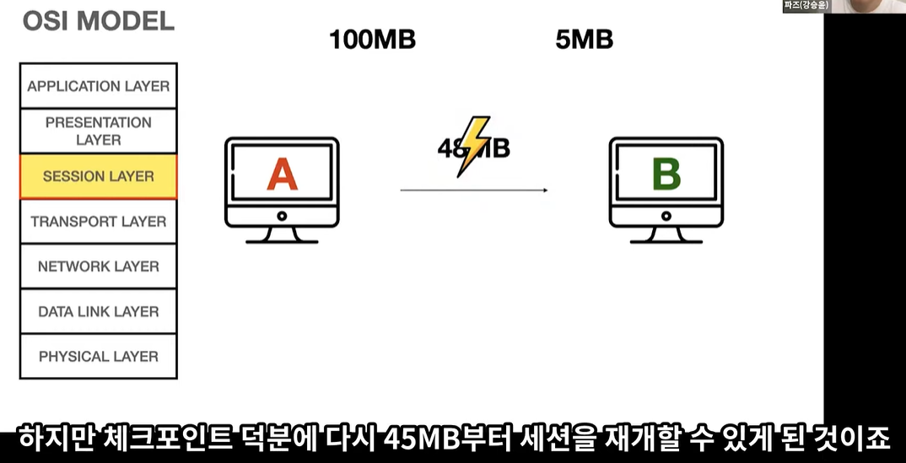

          이미지 출처: [[10분 테코톡] 👍 파즈의 OSI 7 Layer](https://youtu.be/Fl_PSiIwtEo?t=126)

- `포트 연결`이라고도 하며 대표적인 프로토콜로 `SSH`, `TLS`등이 있습니다
- 통신 방식에는 `단방향`, `반이중`, `전이중` 방식이 있습니다

    | 통신 방식 | 설명 | 예시 |
    | --- | --- | --- |
    | 단방향 방식 (Simplex) | 단방향 통신 방식으로써 한쪽에서만 데이터를 전송하는 방식입니다 | 버튼 없는 옛날 TV 등 |
    | 반이중 방식 (Half duplex) | 양방향 통신 방식이지만 통신선이 1개이기 때문에 한쪽이 송신할 때 다른 한쪽은 기다려서 데이터를 핑퐁으로 받는 방식입니다 | 무전기 등 |
    | 전이중 방식 (Full duplex) | 양방향 통신 방식으로써 송신선과 수신선이 각각 독립적으로 존재하므로 양쪽이 동시에 통신할 수 있는 방식입니다 | 전화 등 |

<br>

### 6. 표현 계층 (Presentation Layer)

- 데이터를 어떻게 표현할지 정하는 역할을 가지고 있는 계층입니다
- 해당 계층의 주요 기능은 아래에서 설명할 최상위 계층인 7계층 응용 계층에서 전달 받은 데이터를 `읽을 수 있는 형식으로 변환`하는 역할입니다
    - `데이터가 텍스트인지 이미지 파일인지 구분`
- 확장자의 개념이 해당 계층에서 사용됩니다
    - `ex) JPEG, MPEG, ASCII, MIDI 등등..`
- 전송 데이터의 `인코딩`, `디코딩`, `암호화`, `복호화`등의 기능을 수행합니다
    - 서로 다른 통신 기기 간에 다른 인코딩을 사용할 수도 있기 때문에 데이터 변환을 진행합니다
    - 또한 데이터를 안전하게 사용하기 위해 암/복호화를 진행합니다

<br>

### 7. 응용 계층 (Application Layer)

- 해당 계층은 사용자가 네트워크 자원에 접근하는 방법을 제공하는 계층입니다
- 해당 계층의 프로토콜은 `HTTP`, `FTP`, `SMTP`, `Telnet`, `DHCP`, `POP3` 등의 프로토콜이 사용됩니다
- 프로토콜에서 볼 수 있듯이 `사용자가 볼 수 있는 유일한 계층`으로, 사용자가 직접적으로 실행하는 응용 프로그램들이 해당 계층에 속합니다
- 브라우저, 메일 시스템 등 `사용자가 실제 사용`하는 프로그램(애플리케이션)은 모두 해당 계층에 포함된다고 생각하면 됩니다

<br>

### 사용자가 url로 접속할 때 바로 응용 계층(Application Layer)으로 들어올까?

- 사용자가 주소창에 “www.google.com”을 입력했을 때 `웹 동작방식`은 어떻게 되어있을까요?
- 바로 응용계층으로 오는 줄 알았지만 사실 URL을 가지고 `DNS 서버`에 먼저 갑니다
- 웹 동작방식의 흐름은 아래와 같습니다

  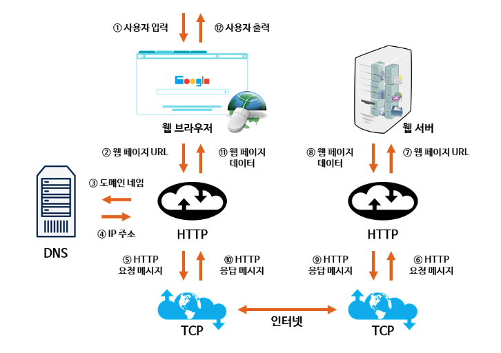

  이미지 출처: [https://velog.io/@eassy/www.google.com을-주소창에서-입력하면-일어나는-일](https://velog.io/@eassy/www.google.com%EC%9D%84-%EC%A3%BC%EC%86%8C%EC%B0%BD%EC%97%90%EC%84%9C-%EC%9E%85%EB%A0%A5%ED%95%98%EB%A9%B4-%EC%9D%BC%EC%96%B4%EB%82%98%EB%8A%94-%EC%9D%BC)

- 즉 사용자가 주소창에 URL을 입력하면 OSI 7계층으로 들어오기 전 `DNS 서버를 통해 도메인주소와 대응하는 IP 주소를 확인`합니다
    - DNS가 해당 도메인과 호스팅하고 있는 서버의 IP 주소를 찾는 과정은 별도의 글에서 다뤄보겠습니다
- 그 후 해당 도메인과 호스팅하고 있는 IP 주소를 찾았으면, 해당 IP 주소로 TCP Connection을 진행합니다
  - TCP Connection: 위에서 얘기한 OSI 7계층(TCP/IP 5계층)의 과정을 통해 데이터 통신이 이루어집니다

<br>

#### DNS?

- DNS란 Domain Name System의 약자로 `URL들의 이름(도메인)과 IP 주소를 저장하고 있는 데이터베이스`입니다
- 인터넷에 있는 모든 URL들에는 고유의 IP 주소가 지정되어 있으므로, IP 주소를 통해서 주소창에 입력한 웹사이트를 호스팅하고 있는 서버 컴퓨터에 접근할 수 있는 것입니다
- 해당 부분 또한 자세한 내용은 별도의 글에서 함께 다뤄보겠습니다

<br>

> 지금까지 1계층부터 7계층까지 간단하게만 알아보았지만 계층마다 파고들면 파고들수록 끝도 없는 개념들이라 적절하게 끊지 않으면 한도 끝도 없이 들어갈 수 있기 때문에 해당 글은 여기에서 마무리 하겠습니다
- 내용들을 정리하며 한번 더 상기시키자면 1~7 계층에서 사용되는 프롵토콜은 간단하게 아래 예시와 같습니다

    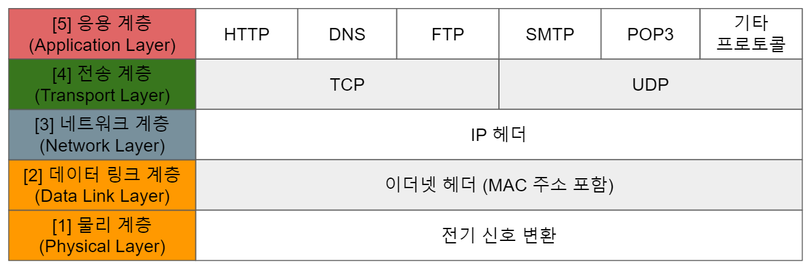
    
    이미지 출처: [https://velog.io/@jakeseo_me/OSI-7계층-시리즈-5-세션-표현-응용-계층](https://velog.io/@jakeseo_me/OSI-7%EA%B3%84%EC%B8%B5-%EC%8B%9C%EB%A6%AC%EC%A6%88-5-%EC%84%B8%EC%85%98-%ED%91%9C%ED%98%84-%EC%9D%91%EC%9A%A9-%EA%B3%84%EC%B8%B5)

<br>

> 끝으로 OSI 7계층을 서칭하다가 쉽게 외우는 방법이 보이길래, 아래 예시를 소개해드리면서 글을 마무리 하겠습니다! <br> 감사합니다 :)


#### "앞페(에)서 터지니 뒤에서 피가나더라"

| 계층 이름 | 첫 알파벳 | 문구 |
| --- | --- | --- |
| 응용 계층 (Application Layer) | A | 앞 |
| 표현 계층 (Presentation Layer) | P | 페 |
| 세션 계층 (Session Layer) | S | 서 |
| 전송 계층 (Transport Layer) | T | 터지 |
| 네트워크 계층 (Network Layer) | N | 니 |
| 데이터링크 계층 (Data-Link Layer) | D | 뒤에서 |
| 물리 계층 (Physical Layer) | P | 피가나더라 |
