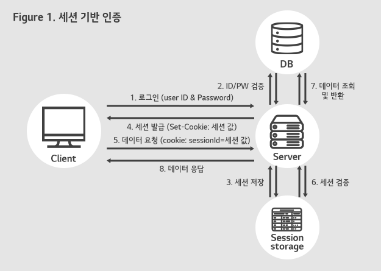
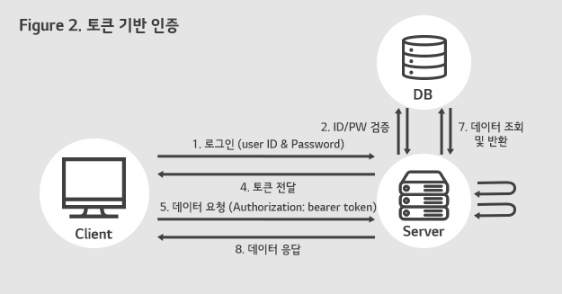
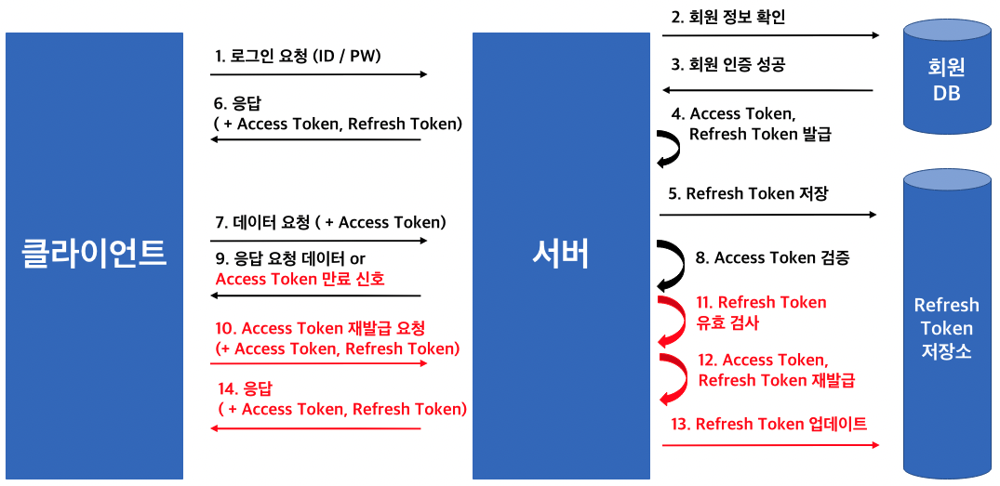

## Session 인증 방식이란?

`세션 개념 자체에 대해서는 이 글을 참고해주세요` → [쿠키 vs 세션](https://github.com/giibeom/programmers_knowledge_storage/blob/5week/%EC%BF%A0%ED%82%A4vs%EC%84%B8%EC%85%98/Computer-Science/%EB%84%A4%ED%8A%B8%EC%9B%8C%ED%81%AC/%EC%BF%A0%ED%82%A4%20vs%20%EC%84%B8%EC%85%98/Alex/%EC%BF%A0%ED%82%A4%20vs%20%EC%84%B8%EC%85%98.md#%EC%84%B8%EC%85%98%EC%9D%80-%EB%AC%B4%EC%97%87%EC%9D%BC%EA%B9%8C)

- 세션 인증 방식은 말 그대로 세션을 통해 HTTP 프로토콜 특징 중 무상태성을 보완하기 위해 사용되는 방식입니다
- 세션 인증 방식 흐름은 다음과 같습니다

`첫 요청 시작`

1. 클라이언트에서 로그인 요청 (ID, PW)
2. DB에서 ID/PW 검증
3. 검증 완료되면 Session Storage (DB, 파일, 메모리 등)에 정보 저장
4. Session ID를 쿠키에 저장 (Set-Cookie: 세션ID) 후 클라이언트 요청 반환

`첫 요청 종료`

`두번째 요청 시작`

5. 클라이언트에서 데이터 요청 (cookie: sessionId=세션ID)
6. 쿠키에서 sessionId를 꺼낸 후 Session Storage에서 세션ID 검증
7. 검증 완료 되면 DB에서 요청한 데이터 조회 및 반환 (단, 인가 실패 시 403에러)
8. 데이터 응답

    

    이미지 출처: [https://blog.lgcns.com/2687](https://blog.lgcns.com/2687)

 

## Token 인증 방식이란?

`주로 사용되는 토큰인 JWT Token 개념 자체에 대해서는 이 글을 참고해주세요` -> [OAuth2.0 + JWT Token](https://github.com/giibeom/programmers_knowledge_storage/blob/4week/OAuth2.0/Computer-Science/%EB%84%A4%ED%8A%B8%EC%9B%8C%ED%81%AC/OAuth2.0/Alex/OAuth2.0.md#jwt%EB%9E%80-%EB%AC%B4%EC%97%87%EC%9D%B8%EA%B0%80)

- 토큰 인증 방식은 세션의 단점인 “서버 부하 야기” 때문에 사용되는 방식입니다
- 토큰 인증 방식 흐름은 다음과 같습니다

`첫 요청 시작`

1. 클라이언트에서 로그인 요청 (ID, PW)
2. DB에서 ID/PW 검증
3. 검증 완료되면 Access Token 생성 후 반환

`첫 요청 종료`

`두번째 요청 시작`

4. 클라이언트에서 데이터 요청 (Header - Authorization: bearer token)
5. 토큰의 서명 값으로 Access Token이 유효한지 검증
6. 검증이 완료되면 DB에서 요청한 데이터 조회 및 반환 (단, 인가 실패 시 403 에러)
    - 토큰 발급 시 토큰 내부에 권한 정보를 추가하여 발급할 수도 있다
7. 데이터 응답

    

    이미지 출처: [https://blog.lgcns.com/2687](https://blog.lgcns.com/2687)

 

- 하지만 아직 세션을 대체하기에는 JWT 토큰에 큰 결점이 있다
    - JWT 토큰 자체는 Stateless 이기 때문에 한번 발급 받은 토큰을 제어할 수 없다 → 보안 문제
    - Refresh Token을 추가함으로써 Access Token 유효 시간을 짧게 설정하여 토큰 제어 불가의 단점을 보완할 수 있지만 이 또한 완벽한 방법은 아니다

 

## Refresh Token?

- Access Token은 한번 발급 되면 제어가 안되기 때문에 보안에 취약할 수 있다 -> Stateless
- 따라서 Access Token은 유효 시간을 매우 짧게(몇분 내지 몇시간) 설정하고 유효 시간이 끝난 경우 Refresh Token을 통해 Access Token을 재발급 해주는 방식을 사용한다

 

### Access Token + Refresh Token 구현 방법

1. 인증(Authentication)이 성공하면 Access Token과 Refresh Token을 둘 다 생성하여 클라이언트에 반환한다
    - Refresh Token은 상응값을 Database에 저장한다
    - Access Token은 보통 몇시간 or 몇분으로 설정하고, Refresh Token은 보통 2주 정도로 설정한다
2. 클라이언트는 Access Token의 유효 시간이 만료된 경우 Refresh Token을 전송
3. 서버에서는 Refresh Token을 Database에 저장된 값과 대조하여 검증 후 새로운 Access Token 발급

   

   이미지 출처: [https://kdhyo98.tistory.com/92](https://kdhyo98.tistory.com/92)

 

### Refresh Token이 탈취되면?

- 위 설명같이 서버는 Access Token과 Refresh Token을 둘 다 클라이언트에 내려준다
- 클라이언트에서도 저장될 경우 보안에 취약하고 결국 Refresh Token도 탈취될 수 있다
- Refresh Token이 탈취 되면 해커가 긴 시간을 서버에 접근할 수 있기 때문에 이를 막기 위해 RTR (Refresh Token Rotation) 기법을 사용한다고 한다
- RTR 기법은 Refresh Token을 한번만 사용하게 하고 만약 토큰이 2번 이상 사용되었음이 감지되면 Refresh Token 및 기타 하위 Token들을 모두 파기하는 방법이다
- `RTR 기법의 자세한 내용은 이 글에서는 다루지 않으니 해당 글을 참고해주세요` → [Dr. Philippe De Ryck](https://pragmaticwebsecurity.com/articles/oauthoidc/refresh-token-protection-implications.html)

 

## Session 인증 방식 vs Token 인증 방식 장단점

| 🧐 | Session 인증 방식                                                                                                                                                   | Token 인증 방식                                                                                                                                                                 |
| --- |-----------------------------------------------------------------------------------------------------------------------------------------------------------------|-----------------------------------------------------------------------------------------------------------------------------------------------------------------------------|
| 장점 | 1. 서버에 저장하기 때문에 관리가 매우 편하다   2. Stateful 하므로 서버에서 로그인 상태를 확인하기 유용하고 제어에 편리하다                                                                                 | 1. 토큰 자체의 서명으로 검증이 가능하기에 메모리나 DB로 인한 서버 부하에 걱정이 없다 2. MSA 구조 같은 여러개의 서버 구조 환경에 편리하다                                                                                         |
| 단점 | 1. 사용자 동시 트래픽이 많거나, Session DB 서버가 꺼질 경우                                                                                2. MSA 구조에서 서버를 여러개 사용하여 로드밸런싱을 할 경우 | 1. Stateless 하기 때문에 토큰 제어가 불가능 하여 토큰이 탈취 될 경우 보안에 불리하다                                                                  2. 토큰 내 데이터는 암호화가 된 것이 아닌 인코딩한 것이므로 데이터 열람이 가능하다 |
| 단점 보완책 | 1. 일반 Database에 집어 넣어 관리하는 방법도 있지만 매 요청마다 확인해야 하기 때문에 속도 저하 유발                                                                                               2. 메모리 캐시 DB (Redis) 같은 서버에 저장하기도 하지만 속도 저하 유발 | 1. Refresh Token을 사용하여 Access Token 유효기간을 짧게 가져가고 RTR 기법으로 방어하면 보완은 가능하지만 여전히 보안에 허점은 존재한다 (Access Token만 계속 탈취될 경우)                                         2. 중요한 데이터는 넣지 않거나 JWE를 통한 암호화를 진행해야 한다 |

 

### 어느 상황에서 무엇을 사용해야 할까?

- 위와 같이 두 방법 다 각자의 장단점이 있고 서로 완전히 대체될 수 없는 방식입니다
- 최근에는 OAuth 2.0 방식이 많이 활용되어 확장성이 높은 토큰 방식을 많이 사용하는 것을 볼 수 있습니다
- 또한 많은 클라이언트 및 디바이스에서 통신하며, 서버가 여러대 있는 MSA 구조에서는 토큰 방식이 유리하다고 생각합니다
- 하지만 넷플릭스 사용자 제한 혹은 인프런의 중복 접속 제한 같은 기능이 필요한 경우에는 Stateful 하여 서버에서 제어가 편리한 세션 방식이 유리하다고 생각합니다

 
 

### Reference

- [얄코 - 세션 VS. 토큰! JWT가 뭔가요?](https://youtu.be/1QiOXWEbqYQ)
- [https://blog.lgcns.com/2687](https://blog.lgcns.com/2687)
- [https://kdhyo98.tistory.com/92](https://kdhyo98.tistory.com/92)