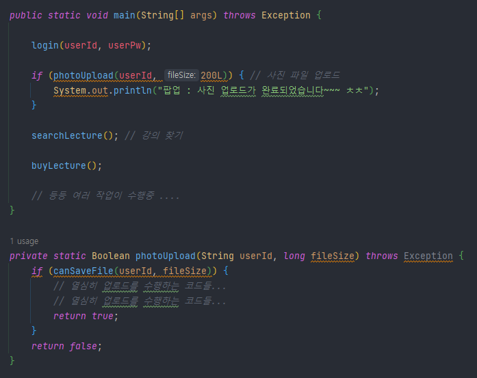
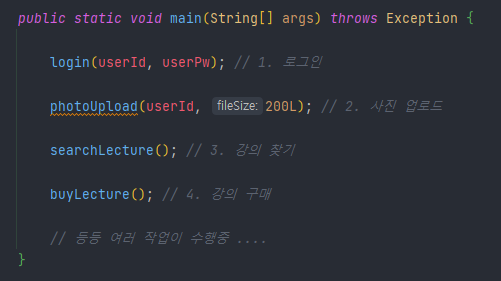

# Sync&Async, Blocking&Non-Blocking

```markdown
💡 본 주제는 많은 사람들이 헷갈리는 개념입니다 (저 또한 이해하느라 죽을뻔…)
따라서 개념 정리를 하기 앞서 제 생각의 흐름대로 예시와 함께 설명해 볼 예정입니다
```


## Synchronous(동기) & Asynchronous(비동기)

이 2가지의 비교는 좀 미뤄두고, 제가 이해했던 바로 Sync & Async는 `작업 완료된 결과물의 처리를 언제하냐`에 관점을 뒀습니다.

예시로 작업은 메서드, 결과물은 데이터라고 생각해보겠습니다.

**메서드**는 `파일 업로드`를 수행하는 친구라면, **결과물**은 파일이 서버에 정상적으로 `업로드된 결과에 대한 데이터`가 되겠네요.

아래 예시처럼 메인 작업장에서 여러 작업들 사이에 파일 업로드 기능이 있다고 생각합시다.


> 예시로 대충 만든거니 보기 불편하더라도 코드적인 부분은 넘어갑시다!

<br>

#### photoUpload가 동기라면?

파일 업로드가 다 완료될 때까지 기다리거나, 다음 작업인 강의 찾기를 수행합니다.

다 완료될 때까지 기다린다면 상관 없겠지만 다음 작업을 수행할 경우, 메인 작업장에서는 파일 업로드가 끝났는지 계속해서 확인해볼 것입니다.

즉 photoUpload의 작업이 끝났는지 계속 확인하며 작업이 완료되면 즉시 결과물을 처리합니다.

<br>

#### photoUpload가 비동기라면?

동일하게 파일 업로드가 다 완료될 때까지 기다리거나, 다음 작업인 강의 찾기를 수행합니다.

하지만 photoUpload가 끝나는지 안 끝나는지 메인 작업장은 관심이 없습니다.

따라서 작업이 완료되어 결과물이 반환되더라도 메인 작업장은 즉시 처리 할 수도, 안 할 수도 있습니다.

<br>

## Blocking & Non-Blocking

이 2가지도 비교는 잠시 미뤄두고, Blocking & Non-Blocking은 위 예시에서 보았던 `메인 작업장의 제어의 관점`에 초점을 뒀습니다.

메인 작업을 수행할 권리가 있는 `제어권 티켓`을 누가 가지고 있는지 즉, 메인 작업장 로직의 흐름이 멈추느냐, 안 멈추느냐를 생각했습니다.

아래 예시로 비교를 해보겠습니다

<br>

#### photoUpload가 Blocking이라면?



사진 파일 업로드가 완료되면 팝업 메시지가 띄워지는 기능을 추가하겠습니다.

위 코드처럼 photoUpload가 Blocking이라면 사진 업로드 작업이 끝날 때까지 메인 작업장은 계속 기다려야 합니다.

따라서 팝업 메시지가 출력된 이후에 강의 찾기(searchLecture) 작업이 실행될 것입니다.

<br>

#### photoUpload가 Non-Blocking이라면?


위 코드는 `ExecutorService`를 통해 새로운 Thread를 생성한 후 사진 파일 업로드 작업을 해당 스레드로 위임하였습니다.

이로써 photoUpload가 실행돼서 제어권 티켓을 잠시 가져갈 때, 작업이 완료되지 않아도 바로 제어권 티켓을 메인 작업장에 다시 넘겨줍니다.

즉 photoUpload가 Non-Blocking이 되었으므로, 메인 작업장은 사진 파일 업로드 작업이 끝나지 않았더라도 바로 강의 찾기(searchLecture) 작업을 시작합니다.

<br>

## 4가지의 조합

> 아래의 상황은 모두 해당 예시의 `photoUpload`를 통해 설명하겠습니다.



### 1. Blocking + Sync

- Java에서 기본적으로 사용되는 동작 방식입니다.
    - 위 예시와 같이 별도의 스레드 작업 등을 하지 않았을 때의 main 함수는 Block+Sync 방식으로 동작 됩니다.

```markdown
💡 예시를 들어보자

1. 로그인을 진행합니다
2. 사진 업로드를 진행합니다
3. 사진 업로드가 완료될 때까지 기다립니다....
4. ........... (업로드중) ............
5. ........... (업로드 완료!!) ............
6. 강의 찾기를 진행합니다
7. 강의를 구매합니다
```

- 또한 저는 Java에서 `synchronized` 방식이 해당 방식에 가깝다고 생각했습니다
    - 하나의 Thread에서 `synchronized`인 자원을 사용할 시, `Lock`을 걸어 나머지 Thread에서는 모두 접근을 못하게 막음으로써 동시에 변경되는 상황을 방지하여 스레드 간의 동일성을 보장하는 방식입니다
    - `synchronized` 자원 사용 시, A & B의 작업 수행 순서(흐름)

      

    - 예제 1: [https://coding-start.tistory.com/68](https://coding-start.tistory.com/68) <br>
      예제 2: [](https://coding-start.tistory.com/68)[https://codechacha.com/ko/java-synchronized-keyword/](https://codechacha.com/ko/java-synchronized-keyword/)

<br>

### 2. Non-Blocking + Async

- JavaScript에서 기본적으로 사용되는 동작 방식입니다.
    - API를 호출하고 다른 작업을 하다가, 콜백을 통해 추가적인 작업을 처리할 때 Non-Blocking+Async 방식을 사용합니다.
    - API 호출하고 기다리는 동안 사용자가 아무것도 못하고 기다려야 되는 상황은 좋지 않겠죠!

```markdown
💡 예시를 들어보자

1. 로그인을 진행합니다
2. 사진 업로드를 진행합니다
3. 강의 찾기를 진행합니다 (업로드중...)
........... (업로드 완료!!) ............
4. 강의를 구매합니다
5. 기타 아래 작업들 수행중...
6. 사진 업로드 작업이 완료된 콜백을 통해 추가 작업을 수행합니다.
```

<br>

### 3. Non-Blocking + Sync

- 해당 방식은 메인 작업장에선 다른 동작을 수행하긴 하지만 주기적으로 메서드의 완료 여부를 확인하는 방식입니다
    - 예를 들어 파일 업로드를 진행 시키고, 다른 작업을 하더라도 주기적으로 `파일 업로드의 진행률`을 보여주어야 할 때 해당 방식을 사용합니다

        ```markdown
        💡 예시를 들어보자
        
        1. 로그인을 진행합니다
        2. 사진 업로드를 진행합니다
        3. 강의 찾기를 진행합니다 (업로드중... 진행률: 70&)
        ........... (업로드 완료!!) ............
        4. 사진 업로드 작업이 완료된 콜백을 통해 추가 작업을 수행합니다. (완료 즉시 바로 처리)
        5. 강의를 구매합니다
        ```

<br>

### 4. Blocking + Async

- 개인적으로 애플리케이션에서 제일 비효율적인 방식이라고 생각합니다
    - Async로 진행되는 함수의 결과값은 메인 작업장 관점에서는 별로 궁금하지도 않고 **콜백이 온다고 해도 바로 처리할 생각도 없지만** 무작정 메인 작업장에서 기다리는 케이스입니다
- 애플리케이션에서는 `NonBlocking+Async 방식을 사용`하더라도, `개발자의 실수` 혹은 미처 생각하지 못한 상황에서 프로세스 `과정 중 하나라도 Blocking으로 동작`하는 코드가 있다면
  `의도하지 않게 Blocking+Async 방식으로 동작`할 수 있으므로 `주의`해서 개발해야 됩니다

```markdown
💡 예시를 들어보자

1. 로그인을 진행합니다
2. 사진 업로드를 진행합니다
3. ........... (업로드중.. 아 관심없는데...) ............
4. ........... (업로드 완료!!) ............
5. 강의 찾기를 진행합니다
6. 강의를 구매합니다
7. 사진 업로드 작업이 완료된 콜백을 통해 추가 작업을 수행합니다.
```


<br>
<br>

### Reference

- [[10분 테코톡] 우의 Block vs Non-Block & Sync vs Async](https://youtu.be/IdpkfygWIMk)
- [[10분 테코톡] 멍토의 Blocking vs Non-Blocking, Sync vs Async](https://youtu.be/oEIoqGd-Sns)
- [널널한 개발자 TV - Blocking I/O와 Non-blocking I/O](https://youtu.be/XNGfl3sfErc)
- [https://wbluke.tistory.com/49](https://wbluke.tistory.com/49)
- [https://musma.github.io/2019/04/17/blocking-and-synchronous.html](https://musma.github.io/2019/04/17/blocking-and-synchronous.html)
- [https://www.javatpoint.com/synchronized-block-example](https://www.javatpoint.com/synchronized-block-example)
