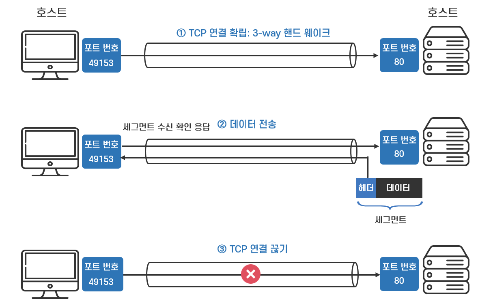

## 인터넷 프로토콜 계층

- 인터넷 프로토콜 계층에는 OSI 7계층과, 이를 단순화한 TCP/IP 4계층이 존재합니다
- 그 중에서 이번엔 TCP/IP 4계층을 기준으로 설명해볼까 합니다
- 아래에는 TCP/IP 4계층을 간단히 정리한 표입니다

    | 계층 | 주요 프로토콜        |
    |----------------| --- |
    | 애플리케이션 계층 (응용 계층) | HTTP, FTP, 등등… |
    | 전송 계층 | TCP, UDP       |
    | 인터넷 계층 | IP             |
    | 네트워크 인터페이스 계층 | LAN 드라이버, 장비   |
- 이 중에서 오늘은 전송 계층에 대해서 알아볼 예정입니다

<br>

## 전송 계층 (Transport Layer)

- 전송 계층은 프로세스 간의 신뢰성 있는 데이터 전송을 담당하는 계층입니다
- 전송 계층은 2가지의 역할을 수행합니다
    1. 데이터가 제대로 도착했는지 확인
    2. 전송된 데이터의 목적지가 어떤 애플리케이션인지 식별 (Port를 활용)

       

       이미지 출처: [https://sangbeomkim.tistory.com/115](https://sangbeomkim.tistory.com/115)

- 전송 계층의 프로토콜은 TCP와 UDP로 나눠집니다

<br>

## TCP란?

- TCP 프로토콜은 `신뢰`할 수 있고 `정확한 데이터를 전달`하기 위해 전송 속도를 조절하거나, 도달하지 않은 데이터를 재전송하는 기능을 가진 프로토콜입니다
- TCP 프로토콜은 클라이언트와 서버가 논리적인 연결을 한 상태로 데이터를 주고 받기 때문에 신뢰성을 보장하는 연결 지향 프로토콜입니다
- IP 프로토콜의 한계를 보완하고자 함께 사용됩니다

    ```markdown
    💡 예시를 들어보자!
    채팅 프로그램에서 안녕 ALEX~ 밥은 먹었지? 라는 메시지를 보내려고 하는 상황이다
    
    1. 프로그램이 "안녕 ALEX~ 밥은 먹었지?" 메시지를 생성한다
    2. SOCKET 라이브러리를 통해 전송 계층으로 전달한다
    3. TCP 정보를 씌운다 (TCP 정보 생성, 메시지 데이터 포함)
    4. IP 정보를 씌운다 (IP 패킷 생성, TCP 데이터 포함)
    5. LAN 카드를 통해 이더넷 프레임이 포함돼서 나간다
    ```

<br>

#### TCP/IP 패킷 구성 정보

- TCP 와 IP는 함께 사용되며 아래와 같이 데이터가 감싸집니다

  

<br>

## TCP의 특징

- TCP 프로토콜의 특징은 다양하지만 그 중에 3가지만 알아보겠습니다

### 1. 연결지향

- TCP 프로토콜은 연결형 서비스로 가상 회선 방식을 제공합니다
    - 데이터를 전송하기 전에 `논리적 연결`이 설정되는데 이를 가상 회선이라고 합니다
- 3-way handshaking 과정을 통해 연결을 설정하고, 4-way handshaking을 통해 연결을 해제합니다

<br>

### 2. 데이터 전달 보증

- 아래에서 자세히 살펴보겠지만 3-way handshaking 과정에서 클라이언트는 먼저 서버에 SYN을 보냅니다
- 하지만 서버 측에서 패킷을 잘 받았다는 신호인 ACK이 일정시간 동안 오지 않는다면, 데이터 전송 과정에 문제가 생겼음을 인지하고 SYN을 재전송을 합니다
  - 이를 TCP Retransmission 이라고 합니다
- 이런 방법을 통해 데이터를 전송했을 때 데이터가 누락될 경우 바로 인지할 수 있기 때문에 데이터의 전달을 보증해줄수 있습니다

<br>

#### TCP 프로토콜의 데이터 전달 보증을 위한 메커니즘

- TCP는 데이터 전달의 신뢰성을 보장하기 위해 몇 가지의 메커니즘이 존재합니다
- 데이터 전달 과정에서 네트워크 패킷 손실이 발생했을 경우 아래와 같은 매커니즘을 동작시킵니다
    - TCP 재전송 (TCP Retransmissions)
    - TCP 중복 (TCP Duplicate / Selective Acknowledgments)
- 해당 글에서는 TCP vs UDP의 비교가 메인이므로, 네트워크 단을 더 깊숙히 들어가지는 않겠습니다
- 따라서 TCP 프로토콜의 신뢰성 보증을 위한 메커니즘을 잘 설명해놓은 글을 링크로 남겨놓겠습니다
    - [https://accedian.com/blog/network-packet-loss-retransmissions-and-duplicate-acknowledgements/](https://accedian.com/blog/network-packet-loss-retransmissions-and-duplicate-acknowledgements/)

<br>

### 3. 순서 보장

- TCP 세그먼트 내부에는 데이터 순서에 대한 정보가 담겨져 있습니다
- 따라서 TCP는 모든 패킷이 수신지에 제대로 도착했는지 확인 후, 수신한 데이터의 순서를 송신한 순서대로 재설정하여 패킷들을 재조립함으로써 전체 데이터를 순서대로 올바르게 전송되도록 도와줍니다

  

  이미지 출처: [https://www.inflearn.com/course/http-웹-네트워크](https://www.inflearn.com/course/http-%EC%9B%B9-%EB%84%A4%ED%8A%B8%EC%9B%8C%ED%81%AC)

<br>

#### 만약 데이터 패킷이 순서대로 오지 않는다면?

    ```markdown
    💡 예시를 들어보자!
    
    카톡으로 "안녕 나는 Alex야 밥은 먹었니?" 라는 메시지를 전송합니다
    메시지는 보통 일정 사이즈가 넘으면 끊어서 보낸다고 합니다
    
    예시로 "안녕", "나는", "Alex야", "밥은", "먹었니"로 끊어서 보낸다고 가정해보겠습니다
    이럴때 수많은 노드들을 통해 메시지들이 각각 다른 루트를 통해 전송될때 순서가 보장이 안된다면,
    서버에서 받았을때의 결과는 "Alex야 나는 먹었니 안녕 밥은" 로 오는 경우가 생길 수 있습니다
    
    이런 경우를 방지하기 위해 TCP 세그먼트 내부에 데이터 순서 정보가 담겨져 있습니다
    ```

<br>

## TCP 통신 흐름

- TCP 통신 과정은 크게 3가지로 나눠질 수 있습니다
    1. TCP 연결: 3-way handshaking
    2. 데이터 전송
    3. TCP 연결 해제: 4-way handshaking

   

   이미지 출처: [https://better-together.tistory.com/140](https://better-together.tistory.com/140)

<br>

#### 3-way handshaking과 4-way handshaking 과정에서 사용되는 플래그 정보

| 종류 | 내용 |
| --- | --- |
| SYN | 연결 설정을 요구하는 플래그 <br> TCP에서 세션을 성립할 때 가장 먼저 보내는 패킷 |
| ACK | 응답 플래그 <br> 상대방으로부터 패킷을 받았다는 걸 알려주는 패킷 |
| FIN | 연결 종료를 요청하는 플래그 <br> 세션 연결을 종료시킬 때 사용되며 더이상 전송할 데이터가 없음을 나타냄 |

<br>

### 3-way handshaking

- 데이터를 전송하기 전, 발신자는 수신자에게 데이터를 받을 수 있는 상황인지를 물어보며, 응답까지 정상적으로 받은 후, 논리적인 연결이 성립되면 그 후 데이터를 전송하는 가상 회선 방식의 개념입니다
  - 편의 상 발신자는 `클라이언트`, 수신자는 `서버`로 부르겠습니다

  ```markdown
  💡 예시를 들어보자

  클라이언트 -> 서버: 여보세요, 내 목소리 잘 들리니?
  서버 -> 클라이언트: ㅇㅇ 잘 들려, 내 목소리는 잘 들리니?
  클라이언트 -> 서버: ㅇㅇ 잘 들려~
  ```

1. 클라이언트는 서버를 향해 SYN을 전송합니다
2. 서버는 ACK과 동시에 SYN을 전송합니다
3. 클라이언트는 ACK을 전송합니다
    - 마지막 ACK 과정에서는 ACK과 함께 데이터를 같이 바로 전송하는 것도 가능합니다

   

   이미지 출처: [https://better-together.tistory.com/140](https://better-together.tistory.com/140)

<br>

### 4-way handshaking

- 데이터 전송이 완료된 후, 발신자는 수신자에게 연결을 끊을 준비를 합니다

```markdown
💡 예시를 들어보자

클라이언트 -> 서버: 할 말 다 끝났다. 이제 끊자~
서버 -> 클라이언트: 알았어 잠깐만!
서버 -> 클라이언트: 나도 끊을게~
클라이언트 -> 서버: ㅇㅇ 끊는다~ 나중에 또 연락해~
```

1. 클라이언트는 서버를 향해 FIN을 전송합니다
2. 서버는 클라이언트에게 ACK을 전송합니다
3. 서버는 연결을 종료할 준비가 되면 클라이언트에게 FIN을 전송합니다
4. 클라이언트는 ACK을 전송하며 클라이언트 - 서버간의 세션을 안전하게 종료합니다

   

   이미지 출처: [https://better-together.tistory.com/140](https://better-together.tistory.com/140)


<br>

## UDP란?

- UDP 프로토콜은 데이터의 일부가 유실되더라도 빠르고 효율적으로 데이터를 전송하는 프로토콜입니다
- UDP 프로토콜은 비연결형 통신이라서 TCP처럼 데이터 전송 전처리 작업의 시간이 소요되지 않습니다 (3-way handshake)
- 하지만 신뢰성을 보장하지 않고, 효율성을 중요하게 생각하기 때문에 데이터의 누락이 존재할 수 있습니다
- 기능이 거의 없는 하얀 도화지 같은 느낌으로, IP 프로토콜에서 port와 체크섬 정도만 추가된 정도입니다
    - 체크섬: 네트워크를 통해 전송된 데이터의 값이 변경되었는지 검사하는 값으로(무결성), 수신된 데이터에 오류가 없는지 여부를 확인합니다
- 따라서 애플리케이션에서 추가 작업이 필요합니다
    - HTTP3에서는 syn, ack 과정의 3 way handshake 하는것까지 다 줄여보자라는 관점으로 더욱 최적화를 위해 UDP를 사용합니다

<br>

## UDP의 특징

- 비연결형 서비스로 데이터그램 방식을 제공합니다
    - 송/수신자 간의 가상회선을 통한 논리적 경로를 설정하지 않고, 패킷들이 각기 `독립적으로 전송`되는 방식을 데이터그램 방식이라고 합니다
- 데이터를 주고 받을 때 데이터를 보내거나 받는다는 신호 절차를 거치지 않습니다 (데이터 신뢰성 X)
    - 데이터 전송 전처리 작업인 3-way handshake를 수행하지 않습니다
    - 따라서 수신자의 상태를 확인하지 않기 때문에 재전송이 일어나지 않으며 `데이터 전달 보증이 되지 않습니다`
- 데이터의 순서를 보장해주지 않습니다
    - 데이터 순서 유지를 위한 작업 또한 하지 않으므로 `데이터 순서 보장이 되지 않습니다`
- 패킷 오버헤드가 적어 `네트워크의 부하가 감소`되며 상대적으로 TCP보다 `전송속도가 빠릅니다`

<br>

## TCP vs UDP

| 🧐 | TCP (Transfer Control Protocol)                                         | UDP (User Datagram Protocol)                                                                                                     |
| --- |-------------------------------------------------------------------------|----------------------------------------------------------------------------------------------------------------------------------|
| 연결 방식 | 연결형 서비스                                                                 | 비 연결형 서비스                                                                                                                        |
| 패킷 교환 방식 | 가상 회선 방식                                                                | 데이터그램 방식                                                                                                                         |
| 전송 순서 | 전송 순서 보장                                                                | 전송 순서가 보장 되지 않음 (뒤죽박죽)                                                                                                           |
| 수신 여부 확인 | 수신 여부를 확인함 (신뢰성 보장)                                                     | 수신 여부를 확인하지 않음                                                                                                                   |
| 통신 방식 | 1 : 1 통신                                                                | 1 : 1 or 1 : N or N : N 통신                                                                                                       |
| 신뢰성 | 높다                                                                      | 낮다                                                                                                                               |
| 속도 | 느리다 (3-way handshake)                                                   | 빠르다                                                                                                                              |
| Header 사이즈 | 20 byte                                                                 | 8 byte                                                                                                                           |
| 사용되는 포트 | HTTP, HTTPS, FTP, SMTP 등                                                | DNS, TFTP, SNMP, RIP 등                                                                                                           |
| 사용에 적합한 상황 | 데이터 유실이 되면 안되는 중요한 데이터를 통신하는 애플리케이션 서비스 <br><br>또한 전송된 데이터의 순서가 중요한 서비스 | 동영상 스트리밍, 실시간 스트리밍 같은 빠르게 데이터가 전송되야 하는 서비스 <br><br> 상당히 많은 데이터 패킷이 오고 가면서 별로 중요하지 않은 몇개의 데이터 손실 정도는 빠르고 끊김없는 이점을 위해 감수할 수 있는 서비스 |

<br>
<br>

### Reference

- [김영한 - 모든 개발자를 위한 HTTP 웹 기본 지식](https://www.inflearn.com/course/http-%EC%9B%B9-%EB%84%A4%ED%8A%B8%EC%9B%8C%ED%81%AC)
- [https://better-together.tistory.com/140](https://better-together.tistory.com/140)
- [https://velog.io/@hidaehyunlee/TCP-와-UDP-의-차이](https://velog.io/@hidaehyunlee/TCP-%EC%99%80-UDP-%EC%9D%98-%EC%B0%A8%EC%9D%B4)
