# 로드 밸런싱

### 목차
1. [로드 밸런서란](#로드-밸런서-(load-balancer)-란?)
2. [로드 밸런서의 기본 기능](#로드-밸런서의-기본-기능)
    1. Health Check
    2. NAT
    3. DSR
    4. 알고리즘에 따른 분산 처리
3. [웹 서버 구조](#웹-서버-구조)
    1. Scale-up
    2. Scale-Out
    3. [정리] Scale-up vs Sclae-out
4. [데이터 정합성](#데이터-정합성-문제란?)
    1. 해결방법
        - Sticky Session
        - Session Clustering
        - In-memory Database
5. [로드 밸런싱](#로드-밸런싱이란?-(load-balancing))
    1. 로드 밸런싱 알고리즘
6. [로드 밸런싱의 구현 방법](#로드-밸런싱의-구현-방법)
    1. 하드웨어
        - L4 / L7
    2. 소프트웨어
        - Reverse Proxy 형태의 로드 밸런서 애플리케이션 (NginX, HAProxy …)
7. [마무리](#마무리)
    - 로드 밸런서가 죽는다면?

<br>
<br>

> 로드 밸런싱을 알려면 우선 로드 밸런서에 대해서 알아보아야 합니다

## 로드 밸런서(Load Balancer)란?

- 로드 밸런서는 트래픽을 분산하여 서버 한대에 요청이 집중되지 않게 하여 각 서버의 과부하를 방지해주는 역할을 해주는 장치 또는 기술입니다
- 일반적으로 서버의 상단 네트워크에 위치합니다
    - 아래 예시와 같이 클라이언트에서 서버로부터의 요청은 로드 밸런서를 통해 각 서버로 전달됩니다

      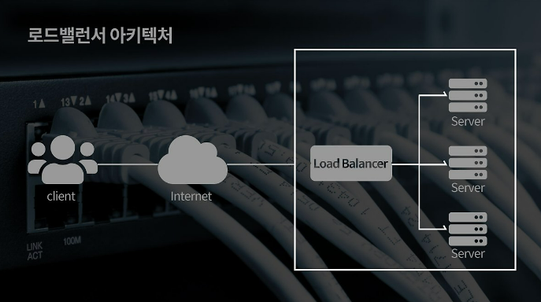

      이미지 출처: [https://naver.me/xor8AbSO](https://naver.me/xor8AbSO)


<br>

## 로드 밸런서의 기본 기능

### 1. Health Check (상태 확인)

- 각 서버가 정상적으로 살아있는지, 요청을 수행할 수 있는 지에 대한 상태를 체크하는 기능입니다
    - 각 서버들의 장애 여부를 판단하여, 정상적으로 동작중인 서버로만 트래픽을 보내줍니다
    - 주로 하드웨어로 많이쓰는 로드밸런서는 L4와 L7 로써 아래와 같은 방식으로 체크합니다
        - L4 체크 : TCP의 3-way handshaking 방식을 기반으로 각 포트의 상태를 체크합니다
        - L7 체크 : 애플리케이션 계층에서 체크하므로 실제 웹 페이지에 통신을 시도하여 상태를 체크합니다
    - 로드 밸런서 내부 설정을 통해 헬스 체크 방법을 변경할 수 있다고 합니다

<br>

### 2. NAT (Network Address Translation)

> 주로 여러 개의 호스트가 하나의 공인 IP 주소를 사용하여 인터넷에 접속하기 위해 사용되는 방식입니다
- IP 주소를 변환해주는 기능입니다
- 공인 IP는 한정적인 수량이므로 IP 주소를 절약할 수 있는 동시에, 하위 서버의 내부적인 IP를 숨길 수 있으므로 보안에도 효과적입니다
    - 즉 로드밸런서를 통해 외부 통신(요청, 응답)이 가능하므로 해당 기능을 사용할 수 있다고 생각됩니다

#### NAT의 종류

| 방식 | 흐름 | 설명 |
| --- | --- | --- |
| SNAT (Source NAT) | 내부 → 외부 | 내부 사설 IP 주소를 외부의 공인 IP 주소로 변환하는 방식 |
| DNAT (Destination NAT) | 외부 → 내부 | 외부 공인 IP 주소를 내부의 사설 IP로 주소로 변환하는 방식 |

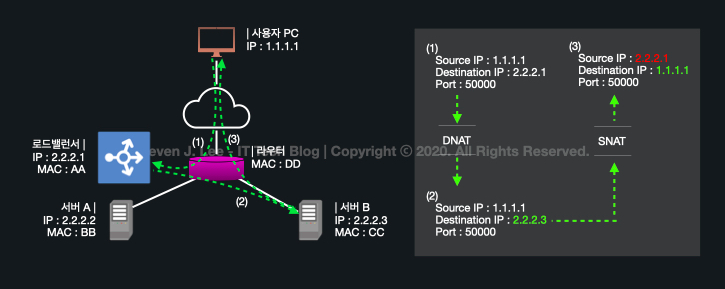

이미지 출처: [https://www.stevenjlee.net/2020/07/11/이해하기-nat-network-address-translation-네트워크-주소-변환/](https://www.stevenjlee.net/2020/07/11/%EC%9D%B4%ED%95%B4%ED%95%98%EA%B8%B0-nat-network-address-translation-%EB%84%A4%ED%8A%B8%EC%9B%8C%ED%81%AC-%EC%A3%BC%EC%86%8C-%EB%B3%80%ED%99%98/)

<br>

### 3. DSR (Direct Server Return or Direct Server Routing)
- 서버에서 클라이언트로 되돌아갈 때, 네트워크 장비나 로드밸런서를 거치지 않고 목적지인 클라이언트로 바로 찾아가는 방식입니다
- 서버 → 로드 밸런서로 가는 단계를 하나 줄여줌으로써 트래픽 부하를 줄여주는 장점이 있습니다

<br>

### 4. Tunneling

- 인터넷 상에서 눈에 보이지 않는 통로를 만들어 통신할 수 있는 개념입니다
    - 즉 데이터 스트림을 가상의 파이프를 통해 전달시키는 기술입니다
- 데이터를 캡슐화해서 **연결된 상호 간에만** 캡슐화된 패킷을 구별해 캡슐화를 해제할 수 있습니다
    - 말그대로 연결된 서버에서만 캡슐화된 데이터를 해제할 수 있는 기능입니다

<br>

### 5. 알고리즘에 따른 분산 처리

- 이 부분에 대해서는 아래에서 자세히 알아보겠습니다

<br>

## 웹 서버 구조

- 일반적인 웹 인프라 구조는 두가지로 이루어집니다
    1. Vertical Scale-Up
    2. Horizontal Scale-Out

<br>

### 1. Scale-up (스케일 업)

- 서버 자체의 성능을 업그레이드 시켜주는 방식입니다
    - 즉 하나의 서버에 디스크를 추가하거나, CPU 혹은 메모리(Ram)를 업그레이드 시키는 등 한 서버 자체의 사양을 업그레이드 하는 방법을 말합니다

  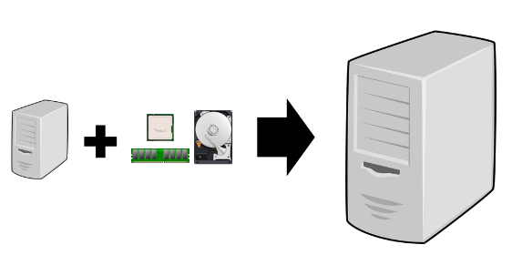

  이미지 출처: [https://liasn.tistory.com/2](https://liasn.tistory.com/2)


<br>

#### 장점

1. 추가적인 네트워크 연결이 필요 없으므로 인프라 설계가 쉽습니다
2. 서버를 추가하는 방법이 아니므로 **데이터 정합성 문제**로부터 자유롭습니다

#### 단점

- 하나의 서버의 성능을 높이는 것엔 물리적인 한계가 발생할 수 밖에 없습니다
- 서버 한대에 모든 부하가 집중되므로 장애 시, 해당 서버가 복구 되기 전까지는 서비스를 중단해야 하는 상황이 발생합니다

> 따라서 Scale-up의 방식은 한 대의 서버에서 모든 데이터를 처리하는 방식이므로, 데이터 갱신이 빈번하게 일어나는 **데이터베이스 서버**에 적합한 방식입니다

<br>

### 2. Scale-out (스케일 아웃)

- 서버를 추가하여 확장하는 방식입니다
    - 즉 서버 한대에서 처리해야 할 트래픽을 여러대의 서버로 분산시키는 방식입니다
- 일반적으로 비슷한 사양이나 덜 좋은 사양의 서버를 추가로 연결합니다
- 해당 방식에서 부하를 균등하게 나눠주는 "**로드밸런싱**"이라는 기술이 필수적으로 적용되어야 합니다

  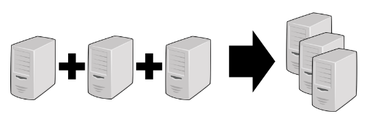

  이미지 출처: [https://liasn.tistory.com/2](https://liasn.tistory.com/2)

<br>

#### 장점

- 서비스 중 서버 한대가 다운되더라도 다른 서버로 서비스 제공이 가능합니다
- 확장이 무제한으로 가능하므로 그때 그때 상황에 맞춰 서버를 유연하게 관리할 수 있습니다
    - 클라우드 서비스에서는 자원 사용량을 모니터링 하여 부하가 많을 경우 자동으로 서버를 증설(Scale-Out) 해주는 Auto Scaling 기능도 있습니다
- 단일 서버에서 겪게 되는 병목 현상을 줄일 수 있습니다

#### 단점

- 여러 대의 서버로 돌아가기 때문에 **데이터 정합성 문제**가 발생할 수 있습니다
    - 따라서 데이터의 일관성을 유지하기 위한 인프라 설계 및 관리가 복잡하고 어렵습니다
- 세션, 웹 이미지 등 서버에 저장되는 데이터를 어떤식으로 확장된 서버들에게도 공유해야할지 등에 대한 기술적인 한계가 존재합니다

> 따라서 Scale-out 방식은 대규모 서비스일 경우, 또는 모든 서버가 동일한 데이터를 가지고 있어야 하므로, 데이터 변화가 적은 **웹 서버**에 적합한 방식입니다

<br>


### [정리] Scale-up vs Sclae-out


|  | Scale-up (Vertical)                                                                        | Scale-out (Horizontal)                                                        |
| --- |--------------------------------------------------------------------------------------------|-------------------------------------------------------------------------------|
| 장점 | - 데이터 정합성 처리 불필요 <br> - 관리 포인트 측면에서 관리가 쉬움 <br> - 단일 서버이므로 손쉽게 성능 향상 가능                    | - 서버의 중단 없이 무제한 확장 가능 <br> - 유연하게 관리할 수 있어 가용성 증가 <br> - 부품에 의한 성능 향상의 한계가 없음 |
| 단점 | - 유연한 확장 불가능 <br> - 확장하려면 서버를 중단해야 함 <br> - 부품 업그레이드의 한계가 존재 <br> - 단일 서버에서 장애 발생 시 서비스 불가 | - 데이터 정합성 처리가 별도로 필요 <br> - 관리 포인트 증가 <br> - 트래픽 조정을 위한 로드 밸런싱 기술 필요          |
| 적합한 방식 | 데이터 갱신이 빈번하게 일어나는 데이터베이스 서버에 적합한 방식 | 대규모 서비스일 경우, 데이터 변화가 적은 웹 서버에 적합한 방식                                          |


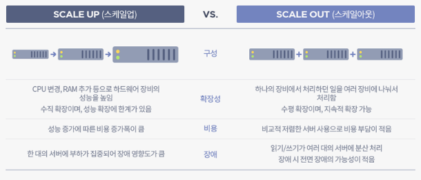

이미지 출처: [https://tech.gluesys.com/blog/2020/02/17/storage_3_intro.html](https://tech.gluesys.com/blog/2020/02/17/storage_3_intro.html)

> 따라서 이처럼 Scale-up 과 Scale-out의 각각의 장단점이 존재하므로 운영 중인 서비스에 맞게 합리적인 방식을 적용하는 것이 좋습니다

<br>

## 데이터 정합성 문제란?

> 위에서 계속 데이터 정합성 문제를 반복해서 말하고 있습니다

- 데이터 정합성 문제란 데이터가 일관되지 않는 문제를 말합니다
    - Scale-out 방식에서 여러 대의 서버가 병렬적인 환경에서 돌아가므로, 각각의 모든 서버에 데이터를 일관되게 맞춰주는 방법이 필요합니다
- 아래와 같은 말이 정합성이 훼손된 예시라고 볼 수 있습니다

  

<br>

### 데이터 정합성 문제를 해결하는 방법

- Scale-out을 통한 웹 서비스 상의 대표적인 데이터 정합성 문제는 **세션 불일치 문제**입니다
    - 사용자가 로그인을 Server1에서 진행하여 세션을 Server1에 저장해놨는데, 다음 요청이 Server2를 통해 들어온다면 Server2에는 세션이 없어 다시 로그인해야 하는 문제가 생깁니다
- 세션 정합성 이슈에 대한 해결책은 크게 3가지 입니다
    1. Sticky Session
    2. Session Clustering
    3. In-memory Database

<br>

| 🧐 바쁘시다면! | 내용 요약                                                                                                 |
| --- |-------------------------------------------------------------------------------------------------------|
| Sticky Session | - 세션을 최초로 생성한 서버로 요청이 고정되는 방식 <br> - 세션 공유 필요 없으므로 정합성 이슈 해결 <br> - 로드 밸런싱과 가용성 면에서 기능 저하             |
| Session Clustering | - 세션이 생성될 때마다 복제하여 나머지 서버에 동기화 작업 <br> - 모든 서버의 세션이 존재하므로 정합성 이슈 해결 <br> - 매번 세션 객체를 복제하는데 오버헤드 발생 위험 |
| Session Storage | - 세션 저장소를 분리하여 사용하는 방식 <br> - 각 서버에 세션 저장소에 대한 정보만 입력하면 세션 공유 가능하므로 서버의 확장에 유연하게 대처 가능                |

<br>

### 1. Sticky Session (서버 고정 방식)

- 세션을 가진 서버로만 요청을 전송하는 방식입니다
    - 첫 요청을 통해 한 서버에서 세션이 생성되었을 경우, 세션기간 동안 동일한 클라이언트의 요청은 로드 밸런서가 항상 같은 서버로만 전달하는 방식입니다

  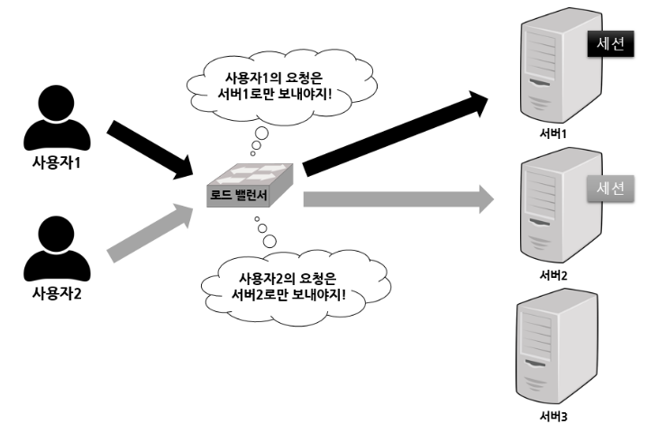

  이미지 출처: [https://liasn.tistory.com/3](https://liasn.tistory.com/3)

<br>

#### 장점

- 여러 서버들끼리 세션 데이터를 교환할 필요가 없습니다

#### 단점

- 특정 서버에 부하가 집중될 수 있습니다 → 로드 밸런싱의 이점 감소

  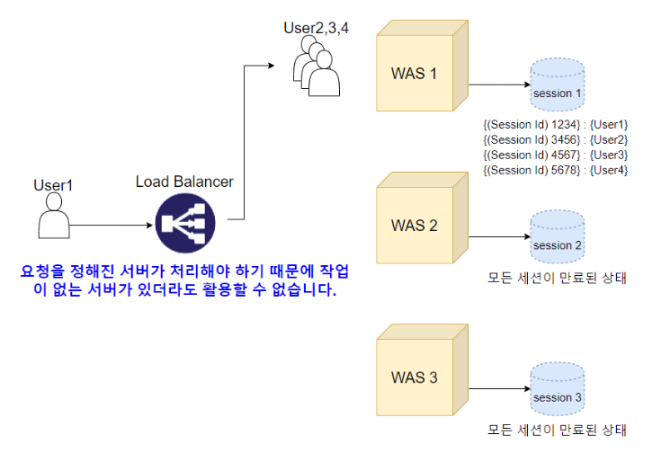

  이미지 출처: [https://hyuntaeknote.tistory.com/6](https://hyuntaeknote.tistory.com/6)

- 특정 서버에 과부하가 걸릴 경우, 로드 밸런서는 이를 감지해 다른 서버로 트래픽을 다시 라우팅합니다 → 결국 세션 유실

  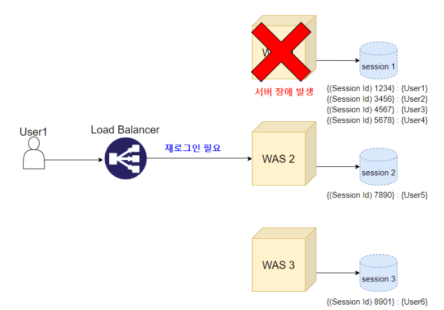

  이미지 출처: [https://hyuntaeknote.tistory.com/6](https://hyuntaeknote.tistory.com/6)


> 따라서 Sticky Session 방식은 세션의 데이터 정합성 문제는 해결할 수 있지만, Scale-out을 통한 트래픽 분산 효과와 서버 가용성을 제대로 사용할 수 없습니다

<br>

### 2. Session Clustering (Tomcat)

- 여러 서버끼리 세션을 공유(동기화)하여 로드밸런서를 통한 요청이 어떤 서버로 전달되든 세션이 동일하게 유지되도록 하는 방식입니다
- 구현 방식은 크게 두가지가 있습니다
    - DeltaManager : all-to-all 세션 복제 (4개 이하 클러스터)
    - BackupManager : primary-secondary 세션 복제 (4개 이상 클러스터)

  #### DeltaManager : all-to-all 세션 복제

    - 하나의 세션 저장소에 변경이 일어난다면, 변경된 사항을 다른 모든 세션 저장소에 적용해주는 방식입니다
    - Tomcat 문서에서는 4개보다 더 많은 노드를 가지는 대규모 클러스터 환경에는 적용하지 않는 것을 권장합니다

      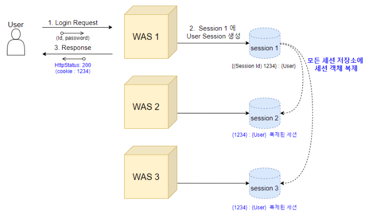

      이미지 출처: [https://hyuntaeknote.tistory.com/6](https://hyuntaeknote.tistory.com/6)

  <br>
    
  #### BackupManager : primary-secondary 세션 복제

  - 하나의 세션 저장소에서 세션이 생성되면 세컨드 저장소(백업)에만세션값 전체를 복제하고, 나머지 저장소에는 세션 key인 JSESSION ID만을 복제하여 all-to-all 방식보다 메모리 사용을 줄일수 있는 방식입니다
  - 4개 이상의 대규모 클러스터에서 사용하기 용이한 방식입니다
    
      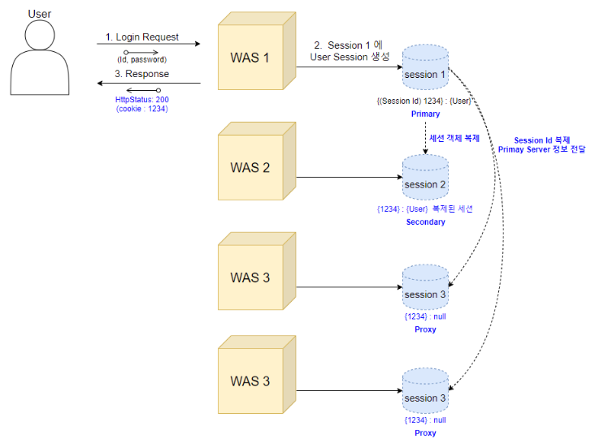
    
      이미지 출처: [https://hyuntaeknote.tistory.com/6](https://hyuntaeknote.tistory.com/6)
    
  - 하지만 세션 ID만 가지고 있는 서버로(Primary, Secondary가 아닌) 요청이 들어올 경우에는 Primary 서버에 세션 키를 통해 세션 객체를 받아와야 하는 작업이 발생하는 단점이 있습니다

<br>

### 3. In-memory Database

- 위 방식은 모두 서버가 상태(데이터: 세션)를 가지고 있기 때문에 사용되는 방식입니다
- 따라서 Scale-out에 장점을 온전히 얻지 못하는 단점이 있습니다 (세션 정합성을 맞춰주기 위해)
- 세션 데이터를 각 서버들이 갖고있지 않고 **외부로 분리**하는 방식으로 Scale-out의 장점을 극대화하면서, 대용량 트래픽에 대응해 효율적이고 유연하게 확장시킬 수 있는 방식이 In-memory Database 방식입니다

  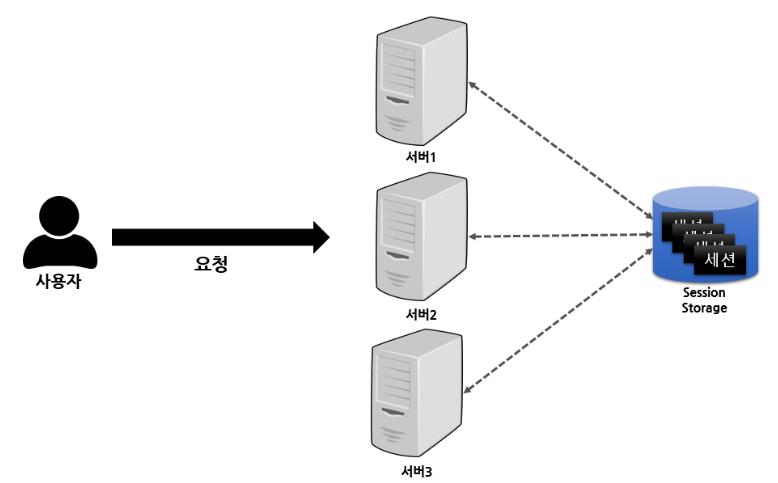

  이미지 출처: [https://liasn.tistory.com/3](https://liasn.tistory.com/3)

<br>

#### 장점

- 세션을 별도의 저장소로 관리함으로써 데이터 정합성 문제 해결
- 임의적으로 라우팅을 고정할 필요 없어 효과적인 로드 밸런싱에 유리 (Sticky Session 단점 해결)
- 세션 정보의 복제 과정이 필요 없어 효율적인 메모리 관리 (Session Clustering 단점 해결)
- 세션 저장소의 정보만 있으면 바로 세션 공유가 가능하기에 서버 확장 등의 유연한 서버 관리에 용이

<br>

#### In-memory DB 종류

- 세션 스토리지의 종류로는 대표적으로 Redis와 Memcached가 사용됩니다

|  | Redis | Memcached                                                                                                           |
| --- | --- |---------------------------------------------------------------------------------------------------------------------|
| 장점 | - 다양한 자료구조 지원 <br> - 데이터 백업 및 복구 가능 <br> - 다양한 Eviction 결정 방식을 통해 메모리 공간 확보 <br> - Spring 공식 지원 <br>- 일반적으로 Read 성능이 더 좋음 | - Multi-Thread 제공 <br> - 효율적인 메모리 할당 방식을 통한 메모리 파편화 최소화 <br> - LRU 한 가지 방식만으로 메모리 공간 확보 <br> - 일반적으로 Write 성능이 더 좋음 |

> 해당 장단점을 고려하여 서비스에 맞는 기술을 선택하면 됩니다


<br>
<br>

```markdown
💡 자 이제 전반적인 개념은 모두 익혔으니 로드밸런싱을 제대로 알아봅시다!
```

## 로드 밸런싱이란? (Load Balancing)

> Load(서버가 받는 요청, 부하) + Balancing(분산)
- **Scale-out 방식**에서 로드 밸런서를 통해 클라이언트로부터 올라오는 모든 **요청(부하)을 분산해주는 기술**입니다
- 로드 밸런싱의 알고리즘 중 5가지에 대해서 간략하게 알아보겠습니다

<br>

### 로드 밸런싱 알고리즘

1. **라운드로빈 방식 (Round Robin Method)**
    - 서버에 들어온 **요청 순서대로 돌아가면서 각 서버에 배정**하는 방식입니다
    - 하위 서버들이 동일한 스펙을 갖고 있고, 서버와의 연결이 오래 지속되지 않는 경우에 활용하기 적합한 방식입니다

<br>

2. **가중 라운드로빈 방식 (Weighted Round Robin Method)**
    - 각 하위 서버들마다 가중치를 매겨, 가중치가 높은 서버에 요청을 우선적으로 배분하는 방식입니다
        - 즉 로드밸런서가 **하위 서버의 성능을 고려**하여 트래픽의 양을 조절해줍니다
    - 주로 **각 서버들의 트래픽 처리 능력이 다른 경우**에 사용되는 방식입니다

<br>

3. **IP 해시 방식 (IP Hash Method)**
    - 클라이언트의 IP 주소를 특정 서버로 매핑(해싱)하여 요청을 처리하는 방식입니다
    - 이 방식은 사용자가 **항상 동일한 서버로 연결되는 것을 보장**합니다

<br>

4. **최소 연결 방식 (Least Connection Method)**
    - 요청이 들어온 시점에서 **가장 연결상태가 적어** 여유로운 서버에 우선적으로 트래픽은 배분하는 방식입니다
    - 하위 서버들이 로드밸런서에게 현재 감당하고 있는 트래픽의 양과 연결중인 커넥션 수에 대한 정보를 공유하고, 해당 정보를 통해 전달 서버를 결정합니다
    - 서버의 연결이 자주 길어지거나, 각 서버에 분배된 트래픽들이 일정하지 않은 경우에 적합합니다

<br>

5. **최소 리스폰타임 (Least Response Time Method)**
    - 서버의 현재 **연결 상태와 응답시간을 모두 고려**하여, **가장 응답시간이 짧은** 서버로 트래픽을 우선적으로 할당하는 방식입니다
    - 각 하위 서버들의 가용한 리소스와 성능, 처리중인 데이터 양 등이 다를 경우에 적합합니다

<br>

## 로드 밸런싱의 구현 방법

- 로드 밸런싱은 **하드웨어 구현, 소프트웨어 구현**으로 나눠집니다

<br>

### 하드웨어 구현방법

- 하드웨어를 통한 로드밸런싱 구현 방법에는 대표적으로 L4와 L7의 로드밸런서가 사용됩니다
- L4 로드밸런서와 L7 로드밸런서의 차이는 아래의 표로 확인해보겠습니다

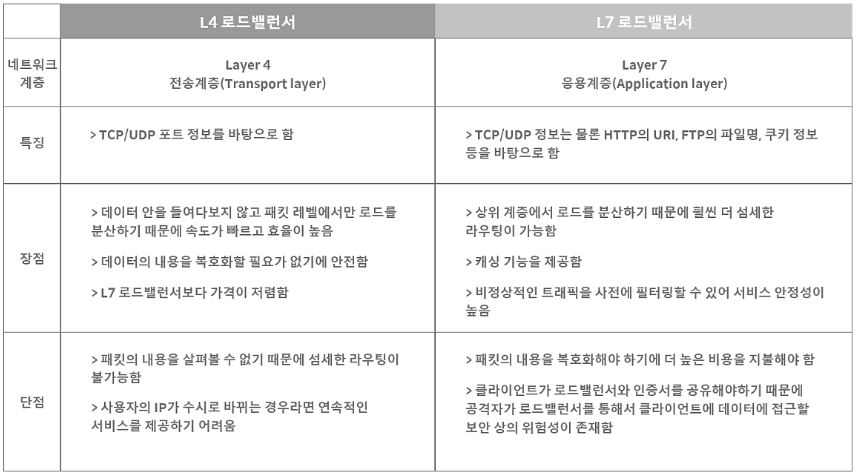

이미지 출처: [가비아 - 로드밸런서(Load Balancer)의 개념과 특징](https://m.post.naver.com/viewer/postView.naver?volumeNo=27046347&memberNo=2521903)


- 간단하게 L4와 L7 장비의 차이는 트래픽 분산을 할 때 그 로드밸런서가 어떤 메타 데이터의 어느 수준(범위)까지 분석해서 분산할지를 가장 큰 차이점으로 두는 것 같습니다
- 또한 두 장비에 대한 속도적인 비교는 둘 다 장비 자체가 워낙 빠르기 때문에 비교 대상에는 포함되지 않습니다 (마이너한 기준)
- 위의 내용에 추가로 L7 로드 밸런서는 특정한 패턴을 지닌 바이러스를 감지해 네트워크를 보호하는 기능이 있으므로, DDoS 같은 비정상적인 트래픽을 필터링하는 기능이 있어 네트워크 보안에 유리합니다

<br>

### 소프트웨어 구현방법

- 하드웨어인 L4, L7 로드밸런서를 대신하여 reverse proxy 형태인 NginX, HAProxy 등의 로드 밸런서 애플리케이션을 활용하여 소프트웨어적으로도 구현할 수 있습니다
- 하드웨어보다 성능적인 면은 떨어지지만 단순히 로직(?)만 구현하면 되므로 비용적으로 유리하다는 장점이 있습니다
    - 또한 Scale-out 방식에서 config 설정 파일만 수정하면 바로 적용시킬 수 있기 때문에 유연하고 쉬운 서버 관리가 가능합니다

<br>

## 마무리

굉장히 많은 내용을 통해 로드밸런싱에 대해서 알아보았습니다

결국은 트래픽을 효과적으로 분산하는 방법을 통해 대량의 트래픽을 감당하기 위한 방법인데요

마지막으로 한가지의 의문이 있습니다

#### 로드 밸런서 자체가 문제가 있다면?

- 로드 밸런서 자체를 이중화하지 않은 단일 서버 상태라면 해당 장비 or 서버에 장애가 일어난다면 하위 서버는 모두 요청을 전달받지 못해 **전체 서비스가 다운**됩니다
- 이 현상을 SPOF (Single Point of Failure)라고 부릅니다
- 따라서 로드밸런서 자체에도 Scale-Out을 해줌으로써 이중화를 통한 안전성을 확보해야 합니다
    - 로드밸런서의 확장은 일반적으로 Master-Slave 방식으로 구성됩니다
    - 평시에는 Master가 로드밸런서의 역할을 주로 수행하고 여분으로 Slave를 갖고있습니다
    - Master에 장애 발생 시 여분인 Slave가 Master를 바로 위임받아 로드밸런서 역할을 바로 수행함으로써 서비스가 중단되지 않게 구성해주어야 합니다


<br>
<br>

### Reference

- [인프라 네트워크 - 로드밸런싱(Load Balancing)이란?](https://youtu.be/kYipnodgi2I)
- [로드 밸런싱이란? | 천상계 개발자가 되려면 이 정도는 알아야지](https://youtu.be/9_6COPOMZvI)
- [가비아 - 로드밸런서(Load Balancer)의 개념과 특징](https://m.post.naver.com/viewer/postView.naver?volumeNo=27046347&memberNo=2521903)
- [[Infra] 스케일 업(Scale-up) vs 스케일 아웃(Scale-out)](https://junghyungil.tistory.com/15)
- [분산 서버 환경의 세션 정합성 관리](https://souljit2.tistory.com/71#2)
- [서버의 확장? Scale up과 Scale out이란?](https://liasn.tistory.com/2)
- [Scale out 확장 구조에서 Session 불일치 문제와 해결 방법](https://liasn.tistory.com/3)
- [다중 서버 환경에서 Session은 어떻게 공유하고 관리할까?](https://hyuntaeknote.tistory.com/6)
