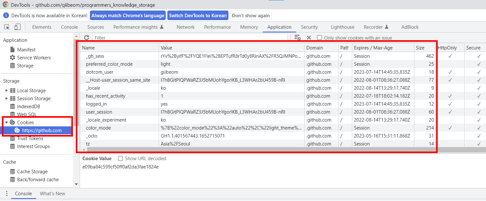
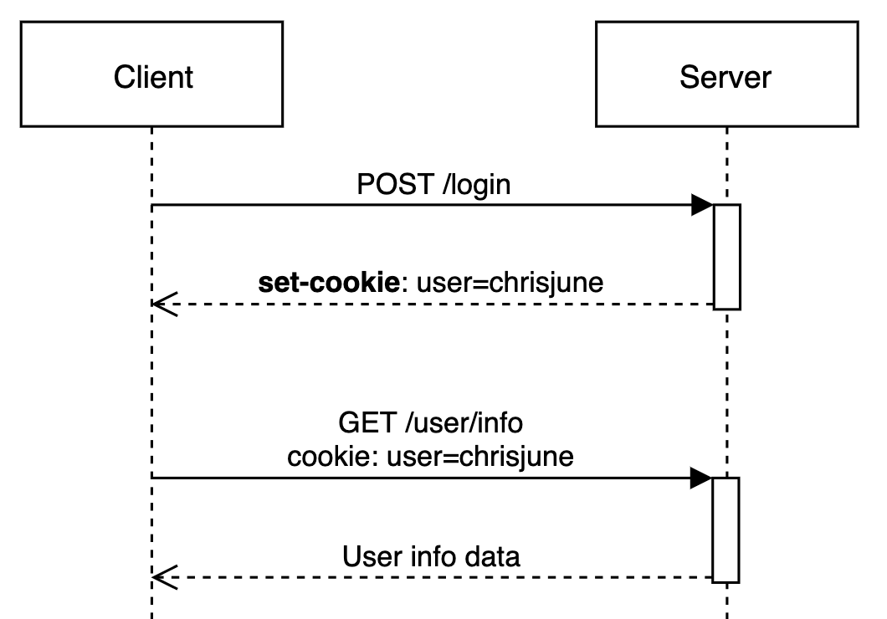
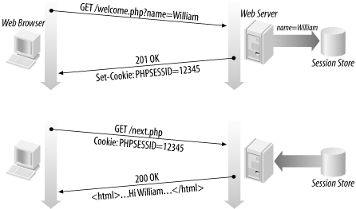

# 쿠키 vs 세션

```markdown
Auth(인증) 서비스를 만들 때 보통 쿠키, 세션, 토큰, JWT 등을 많이 접해본다
쿠키? 세션? 그 속으로 들어가보자
```

<br>

## 쿠키와 세션은 왜 사용할까?

- HTTP 프로토콜의 특징 때문이다
- HTTP 프로토콜 특징 중 하나인 무상태(Stateless)는 서버로 가는 모든 요청(request)은 이전 요청과 독립적으로 다뤄진다 → 요청끼리의 연결이 없어 메모리가 없음
- 따라서 사용자가 누군지 매 요청마다 알려줘야한다 → 서버 부하 야기
- 따라서 어딘가에 간단하지만 매 요청마다 필요한 데이터 정보를 저장할 곳이 필요하다 <br>
  → `쿠키, 세션 사용`

<br>

## 쿠키(Cookie)

### 쿠키(Cookie)는 무엇일까?

`쿠키는 세션ID 등의 정보를 옮기는 매게체 역할`

- 브라우저를 통해 사용자에 대한 정보를 저장할 수 있는 key-value 형태의 기록 데이터 파일
- 유효시간을 통해 브라우저가 종료되어도 인증이 유지될 수 있다
- 클라이언트의 별다른 요청 없이 브라우저가 매 요청(Request)마다 쿠키를 Header에 담아 서버로 전송한다 → 같은 도메인 내에서만 해당
- 쿠키는 클라이언트에 최대 300개까지, 하나의 도메인당 20개의 값만 저장이 가능하며 하나의 쿠키 값은 4KB까지 저장이 가능하다
- 쿠키는 브라우저에만 존재하므로 네이티브 앱(안드로이드, iOS)에는 존재하지 않음
    - 따라서 네이티브앱에서는 토큰을 사용하여 쿠키역할을 대체

<br>

### 쿠키는 어떻게 생겼을까?

- 🍪 쿠키의 구성요소는 크게 5가지로 구분된다 🥠

    | 구성 요소 | 설명 |
    | --- | --- |
    | Name (이름) | 각각의 쿠키를 구별하는데 사용하는 유니크한 이름 |
    | Value (값) | 쿠키의 이름과 관련된 값 |
    | Domain (도메인) | 쿠키를 전송할 도메인 |
    | Path (경로) | 쿠키를 전송할 요청 경로 |
    | Expires / Max-Age (유효시간) | 쿠키의 유지시간 |



<br>

### 쿠키는 어떻게 동작할까?

1. 사용자가 사이트에 방문 (request)
2. 서버에서 브라우저에 저장할 해당 사용자에 대한 간단한 정보를 쿠키로 생성
3. 반환 데이터에 해당 쿠키를 세팅 (response header)
    - 유효시간을 설정하게 되면 브라우저를 종료하더라도 클라이언트에서 보관됨
4. 서버에서 사용자가 요청한 페이지 반환 (response)
5. 같은 도메인 내에서 다른 요청을 할 때 브라우저는 자동으로 요청 데이터 (request header)에 쿠키를 세팅하여 서버로 전송
6. 요청을 받은 서버는 쿠키를 읽어 이후 동작 실행
    - 쿠키의 데이터가 변경이 필요할 시 쿠키를 업데이트 하여 response header에 포함시켜 반환



이미지 출처: [web-쿠키-세션이란](https://chrisjune-13837.medium.com/web-%EC%BF%A0%ED%82%A4-%EC%84%B8%EC%85%98%EC%9D%B4%EB%9E%80-aa6bcb327582)

<br>

### 쿠키는 어떻게 사용할까?

- 쿠키는 별도에 보안이 안되는 공개된 데이터이므로 중요하지 않은 간단한 사용자에 대한 정보를 기록하는데 사용된다
- 예로 들면 어떤 광고성 팝업에는 “오늘 이 창을 보지 않음” 혹은 “1주일 동안 보지 않음” 이라는 체크박스를 쿠키를 통해 동작시킨다
- 또한 쇼핑몰에서 비로그인 상태에서 장바구니에 담는 기능 또한 쿠키를 통해 구현할 수 있다

<br>

---

<br>

## 세션(Session)

### 세션은 무엇일까?

- 사용자가 웹 서버에 접속해 있는 상태에서 사용자의 정보를 유지시키는 기술
- 세션은 쿠키를 기반으로 동작하지만 데이터를 브라우저가 아닌 서버에 저장한다
- 각 클라이언트에 고유 Session ID를 부여하고 해당 ID를 쿠키에 저장한다
- 브라우저가 종료되면 세션은 삭제된다
- 각 브라우저당 1개, 즉 사용자당 한개가 생성된다
    - 사용자가 웹 서버에 접속해 있는 상태를 하나의 단위로 본다
- 서버 용량이 허용하는 한에서 세션 내 저장 데이터 용량 제한이 없다

<br>

### 세션은 어떻게 동작할까?

1. 클라이언트에서 유저 id, pw를 통해 로그인을 진행
2. 로그인(인증)이 성공하면 서버는 Session DB에 해당 유저 데이터를 생성
3. Session DB에 만들어진 해당 유저 데이터의 고유 ID인 Session ID를 쿠키에 저장
4. 브라우저 응답에 해당 쿠키도 포함하여 반환
5. 쿠키에 저장되어있는 세션 ID는 매 요청마다 서버로 전송(쿠키 특징)하여 서버는 세션 ID를 이용하여 사용자를 파악

   
   
   이미지 출처: [https://kosaf04pyh.tistory.com/24](https://kosaf04pyh.tistory.com/24)

<br>

### 세션은 어떻게 사용할까?

- 세션은 쿠키에 저장되어 있는 Session ID 가 삭제하거나 브라우저를 종료하지만 않으면 정보가 유지된다
- 따라서 클라이언트(브라우저)를 유지한 상태로 다른 화면을 이동할 때 로그인 상태가 풀리지 않고 유지된다
- 로그아웃을 하게 되면 세션 삭제를 진행한다

<br>

### 세션을 로그인 인증 기능으로 사용할 때의 문제점

- 현재 로그인한 모든 유저들의 각각의 Session ID를 Session DB에 저장한다
- 또한 매 요청마다 서버는 쿠키에 있는 Session ID를 확인하여 일치하는 유저를 찾은 후 다음 작업을 수행한다
- 이런 방식은 유저가 늘어나면 늘어날수록 DB의 리소스가 증가하여 서버 과부하로 이어진다
- 이를 방지하고자 사용되는 것이 JWT 토큰이다
    - JWT는 별다른 DB를 이용하지 않고 sign(사인)만으로 검증할 수 있는 “정보를 갖고 있는” 토큰이다
    - `JWT에 관련된 내용은 이 글을 참고해주세요` → [OAuth2.0, 그속으로](https://github.com/All-Rounder-Storage/programmers_knowledge_storage/blob/main/Computer-Science/%EB%84%A4%ED%8A%B8%EC%9B%8C%ED%81%AC/OAuth2.0/Alex/OAuth2.0.md#JWT%EB%9E%80)

<br>

### 로그인 인증 기능을 JWT로 사용한다면 세션은 무엇으로 사용할까?

- 세션은 로그인 인증을 위한 것만이 아닌 해당 클라이언트(사용자)에 대한 정보를 사용자가 웹사이트에 머무는 동안 저장하기 위한 용도이다
- 따라서 로그인 정보 뿐만이 아닌 사용자에 대한 기타 정보들도 담을 수 있다
- 그러므로 로그인이 되지 않은 상태에서도 클라이언트에 대한 세션은 존재할 수 있다
- `주의: 세션은 서버입장에서 매우 비싼 리소스이기 때문에 세션에 담을 정보는 최소화 해야한다`

<br>

---

<br>

## 쿠키와 세션의 차이

- `쿠키와 세션은 서로 대립하거나 세션이 쿠키를 대체하는 기술로 오해하곤 하지만 사실 쿠키와 세션은 상호 보완하는 기술이다`

| 🧐 | 쿠키                                                                | 세션                                                            |
| --- |-------------------------------------------------------------------|---------------------------------------------------------------|
| 저장 위치 | 클라이언트 (브라우저)                                                      | 웹 서버                                                          |
| 저장 형식 | Text                                                              | Object                                                        |
| 만료 시점 | 쿠키 저장 시 만료 시점 설정 가능 <br> (브라우저를 닫아도 만료 시점이 지나지 않았다면 자동으로 삭제되지 않음) | 브라우저 닫으면 자동 삭제 <br> (만료 시점 설정 가능하지만 브라우저를 종료할 경우엔 관계없이 자동 삭제) |
| 사용하는 자원 리소스 | 클라이언트 리소스                                                         | 서버 리소스                                                        |
| 용량 제한 | 클라이언트 당 300개 <br> 하나의 도메인 당 20개 <br> 하나의 쿠키당 4KB(=4096byte)       | 클라이언트 당 1개 서버가 허용하는 한 데이터 용량 제한 없음                            |
| 속도 | 파일에서 읽기때문에 세션보다 빠름                                                | 요청마다 서버에서 쿠키 내 Session ID를 꺼낸 후 처리를 해야 하므로 쿠키보다 느림            |
| 보안 | 쿠키는 브라우저에 저장하기 때문에 탈취, 변조가 가능하므로 보안에 취약                           | 세션은 브라우저에서 ID값만 가지고 있고 서버에 데이터가 저장되므로 상대적으로 안전                |

<br>

## 쿠키와 세션은 어느 상황에서 무엇이 더 적절할까?

- 앞서 설명한 것과 같이 세션은 보안에 유리하지만 서버의 리소스를 많이 잡아먹는다
- 따라서 중요한 데이터는 최대한 최소화하여 세션에 저장한다
- 반대로 탈취나 도난이 되도 크게 문제 없지만 굳이 DB에 저장하여 서버와의 Connection을 일으키지 않아도 되는 가벼운 사용자 정보를 쿠키에 저장한다 (팝업창 오늘 다시보지 않기 여부, 쇼핑몰 장바구니 기능 등)

<br>

## 쿠키/세션 vs 캐시

- 캐시는 웹 페이지를 빠르게 렌더링 할 수 있도록 브라우저나 서버 앞단에 웹 페이지의 요소를 저장해놓고 사용하는 임시 저장소이다
- 따라서 페이지가 렌더링이 된 후 일어나는 요청들(상대적 뒷 단) 내에서 사용자 정보를 저장하는 쿠키, 세션과는 엄연히 다르다
- 캐시는 한번 저장되면 브라우저를 참고하기 때문에 서버에서 데이터 변경이 일어나도 사용자는 변경되지 않게 보이는 현상이 종종 발생한다.
- 이런 상황에서는 캐시를 지워주거나 [서버 → 클라이언트] 응답(response) 시, header에 캐시 만료 시간을 따로 설정하는 방법 등을 이용하면 된다

<br>

### Reference

- [노마드 코더 - 세션 vs 토큰 vs 쿠키?](https://youtu.be/tosLBcAX1vk)
- [https://interconnection.tistory.com/74](https://interconnection.tistory.com/74)
- [https://hahahoho5915.tistory.com/32](https://hahahoho5915.tistory.com/32)
- [https://dev-coco.tistory.com/61](https://dev-coco.tistory.com/61)
