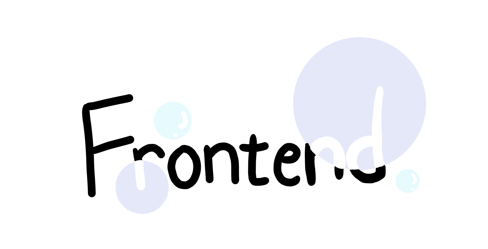

# 프론트엔드

  

순간 순간의 배움이 기록되는 프론트엔드 위키입니다 :)

### Sections 📖

---

Web Browser

1. [브라우저의 동작원리는 무엇일까요](./Web_Browser/브라우저의_동작원리는_무엇일까요.md)

HTML

CSS

Javascript

1. [실행 컨텍스트는 무엇일까요](./Javascript/실행_컨텍스트는_무엇일까요.md)
2. [var, let, const는 무엇일까요](./Javascript/var_let_const는_무엇일까요.md)

React

