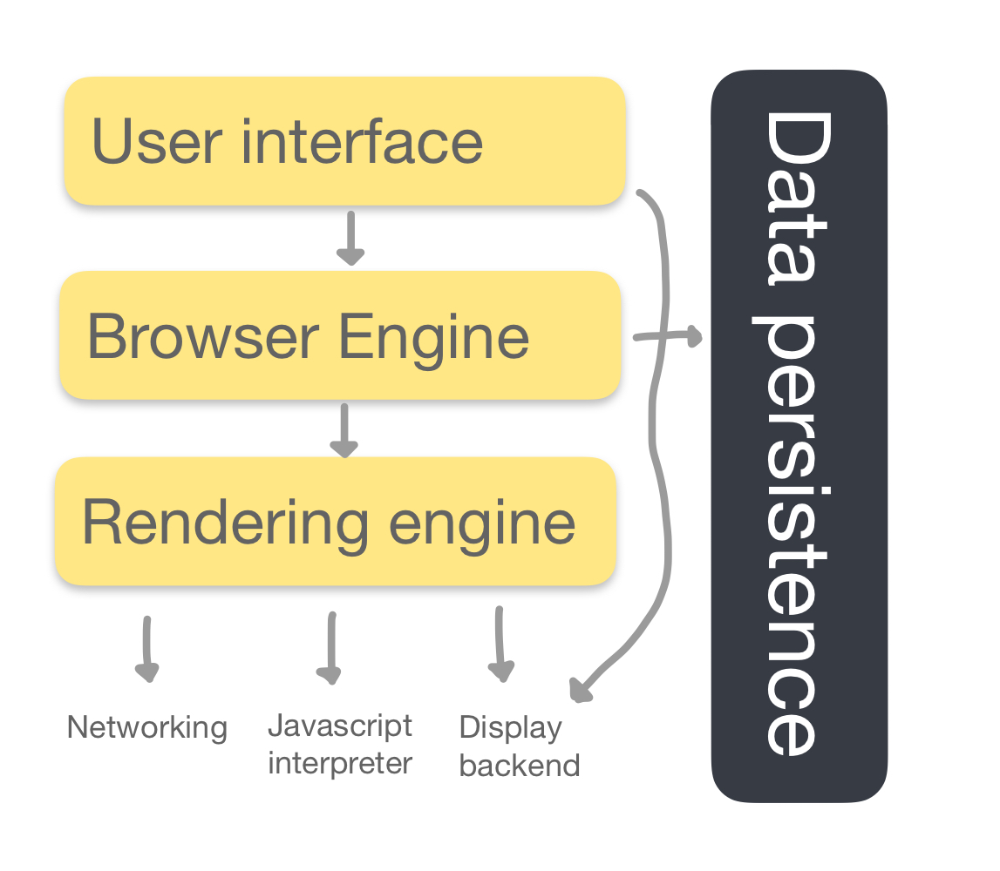
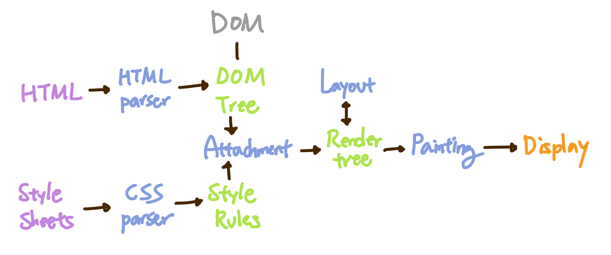
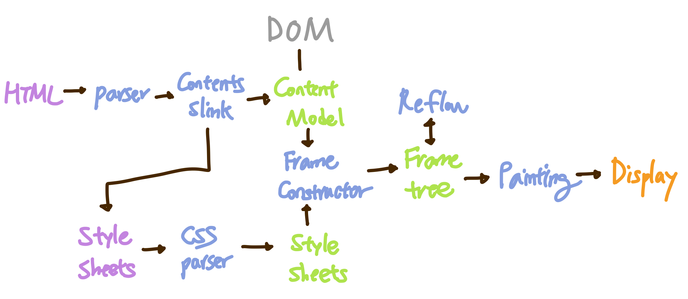
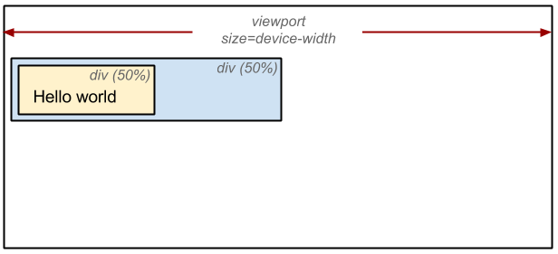

# 브라우저의 동작 원리는 무엇일까요

브라우저는 HTML과 CSS 명세에 따라 HTML 파일을 해석해서 표시하는 역할을 한다.

<br>

브라우저의 동작 과정 중 **핵심**만 뽑아 요약한다면 5단계로 설명할 수 있다.

> 1.  HTML을 파싱하여 DOM 노드를 만들고, DOM 노드를 병합하여 DOM 트리를 만든다.
> 2. CSS를 파싱하여 스타일 규칙 (CSSOM)을 만든다.
> 3. DOM 트리와 CSSOM을 Attachment라는 과정을 통해 Render Tree를 생성한다.
> 4. 만들어진 Render Tree에 노드를 제 위치에 표시하기 위해, 각 노드의 위치와 크기를 계산하는 Layout 이라는 과정을 거친다.
> 5. Layout 과정을 거친 노드를 화면에 실제로 그려내기 위한 Paint 과정 후 화면에 UI가 표시된다.

브라우저의 동작 과정을 더 쉽게 이해하기 위해서는 브라우저의 기본 구조에 대해서 먼저 살펴보면 좋다.

<br>

## 브라우저의 기본 구조

<p align="center">

</p>
<br>

- User Interface (사용자 인터페이스) : 요청한 페이지를 보여주는 창을 제외한 나머지 모든 부분 (ex. 주소 표시줄, 이전 / 다음 버튼.. )
- Browser Engine (브라우저 엔진) : User Interface와 Rendering Engine사이의 동작을 제어
- [Rendering Engine (렌더링 엔진)](#rendering-engine-(렌더링-엔진)) : 요청한 컨텐츠를 표시
- Networking : HTTP 요청과 같은 네트워크 호출에 사용
- Javascript Interpreter / Engine (자바스크립트 해석기) : 자바스크립트 코드를 해석하고 실행
- Display Backend (UI 백엔드): 기본적인 장치(ex. 콤보 박스..)를 그리며 OS 사용자 인터페이스 체계를 사용.
- Data Persistence (자료 저장소): Local Storage, 쿠키 등 데이터를 저장하는 계층

<br>

## Rendering Engine (렌더링 엔진)

렌더링 엔진은 요청한 컨텐츠를 브라우저 화면에 나태내는 역할을 한다. (ex. HTML을 요청하면 HTML과 CSS 파싱 과정을 거쳐 화면에 표시)

브라우저마다 사용하는 렌더링 엔진이 다르기 때문에 `크로스 브라우징 이슈` (같은 소스가 브라우저마다 다르게 그려지는 현상)가 발생하기도 한다.   
+) 자바스크립트 엔진이 달라서 발생하기도 한다.

이 때문에 CSS에서는 아래와 같은 코드를 볼 수 있다.

```
-moz-border-radius: 2px;
-ms-border-radius: 2px;
-o-border-radius: 2px;
-webkit-border-radius: 2px;
border-radius: 2px;
```

| 브라우저 | 렌더링 엔진 |
| --- | --- |
| Chrome | Webkit, Blink (버전 28 이후) |
| Safari | Webkit |
| FireFox | Gecko |

<br>

## 렌더링 엔진의 동작 과정

렌더링 엔진에 따라서 동작과정이 약간 다르다.

하지만, 대표적인 Webkit과 Gecko 같은 경우는 용어를 다르게 사용하고 있을 뿐 동작 과정은 기본적으로 동일하다

| Webkit | Gecko | Description |
| --- | --- | --- |
|  |  | |
| Render Tree (렌더 트리) | Frame Tree (형상 트리) | 시각적으로 처리 되는 노드 트리 |
| Render Object | Frame | 처리 되는 노드 |
| Layout | Reflow | 노드를 배치하는 과정 |
| Attachment | Frame Constructor | 노드 트리를 만드는 과정 |
- Content Sink (컨텐츠 싱크) :  DOM 요소를 생성하는 과정

<br>

## Parser (파서)

파서는 브라우저가 코드를 이해하고 사용할 수 있는 구조로 변환한다. 이를 **파싱**이라고 부르면 파싱 결과는 문서 결과를 나타내는 노트 트리로, **파싱 트리 (parser tree)** 혹은 **문법 트리 (syntax tree)**라고 한다.

### DOM (Document Object Model)

---

```html
<!DOCTYPE html>
<html>
  <head>
    <meta name="viewport" content="width=device-width,initial-scale=1" />
    <link href="style.css" rel="stylesheet" />
    <title>Critical Path</title>
  </head>
  <body>
    <p>Hello <span>web performance</span> students!</p>
    <div></div>
  </body>
</html>
```


1. Conversion(변환): HTML의 원시 바이트(raw bytes)를 읽어와 해당 파일에 지정된 인코딩(UTF-8 등...)에 따라 각각의 Characters로 변환
2. Tokenizing(토큰화): 문자열을 W3C HTML5 표준에 따라 고유 토큰(`<html>`, `<body>`등, 꺽쇠괄호로 묶인 문자열)으로 변환
3. 렉싱(Lexing): 토큰을 해당 속성 및 규칙을 정의한 객체(Objects)로 변환
4. DOM 생성(Dom construction): HTML은 parent-child 관계로 정의할 수 있어 (HTML 객체는 body 객체의 부모이며, body 객체는 paragraph 객체의 부모이다), 트리 구조로 나타낼 수 있다. 렉싱 과정을 거쳐 생성된 노드들을 트리 구조로 변환

⇒ 브라우저가 HTML 마크업을 처리할때마다, 브라우저는 위의 과정을 반복한다.

<br>

### CSSOM (CSS Object Model)

---

DOM을 생성하는 과정 그대로 CSSOM을 생성한다.

브라우저는 DOM을 생성하는 동안 외부 CSS를 참조하는 `<link>`
태그를 만나게 되면 브라우저에 리소스를 요청한다.

CSS의 원시 바이트(raw bytes)가 문자열로 변환 → 차례로 토큰과 노드로 변환 → 마지막으로 CSSOM(CSS Object Model)이라는 트리 구조를 만든다.


* CSSOM이 트리 구조를 가지는 이유는 하향식으로 규칙을 적용하기 때문이다 (`body` 태그 내에 있는 `span` 태그 안에 포함된 텍스트의 크기는16px이고 색상은 빨간색이다. 하지만 `span` 태그가 `p` 태그의 하위인 경우 해당 표시되지 않는다.)

<br>

## Attachment

CSSOM 트리와 DOM 트리를 결합하여 렌더 트리를 형성한다.


렌더 트리는 페이지에 표시되는 모든 DOM 콘텐츠와 각 노드에 대한 모든 CSSOM 스타일 정보를 가진다.

브라우저는 렌더트리를 생성하기 위해 대략적으로 이런 과정을 거친다.

1. DOM 트리의 root에서 시작하여 화면에 표시되는 노드 각각을 탐색한다.
    - 화면에 표시되지 않거나 생략된 일부 노드들(`script`, `meta` 태그 등..)은 렌더 트리에 반영되지 않는다.
    - CSS에 의해 화면에서 숨겨지는 노드들은 렌더 트리에 반영되지 않는다. 위의 예시에서 `span` 노드의 경우 `display:none`이 설정되기 때문에 렌더 트리에 반영되지 않는다.
    - +)  `visibility` 속성에 `hidden` 값이 할당된 노드는 여전히 화면에 공간을 차지하고 있기 때문에 렌더 트리에 포함된다.
2. 화면에 보여지는 각 노드에 적절하게 일치하는 CSSOM 규칙을 찾아 적용한다.
3. 화면에 표시되는 노드를 내용 및 계산된 스타일과 함께 내보낸다.

<br>

## Layout

`Render tree`가 뷰포트 내에 표현되기 위해서는 정확한 **위치**와 **크기**를 계산하는 과정인 `Layout` 을 거친다.<br>

CSS에 상대적인 값인 %로 할당된 값들은 절대적인 값인 px 단위로 변환된다.



뷰포트가 달라질 경우 상대적인 단위들(%, vh, vw 등)을 재계산해야 하는데 이 때문에 `Reflow`라고도 부른다.

<br>

## Painting

렌더링의 마지막 단계로 계산된 위치와 크기를 화면에 실제 픽셀로 변환한다.

<br>

## Display

Painting 과정 후 브라우저 화면에 UI가 나타나게 된다.

<br>

Reference

---

- [Constructing the Object Model](https://web.dev/critical-rendering-path-constructing-the-object-model/)
- [Render-tree Construction, Layout, and Paint](https://web.dev/critical-rendering-path-render-tree-construction/)
- [브라우저는 어떻게 동작하는가?](https://d2.naver.com/helloworld/59361)
- [[Browser] 브라우저 렌더링](https://beomy.github.io/tech/browser/browser-rendering)