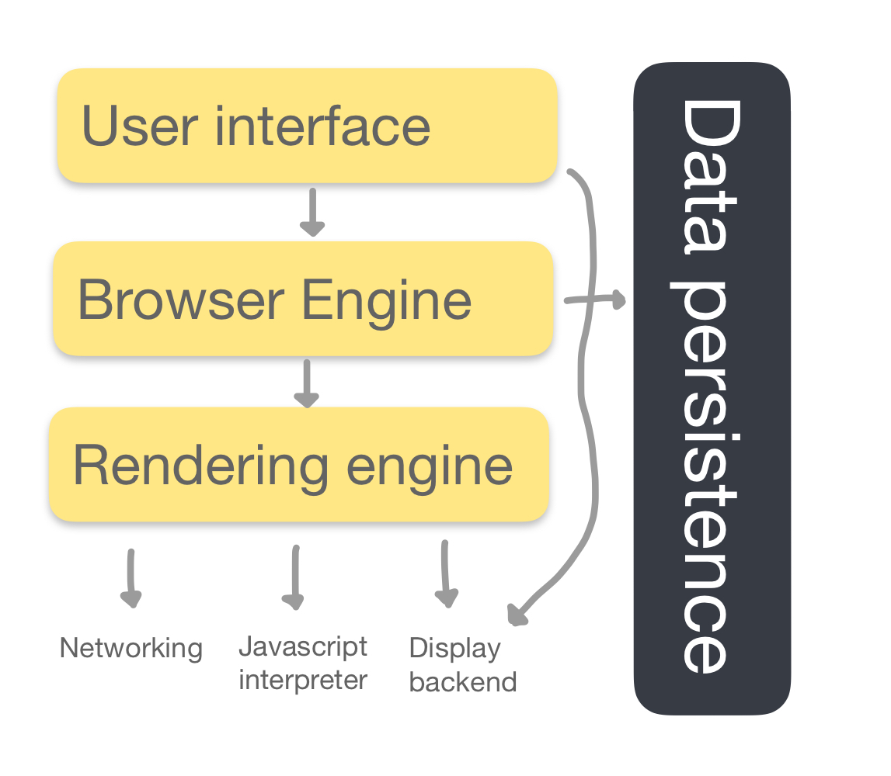
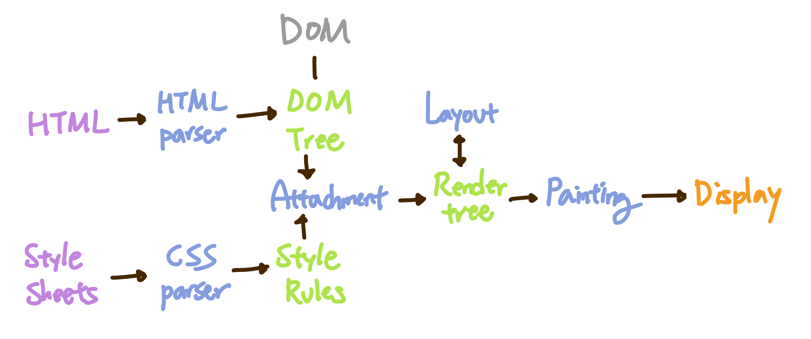
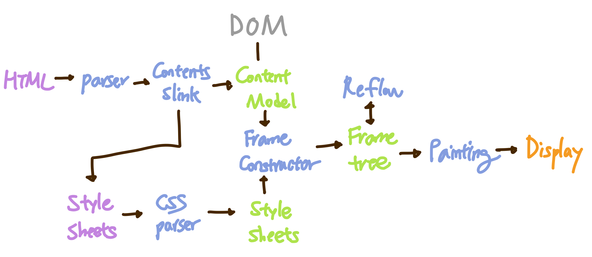

# 브라우저의 동작 원리는 무엇일까요

브라우저는 HTML과 CSS 명세에 따라 HTML 파일을 해석해서 표시하는 역할을 한다.

<br>

브라우저의 동작 과정 중 **핵심**만 뽑아 요약한다면 5단계로 설명할 수 있다.

> 1.  HTML을 파싱하여 DOM 노드를 만들고, DOM 노드를 병합하여 DOM 트리를 만든다.
> 2. CSS를 파싱하여 스타일 규칙 (CSSOM)을 만든다.
> 3. DOM 트리와 CSSOM을 Attachment라는 과정을 통해 Render Tree를 생성한다.
> 4. 만들어진 Render Tree에 노드를 제 위치에 표시하기 위해, 각 노드의 위치와 크기를 계산하는 Layout 이라는 과정을 거친다.
> 5. Layout 과정을 거친 노드를 화면에 실제로 그려내기 위한 Paint 과정 후 화면에 UI가 표시된다.

브라우저의 동작 과정을 더 쉽게 이해하기 위해서는 브라우저의 기본 구조에 대해서 먼저 살펴보면 좋다.

<br>

## 브라우저의 기본 구조

<p align="center">

</p>
<br>

- User Interface (사용자 인터페이스) : 요청한 페이지를 보여주는 창을 제외한 나머지 모든 부분 (ex. 주소 표시줄, 이전 / 다음 버튼.. )
- Browser Engine (브라우저 엔진) : User Interface와 Rendering Engine사이의 동작을 제어
- [Rendering Engine (렌더링 엔진)](#rendering-engine-(렌더링-엔진)) : 요청한 컨텐츠를 표시
- Networking : HTTP 요청과 같은 네트워크 호출에 사용
- Javascript Interpreter / Engine (자바스크립트 해석기) : 자바스크립트 코드를 해석하고 실행
- Display Backend (UI 백엔드): 기본적인 장치(ex. 콤보 박스..)를 그리며 OS 사용자 인터페이스 체계를 사용.
- Data Persistence (자료 저장소): Local Storage, 쿠키 등 데이터를 저장하는 계층

<br>

## Rendering Engine (렌더링 엔진)

렌더링 엔진은 요청한 컨텐츠를 브라우저 화면에 나태내는 역할을 한다. (ex. HTML을 요청하면 HTML과 CSS 파싱 과정을 거쳐 화면에 표시)

브라우저마다 사용하는 렌더링 엔진이 다르기 때문에 `크로스 브라우징 이슈` (같은 소스가 브라우저마다 다르게 그려지는 현상)가 발생하기도 한다.   
+) 자바스크립트 엔진이 달라서 발생하기도 한다.

이 때문에 CSS에서는 아래와 같은 코드를 볼 수 있다.

```
-moz-border-radius: 2px;
-ms-border-radius: 2px;
-o-border-radius: 2px;
-webkit-border-radius: 2px;
border-radius: 2px;
```

| 브라우저 | 렌더링 엔진 |
| --- | --- |
| Chrome | Webkit, Blink (버전 28 이후) |
| Safari | Webkit |
| FireFox | Gecko |

<br>

## 렌더링 엔진의 동작 과정

렌더링 엔진에 따라서 동작과정이 약간 다르다.

하지만, 대표적인 Webkit과 Gecko 같은 경우는 용어를 다르게 사용하고 있을 뿐 동작 과정은 기본적으로 동일하다

| Webkit | Gecko | Description |
| --- | --- | --- |
|  |  | |
| Render Tree (렌더 트리) | Frame Tree (형상 트리) | 시각적으로 처리 되는 노드 트리 |
| Render Object | Frame | 처리 되는 노드 |
| Layout | Reflow | 노드를 배치하는 과정 |
| Attachment | Frame Constructor | 노드 트리를 만드는 과정 |
- Content Sink (컨텐츠 싱크) :  DOM 요소를 생성하는 과정